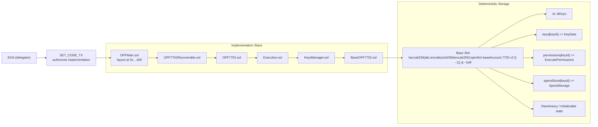
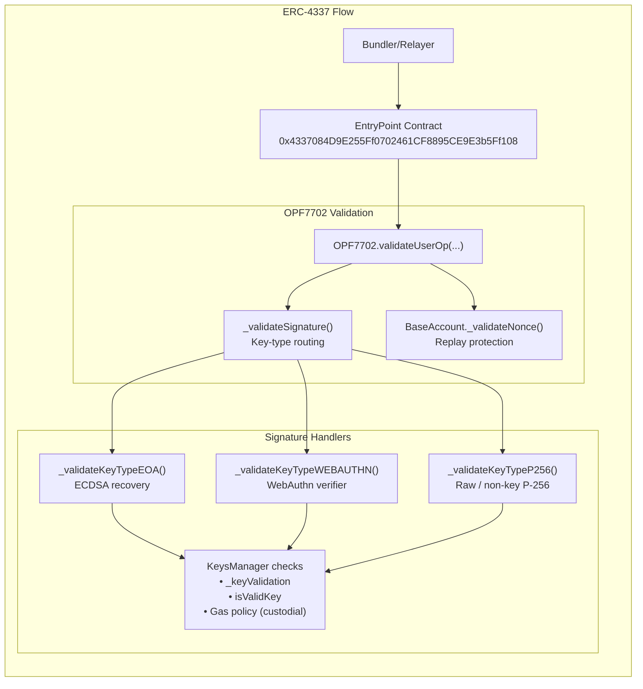
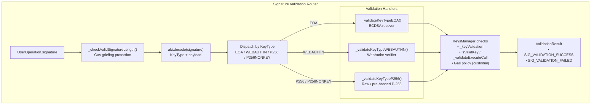
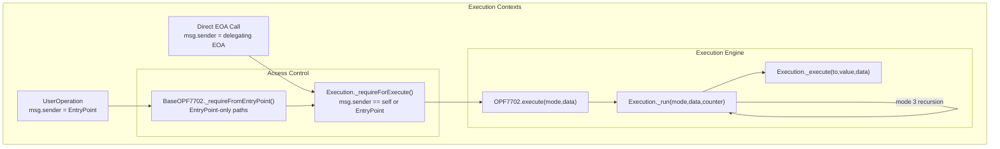

# Account Abstraction Implementation

This page explains how the Openfort EIP-7702 Smart Accounts system implements both EIP-7702 (Account Implementation Contract Standard) and ERC-4337 (Account Abstraction via Entry Point) to provide comprehensive account abstraction functionality. For details about session key permissions and access controls, see Session Keys & Permission System. For social recovery mechanisms, see Social Recovery System.

## Table of Contents

- [EIP-7702 Delegation Architecture](#eip-7702-delegation-architecture)
- [ERC-4337 Integration](#erc-4337-integration)
  - [IAccount Interface Implementation](#iaccount-interface-implementation)
- [Signature Validation Architecture](#signature-validation-architecture)
- [EIP-7702 and ERC-4337 Interoperability](#eip-7702-and-erc-4337-interoperability)
  - [Integration Points](#integration-points)
  - [Execution Contexts](#execution-contexts)
  
## EIP-7702 Delegation Architecture

EIP-7702 enables any Externally Owned Account (EOA) to delegate its code execution to a smart contract implementation without requiring a deployment transaction. The system uses a deterministic storage layout to maintain state consistency across different account addresses.

Delegation Flow

## ERC-4337 Integration
The system implements the IAccount interface from ERC-4337 to enable UserOperation processing through bundlers and the EntryPoint contract.

### IAccount Interface Implementation
The BaseOPF7702 contract implements the required ERC-4337 interface methods:
| Method | Implementation Location | Purpose |
|--------|-------------------------|---------|
| validateUserOp() | BaseOPF7702 | Validates UserOperation signatures and permissions |
| Signature validation | BaseOPF7702._validateSignature() | Routes to appropriate signature handler |

## Signature Validation Architecture
The system supports multiple signature schemes through a unified validation interface that routes signatures based on key type and context.

## EIP-7702 and ERC-4337 Interoperability
The system seamlessly integrates both standards to provide zero-deployment accounts with full account abstraction capabilities.

### Integration Points
| Component | EIP-7702 Role | ERC-4337 Role | Implementation |
|-----------|---------------|---------------|----------------|
| Storage | Deterministic slots across addresses | State persistence for UserOps | Fixed slot calculation |
| Validation | Code delegation verification | UserOperation signature validation | Unified signature routing |
| Execution | Direct EOA transactions | Bundled UserOperations | Same execution engine |

### Execution Contexts
The implementation handles both direct EOA calls (via EIP-7702 delegation) and bundled UserOperations (via ERC-4337 flow) through the same execution engine.

