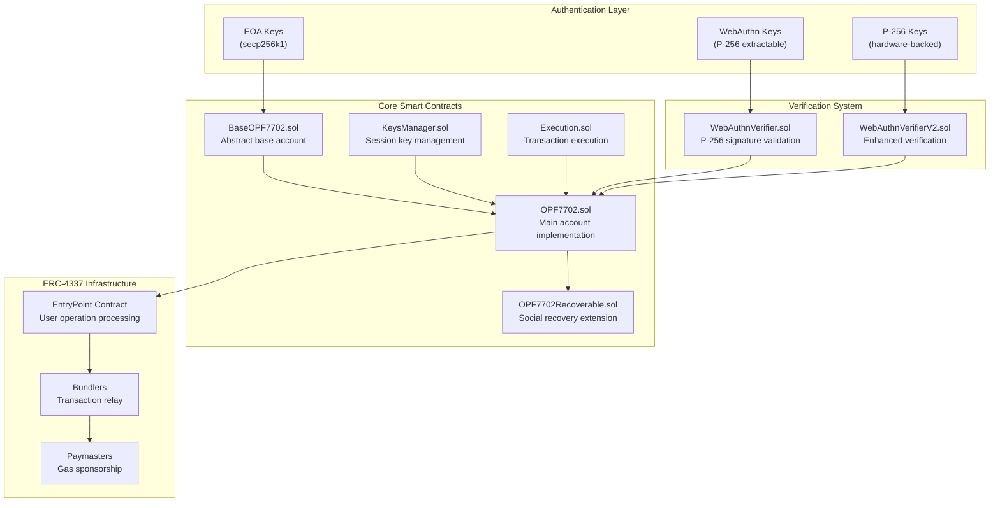

# Openfort EIP-7702 Architecture

<p align="center">
  
</p>


This document provides a comprehensive overview of the Openfort EIP-7702 Smart Accounts system—a production-ready implementation that combines EIP-7702 and ERC-4337 standards to deliver zero-deployment-cost accounts with multi-scheme key support (EOA, WebAuthn, P-256), policy-gated session management, ERC-7821 batch execution, guardian-based recovery, and WebAuthn authentication integration.

TL;DR

* OPFMain is the concrete account. It stacks:

    - `OPF7702Recoverable` → guardian recovery + EIP‑712 + initialization.

    - `OPF7702` → ERC‑4337 signature/permission pipeline + ERC‑1271.

    - `Execution` → ERC‑7821 batch executor (single batch, batch+opData, batch‑of‑batches).

    - `KeysManager` → key registry, spending limits, whitelists, session quotas.

    - `BaseOPF7702` → EntryPoint/WebAuthnVerifier/GasPolicy wiring, ERC‑165/777/721/1155 holders, storage helpers.

* `Signature` schemes: EOA (secp256k1), WebAuthn (P‑256), P‑256 raw, P‑256NONKEY (pre‑SHA‑256 for non‑extractable keys).

* `Sessions`: limit‑bounded keys (limit>0) get GasPolicy budgets and enforced whitelists/selectors/token limits.

* `Recovery`: guardians co‑sign an EIP‑712 digest to rotate the master key (limit==0) after time locks.

* `EIP‑7702`: upgradeProxyDelegation() to rotate logic behind an EIP‑7702 authority (via Solady LibEIP7702).

## Repository layout (high‑level)
```ts
src/
  core/
    BaseOPF7702.sol        # Base 4337 account + infra wiring
    KeysManager.sol        # Registry for keys + limits + whitelists
    Execution.sol          # ERC‑7821 batch executor (modes 1/2/3)
    OPF7702.sol            # 4337 validation + ERC‑1271 + call gating
    OPF7702Recoverable.sol # Guardians + EIP‑712 + recovery state machine
    OPFMain.sol            # Concrete wallet, adds EIP‑7702 proxy upgrade
  interfaces/              # Narrow, audit‑friendly surfaces
  libs/                    # P‑256, Base64, hashing, validation helpers
  utils/                   # ERC‑7201 storage view, GasPolicy, verifiers
  ```

## System Purpose
The Openfort EIP-7702 Smart Accounts system addresses key limitations in traditional wallet experiences by providing:

* Zero-deployment accounts using EIP-7702 delegation without requiring deployment transactions
* Advanced authentication supporting EOA signatures, WebAuthn/Passkeys, and P-256 cryptographic keys
* Session key management with fine-grained permissions, spending limits, and time-based controls
* Social recovery through guardian-based mechanisms
* ERC-4337 compatibility for seamless integration with account abstraction infrastructure
* The system enables users to interact with blockchain applications using familiar authentication methods (biometrics, hardware keys) while maintaining full control over their accounts and permissions.

## Core Architecture
The system is built on a modular architecture that separates concerns across multiple smart contracts, enabling flexible deployment and upgrade patterns.

### System Component Overview
<div class="group relative cursor-pointer overflow-x-auto rounded-md bg-[#f2f1f0] p-4 transition-colors hover:bg-[#ededed] dark:bg-[#1f1f1f] dark:hover:bg-[#242424]" type="button" aria-haspopup="dialog" aria-expanded="false" aria-controls="radix-«r29»" data-state="closed"><div class="flex justify-center"><svg aria-roledescription="flowchart-v2" role="graphics-document document" viewBox="-140.14016723632812 -23.70452761171882 1855.8905029296875 932.9999389648438" style="max-width: 1855.89px; touch-action: none; user-select: none; cursor: grab;" class="flowchart" xmlns:xlink="http://www.w3.org/1999/xlink" xmlns="http://www.w3.org/2000/svg" id="mermaid-a4tp500twnv" preserveAspectRatio="xMidYMid meet"><style>#mermaid-a4tp500twnv{font-family:ui-sans-serif,-apple-system,system-ui,Segoe UI,Helvetica;font-size:16px;fill:#ccc;}@keyframes edge-animation-frame{from{stroke-dashoffset:0;}}@keyframes dash{to{stroke-dashoffset:0;}}#mermaid-a4tp500twnv .edge-animation-slow{stroke-dasharray:9,5!important;stroke-dashoffset:900;animation:dash 50s linear infinite;stroke-linecap:round;}#mermaid-a4tp500twnv .edge-animation-fast{stroke-dasharray:9,5!important;stroke-dashoffset:900;animation:dash 20s linear infinite;stroke-linecap:round;}#mermaid-a4tp500twnv .error-icon{fill:#333;}#mermaid-a4tp500twnv .error-text{fill:#cccccc;stroke:#cccccc;}#mermaid-a4tp500twnv .edge-thickness-normal{stroke-width:1px;}#mermaid-a4tp500twnv .edge-thickness-thick{stroke-width:3.5px;}#mermaid-a4tp500twnv .edge-pattern-solid{stroke-dasharray:0;}#mermaid-a4tp500twnv .edge-thickness-invisible{stroke-width:0;fill:none;}#mermaid-a4tp500twnv .edge-pattern-dashed{stroke-dasharray:3;}#mermaid-a4tp500twnv .edge-pattern-dotted{stroke-dasharray:2;}#mermaid-a4tp500twnv .marker{fill:#666;stroke:#666;}#mermaid-a4tp500twnv .marker.cross{stroke:#666;}#mermaid-a4tp500twnv svg{font-family:ui-sans-serif,-apple-system,system-ui,Segoe UI,Helvetica;font-size:16px;}#mermaid-a4tp500twnv p{margin:0;}#mermaid-a4tp500twnv .label{font-family:ui-sans-serif,-apple-system,system-ui,Segoe UI,Helvetica;color:#fff;}#mermaid-a4tp500twnv .cluster-label text{fill:#fff;}#mermaid-a4tp500twnv .cluster-label span{color:#fff;}#mermaid-a4tp500twnv .cluster-label span p{background-color:transparent;}#mermaid-a4tp500twnv .label text,#mermaid-a4tp500twnv span{fill:#fff;color:#fff;}#mermaid-a4tp500twnv .node rect,#mermaid-a4tp500twnv .node circle,#mermaid-a4tp500twnv .node ellipse,#mermaid-a4tp500twnv .node polygon,#mermaid-a4tp500twnv .node path{fill:#111;stroke:#222;stroke-width:1px;}#mermaid-a4tp500twnv .rough-node .label text,#mermaid-a4tp500twnv .node .label text,#mermaid-a4tp500twnv .image-shape .label,#mermaid-a4tp500twnv .icon-shape .label{text-anchor:middle;}#mermaid-a4tp500twnv .node .katex path{fill:#000;stroke:#000;stroke-width:1px;}#mermaid-a4tp500twnv .rough-node .label,#mermaid-a4tp500twnv .node .label,#mermaid-a4tp500twnv .image-shape .label,#mermaid-a4tp500twnv .icon-shape .label{text-align:center;}#mermaid-a4tp500twnv .node.clickable{cursor:pointer;}#mermaid-a4tp500twnv .root .anchor path{fill:#666!important;stroke-width:0;stroke:#666;}#mermaid-a4tp500twnv .arrowheadPath{fill:#0b0b0b;}#mermaid-a4tp500twnv .edgePath .path{stroke:#666;stroke-width:2.0px;}#mermaid-a4tp500twnv .flowchart-link{stroke:#666;fill:none;}#mermaid-a4tp500twnv .edgeLabel{background-color:#161616;text-align:center;}#mermaid-a4tp500twnv .edgeLabel p{background-color:#161616;}#mermaid-a4tp500twnv .edgeLabel rect{opacity:0.5;background-color:#161616;fill:#161616;}#mermaid-a4tp500twnv .labelBkg{background-color:rgba(22, 22, 22, 0.5);}#mermaid-a4tp500twnv .cluster rect{fill:#161616;stroke:#222;stroke-width:1px;}#mermaid-a4tp500twnv .cluster text{fill:#fff;}#mermaid-a4tp500twnv .cluster span{color:#fff;}#mermaid-a4tp500twnv div.mermaidTooltip{position:absolute;text-align:center;max-width:200px;padding:2px;font-family:ui-sans-serif,-apple-system,system-ui,Segoe UI,Helvetica;font-size:12px;background:#333;border:1px solid hsl(0, 0%, 10%);border-radius:2px;pointer-events:none;z-index:100;}#mermaid-a4tp500twnv .flowchartTitleText{text-anchor:middle;font-size:18px;fill:#ccc;}#mermaid-a4tp500twnv rect.text{fill:none;stroke-width:0;}#mermaid-a4tp500twnv .icon-shape,#mermaid-a4tp500twnv .image-shape{background-color:#161616;text-align:center;}#mermaid-a4tp500twnv .icon-shape p,#mermaid-a4tp500twnv .image-shape p{background-color:#161616;padding:2px;}#mermaid-a4tp500twnv .icon-shape rect,#mermaid-a4tp500twnv .image-shape rect{opacity:0.5;background-color:#161616;fill:#161616;}#mermaid-a4tp500twnv :root{--mermaid-font-family:"trebuchet ms",verdana,arial,sans-serif;}</style><g><marker orient="auto" markerHeight="8" markerWidth="8" markerUnits="userSpaceOnUse" refY="5" refX="5" viewBox="0 0 10 10" class="marker flowchart-v2" id="mermaid-a4tp500twnv_flowchart-v2-pointEnd"><path style="stroke-width: 1; stroke-dasharray: 1, 0;" class="arrowMarkerPath" d="M 0 0 L 10 5 L 0 10 z"></path></marker><marker orient="auto" markerHeight="8" markerWidth="8" markerUnits="userSpaceOnUse" refY="5" refX="4.5" viewBox="0 0 10 10" class="marker flowchart-v2" id="mermaid-a4tp500twnv_flowchart-v2-pointStart"><path style="stroke-width: 1; stroke-dasharray: 1, 0;" class="arrowMarkerPath" d="M 0 5 L 10 10 L 10 0 z"></path></marker><marker orient="auto" markerHeight="11" markerWidth="11" markerUnits="userSpaceOnUse" refY="5" refX="11" viewBox="0 0 10 10" class="marker flowchart-v2" id="mermaid-a4tp500twnv_flowchart-v2-circleEnd"><circle style="stroke-width: 1; stroke-dasharray: 1, 0;" class="arrowMarkerPath" r="5" cy="5" cx="5"></circle></marker><marker orient="auto" markerHeight="11" markerWidth="11" markerUnits="userSpaceOnUse" refY="5" refX="-1" viewBox="0 0 10 10" class="marker flowchart-v2" id="mermaid-a4tp500twnv_flowchart-v2-circleStart"><circle style="stroke-width: 1; stroke-dasharray: 1, 0;" class="arrowMarkerPath" r="5" cy="5" cx="5"></circle></marker><marker orient="auto" markerHeight="11" markerWidth="11" markerUnits="userSpaceOnUse" refY="5.2" refX="12" viewBox="0 0 11 11" class="marker cross flowchart-v2" id="mermaid-a4tp500twnv_flowchart-v2-crossEnd"><path style="stroke-width: 2; stroke-dasharray: 1, 0;" class="arrowMarkerPath" d="M 1,1 l 9,9 M 10,1 l -9,9"></path></marker><marker orient="auto" markerHeight="11" markerWidth="11" markerUnits="userSpaceOnUse" refY="5.2" refX="-1" viewBox="0 0 11 11" class="marker cross flowchart-v2" id="mermaid-a4tp500twnv_flowchart-v2-crossStart"><path style="stroke-width: 2; stroke-dasharray: 1, 0;" class="arrowMarkerPath" d="M 1,1 l 9,9 M 10,1 l -9,9"></path></marker><g class="root"><g class="clusters"><g data-look="classic" id="subGraph3" class="cluster"><rect height="409" width="321.234375" y="516" x="8" style=""></rect><g transform="translate(79.171875, 516)" class="cluster-label"><foreignObject height="24" width="178.890625"><div style="display: table-cell; white-space: nowrap; line-height: 1.5; max-width: 200px; text-align: center;" xmlns="http://www.w3.org/1999/xhtml"><span class="nodeLabel"><p>ERC-4337 Infrastructure</p></span></div></foreignObject></g></g><g data-look="classic" id="subGraph2" class="cluster"><rect height="128" width="601.859375" y="186" x="1246.03125" style=""></rect><g transform="translate(1477.1953125, 186)" class="cluster-label"><foreignObject height="24" width="139.53125"><div style="display: table-cell; white-space: nowrap; line-height: 1.5; max-width: 200px; text-align: center;" xmlns="http://www.w3.org/1999/xhtml"><span class="nodeLabel"><p>Verification System</p></span></div></foreignObject></g></g><g data-look="classic" id="subGraph1" class="cluster"><rect height="458" width="876.796875" y="186" x="349.234375" style=""></rect><g transform="translate(708.7421875, 186)" class="cluster-label"><foreignObject height="24" width="157.78125"><div style="display: table-cell; white-space: nowrap; line-height: 1.5; max-width: 200px; text-align: center;" xmlns="http://www.w3.org/1999/xhtml"><span class="nodeLabel"><p>Core Smart Contracts</p></span></div></foreignObject></g></g><g data-look="classic" id="subGraph0" class="cluster"><rect height="128" width="1446.4140625" y="8" x="385.7265625" style=""></rect><g transform="translate(1034.43359375, 8)" class="cluster-label"><foreignObject height="24" width="149"><div style="display: table-cell; white-space: nowrap; line-height: 1.5; max-width: 200px; text-align: center;" xmlns="http://www.w3.org/1999/xhtml"><span class="nodeLabel"><p>Authentication Layer</p></span></div></foreignObject></g></g></g><g class="edgePaths"><path marker-end="url(#mermaid-a4tp500twnv_flowchart-v2-pointEnd)" style="" class="edge-thickness-normal edge-pattern-solid edge-thickness-normal edge-pattern-solid flowchart-link" id="L_EOAKeys_BaseOPF7702_0" d="M496.156,111L496.156,115.167C496.156,119.333,496.156,127.667,496.156,136C496.156,144.333,496.156,152.667,496.156,161C496.156,169.333,496.156,177.667,496.156,185.333C496.156,193,496.156,200,496.156,203.5L496.156,207"></path><path marker-end="url(#mermaid-a4tp500twnv_flowchart-v2-pointEnd)" style="" class="edge-thickness-normal edge-pattern-solid edge-thickness-normal edge-pattern-solid flowchart-link" id="L_WebAuthnKeys_WebAuthnVerifier_0" d="M1406.586,111L1406.586,115.167C1406.586,119.333,1406.586,127.667,1406.586,136C1406.586,144.333,1406.586,152.667,1406.586,161C1406.586,169.333,1406.586,177.667,1406.586,185.333C1406.586,193,1406.586,200,1406.586,203.5L1406.586,207"></path><path marker-end="url(#mermaid-a4tp500twnv_flowchart-v2-pointEnd)" style="" class="edge-thickness-normal edge-pattern-solid edge-thickness-normal edge-pattern-solid flowchart-link" id="L_P256Keys_WebAuthnVerifierV2_0" d="M1697.516,111L1697.516,115.167C1697.516,119.333,1697.516,127.667,1697.516,136C1697.516,144.333,1697.516,152.667,1697.516,161C1697.516,169.333,1697.516,177.667,1697.516,185.333C1697.516,193,1697.516,200,1697.516,203.5L1697.516,207"></path><path marker-end="url(#mermaid-a4tp500twnv_flowchart-v2-pointEnd)" style="" class="edge-thickness-normal edge-pattern-solid edge-thickness-normal edge-pattern-solid flowchart-link" id="L_BaseOPF7702_OPF7702_0" d="M496.156,289L496.156,293.167C496.156,297.333,496.156,305.667,496.156,314C496.156,322.333,496.156,330.667,567.975,344.496C639.793,358.325,783.43,377.651,855.249,387.313L927.067,396.976"></path><path marker-end="url(#mermaid-a4tp500twnv_flowchart-v2-pointEnd)" style="" class="edge-thickness-normal edge-pattern-solid edge-thickness-normal edge-pattern-solid flowchart-link" id="L_KeysManager_OPF7702_0" d="M780.469,289L780.469,293.167C780.469,297.333,780.469,305.667,780.469,314C780.469,322.333,780.469,330.667,804.919,341.457C829.369,352.246,878.27,365.493,902.72,372.116L927.17,378.739"></path><path marker-end="url(#mermaid-a4tp500twnv_flowchart-v2-pointEnd)" style="" class="edge-thickness-normal edge-pattern-solid edge-thickness-normal edge-pattern-solid flowchart-link" id="L_Execution_OPF7702_0" d="M1062.281,289L1062.281,293.167C1062.281,297.333,1062.281,305.667,1062.281,314C1062.281,322.333,1062.281,330.667,1062.224,338.333C1062.166,346,1062.051,353,1061.993,356.5L1061.936,360.001"></path><path marker-end="url(#mermaid-a4tp500twnv_flowchart-v2-pointEnd)" style="" class="edge-thickness-normal edge-pattern-solid edge-thickness-normal edge-pattern-solid flowchart-link" id="L_OPF7702_OPFRecoverable_0" d="M1063.618,466L1063.83,470.167C1064.041,474.333,1064.464,482.667,1064.675,491C1064.887,499.333,1064.887,507.667,1064.887,515.333C1064.887,523,1064.887,530,1064.887,533.5L1064.887,537"></path><path marker-end="url(#mermaid-a4tp500twnv_flowchart-v2-pointEnd)" style="" class="edge-thickness-normal edge-pattern-solid edge-thickness-normal edge-pattern-solid flowchart-link" id="L_WebAuthnVerifier_OPF7702_0" d="M1406.586,289L1406.586,293.167C1406.586,297.333,1406.586,305.667,1361.077,314C1315.568,322.333,1224.549,330.667,1175.526,338.518C1126.502,346.369,1119.473,353.737,1115.958,357.421L1112.444,361.106"></path><path marker-end="url(#mermaid-a4tp500twnv_flowchart-v2-pointEnd)" style="" class="edge-thickness-normal edge-pattern-solid edge-thickness-normal edge-pattern-solid flowchart-link" id="L_WebAuthnVerifierV2_OPF7702_0" d="M1697.516,289L1697.516,293.167C1697.516,297.333,1697.516,305.667,1606.852,314C1516.188,322.333,1334.859,330.667,1239.639,338.577C1144.419,346.487,1135.307,353.974,1130.75,357.717L1126.194,361.461"></path><path marker-end="url(#mermaid-a4tp500twnv_flowchart-v2-pointEnd)" style="" class="edge-thickness-normal edge-pattern-solid edge-thickness-normal edge-pattern-solid flowchart-link" id="L_OPF7702_EntryPoint_0" d="M931.031,430.954L849.482,440.961C767.932,450.969,604.833,470.985,523.284,485.159C441.734,499.333,441.734,507.667,417.8,517.442C393.866,527.217,345.997,538.434,322.063,544.043L298.129,549.651"></path><path marker-end="url(#mermaid-a4tp500twnv_flowchart-v2-pointEnd)" style="" class="edge-thickness-normal edge-pattern-solid edge-thickness-normal edge-pattern-solid flowchart-link" id="L_EntryPoint_Bundlers_0" d="M168.617,619L168.617,623.167C168.617,627.333,168.617,635.667,168.617,644C168.617,652.333,168.617,660.667,168.617,668.333C168.617,676,168.617,683,168.617,686.5L168.617,690"></path><path marker-end="url(#mermaid-a4tp500twnv_flowchart-v2-pointEnd)" style="" class="edge-thickness-normal edge-pattern-solid edge-thickness-normal edge-pattern-solid flowchart-link" id="L_Bundlers_Paymasters_0" d="M168.617,772L168.617,776.167C168.617,780.333,168.617,788.667,168.617,796.333C168.617,804,168.617,811,168.617,814.5L168.617,818"></path></g><g class="edgeLabels"><g class="edgeLabel"><g transform="translate(0, 0)" class="label"><foreignObject height="0" width="0"><div style="display: table-cell; white-space: nowrap; line-height: 1.5; max-width: 200px; text-align: center;" class="labelBkg" xmlns="http://www.w3.org/1999/xhtml"><span class="edgeLabel"></span></div></foreignObject></g></g><g class="edgeLabel"><g transform="translate(0, 0)" class="label"><foreignObject height="0" width="0"><div style="display: table-cell; white-space: nowrap; line-height: 1.5; max-width: 200px; text-align: center;" class="labelBkg" xmlns="http://www.w3.org/1999/xhtml"><span class="edgeLabel"></span></div></foreignObject></g></g><g class="edgeLabel"><g transform="translate(0, 0)" class="label"><foreignObject height="0" width="0"><div style="display: table-cell; white-space: nowrap; line-height: 1.5; max-width: 200px; text-align: center;" class="labelBkg" xmlns="http://www.w3.org/1999/xhtml"><span class="edgeLabel"></span></div></foreignObject></g></g><g class="edgeLabel"><g transform="translate(0, 0)" class="label"><foreignObject height="0" width="0"><div style="display: table-cell; white-space: nowrap; line-height: 1.5; max-width: 200px; text-align: center;" class="labelBkg" xmlns="http://www.w3.org/1999/xhtml"><span class="edgeLabel"></span></div></foreignObject></g></g><g class="edgeLabel"><g transform="translate(0, 0)" class="label"><foreignObject height="0" width="0"><div style="display: table-cell; white-space: nowrap; line-height: 1.5; max-width: 200px; text-align: center;" class="labelBkg" xmlns="http://www.w3.org/1999/xhtml"><span class="edgeLabel"></span></div></foreignObject></g></g><g class="edgeLabel"><g transform="translate(0, 0)" class="label"><foreignObject height="0" width="0"><div style="display: table-cell; white-space: nowrap; line-height: 1.5; max-width: 200px; text-align: center;" class="labelBkg" xmlns="http://www.w3.org/1999/xhtml"><span class="edgeLabel"></span></div></foreignObject></g></g><g class="edgeLabel"><g transform="translate(0, 0)" class="label"><foreignObject height="0" width="0"><div style="display: table-cell; white-space: nowrap; line-height: 1.5; max-width: 200px; text-align: center;" class="labelBkg" xmlns="http://www.w3.org/1999/xhtml"><span class="edgeLabel"></span></div></foreignObject></g></g><g class="edgeLabel"><g transform="translate(0, 0)" class="label"><foreignObject height="0" width="0"><div style="display: table-cell; white-space: nowrap; line-height: 1.5; max-width: 200px; text-align: center;" class="labelBkg" xmlns="http://www.w3.org/1999/xhtml"><span class="edgeLabel"></span></div></foreignObject></g></g><g class="edgeLabel"><g transform="translate(0, 0)" class="label"><foreignObject height="0" width="0"><div style="display: table-cell; white-space: nowrap; line-height: 1.5; max-width: 200px; text-align: center;" class="labelBkg" xmlns="http://www.w3.org/1999/xhtml"><span class="edgeLabel"></span></div></foreignObject></g></g><g class="edgeLabel"><g transform="translate(0, 0)" class="label"><foreignObject height="0" width="0"><div style="display: table-cell; white-space: nowrap; line-height: 1.5; max-width: 200px; text-align: center;" class="labelBkg" xmlns="http://www.w3.org/1999/xhtml"><span class="edgeLabel"></span></div></foreignObject></g></g><g class="edgeLabel"><g transform="translate(0, 0)" class="label"><foreignObject height="0" width="0"><div style="display: table-cell; white-space: nowrap; line-height: 1.5; max-width: 200px; text-align: center;" class="labelBkg" xmlns="http://www.w3.org/1999/xhtml"><span class="edgeLabel"></span></div></foreignObject></g></g><g class="edgeLabel"><g transform="translate(0, 0)" class="label"><foreignObject height="0" width="0"><div style="display: table-cell; white-space: nowrap; line-height: 1.5; max-width: 200px; text-align: center;" class="labelBkg" xmlns="http://www.w3.org/1999/xhtml"><span class="edgeLabel"></span></div></foreignObject></g></g></g><g class="nodes"><g transform="translate(496.15625, 72)" id="flowchart-EOAKeys-0" class="node default"><rect height="78" width="150.859375" y="-39" x="-75.4296875" style="" class="basic label-container"></rect><g transform="translate(-45.4296875, -24)" style="" class="label"><rect></rect><foreignObject height="48" width="90.859375"><div style="display: table-cell; white-space: nowrap; line-height: 1.5; max-width: 200px; text-align: center;" xmlns="http://www.w3.org/1999/xhtml"><span class="nodeLabel"><p>EOA Keys<br>(secp256k1)</p></span></div></foreignObject></g></g><g transform="translate(1406.5859375, 72)" id="flowchart-WebAuthnKeys-1" class="node default"><rect height="78" width="202.953125" y="-39" x="-101.4765625" style="" class="basic label-container"></rect><g transform="translate(-71.4765625, -24)" style="" class="label"><rect></rect><foreignObject height="48" width="142.953125"><div style="display: table-cell; white-space: nowrap; line-height: 1.5; max-width: 200px; text-align: center;" xmlns="http://www.w3.org/1999/xhtml"><span class="nodeLabel"><p>WebAuthn Keys<br>(P-256 extractable)</p></span></div></foreignObject></g></g><g transform="translate(1697.515625, 72)" id="flowchart-P256Keys-2" class="node default"><rect height="78" width="199.25" y="-39" x="-99.625" style="" class="basic label-container"></rect><g transform="translate(-69.625, -24)" style="" class="label"><rect></rect><foreignObject height="48" width="139.25"><div style="display: table-cell; white-space: nowrap; line-height: 1.5; max-width: 200px; text-align: center;" xmlns="http://www.w3.org/1999/xhtml"><span class="nodeLabel"><p>P-256 Keys<br>(hardware-backed)</p></span></div></foreignObject></g></g><g transform="translate(496.15625, 250)" id="flowchart-BaseOPF7702-3" class="node default"><rect height="78" width="223.84375" y="-39" x="-111.921875" style="" class="basic label-container"></rect><g transform="translate(-81.921875, -24)" style="" class="label"><rect></rect><foreignObject height="48" width="163.84375"><div style="display: table-cell; white-space: nowrap; line-height: 1.5; max-width: 200px; text-align: center;" xmlns="http://www.w3.org/1999/xhtml"><span class="nodeLabel"><p>BaseOPF7702.sol<br>Abstract base account</p></span></div></foreignObject></g></g><g transform="translate(780.46875, 250)" id="flowchart-KeysManager-4" class="node default"><rect height="78" width="244.78125" y="-39" x="-122.390625" style="" class="basic label-container"></rect><g transform="translate(-92.390625, -24)" style="" class="label"><rect></rect><foreignObject height="48" width="184.78125"><div style="display: table-cell; white-space: nowrap; line-height: 1.5; max-width: 200px; text-align: center;" xmlns="http://www.w3.org/1999/xhtml"><span class="nodeLabel"><p>KeysManager.sol<br>Session key management</p></span></div></foreignObject></g></g><g transform="translate(1062.28125, 250)" id="flowchart-Execution-5" class="node default"><rect height="78" width="218.84375" y="-39" x="-109.421875" style="" class="basic label-container"></rect><g transform="translate(-79.421875, -24)" style="" class="label"><rect></rect><foreignObject height="48" width="158.84375"><div style="display: table-cell; white-space: nowrap; line-height: 1.5; max-width: 200px; text-align: center;" xmlns="http://www.w3.org/1999/xhtml"><span class="nodeLabel"><p>Execution.sol<br>Transaction execution</p></span></div></foreignObject></g></g><g transform="translate(1061.03125, 415)" id="flowchart-OPF7702-6" class="node default"><rect height="102" width="260" y="-51" x="-130" style="" class="basic label-container"></rect><g transform="translate(-100, -36)" style="" class="label"><rect></rect><foreignObject height="72" width="200"><div style="display: table; white-space: break-spaces; line-height: 1.5; max-width: 200px; text-align: center; width: 200px;" xmlns="http://www.w3.org/1999/xhtml"><span class="nodeLabel"><p>OPF7702.sol<br>Main account implementation</p></span></div></foreignObject></g></g><g transform="translate(1064.88671875, 580)" id="flowchart-OPFRecoverable-7" class="node default"><rect height="78" width="244.578125" y="-39" x="-122.2890625" style="" class="basic label-container"></rect><g transform="translate(-92.2890625, -24)" style="" class="label"><rect></rect><foreignObject height="48" width="184.578125"><div style="display: table-cell; white-space: nowrap; line-height: 1.5; max-width: 200px; text-align: center;" xmlns="http://www.w3.org/1999/xhtml"><span class="nodeLabel"><p>OPF7702Recoverable.sol<br>Social recovery extension</p></span></div></foreignObject></g></g><g transform="translate(1406.5859375, 250)" id="flowchart-WebAuthnVerifier-8" class="node default"><rect height="78" width="251.109375" y="-39" x="-125.5546875" style="" class="basic label-container"></rect><g transform="translate(-95.5546875, -24)" style="" class="label"><rect></rect><foreignObject height="48" width="191.109375"><div style="display: table-cell; white-space: nowrap; line-height: 1.5; max-width: 200px; text-align: center;" xmlns="http://www.w3.org/1999/xhtml"><span class="nodeLabel"><p>WebAuthnVerifier.sol<br>P-256 signature validation</p></span></div></foreignObject></g></g><g transform="translate(1697.515625, 250)" id="flowchart-WebAuthnVerifierV2-9" class="node default"><rect height="78" width="230.75" y="-39" x="-115.375" style="" class="basic label-container"></rect><g transform="translate(-85.375, -24)" style="" class="label"><rect></rect><foreignObject height="48" width="170.75"><div style="display: table-cell; white-space: nowrap; line-height: 1.5; max-width: 200px; text-align: center;" xmlns="http://www.w3.org/1999/xhtml"><span class="nodeLabel"><p>WebAuthnVerifierV2.sol<br>Enhanced verification</p></span></div></foreignObject></g></g><g transform="translate(168.6171875, 580)" id="flowchart-EntryPoint-10" class="node default"><rect height="78" width="251.234375" y="-39" x="-125.6171875" style="" class="basic label-container"></rect><g transform="translate(-95.6171875, -24)" style="" class="label"><rect></rect><foreignObject height="48" width="191.234375"><div style="display: table-cell; white-space: nowrap; line-height: 1.5; max-width: 200px; text-align: center;" xmlns="http://www.w3.org/1999/xhtml"><span class="nodeLabel"><p>EntryPoint Contract<br>User operation processing</p></span></div></foreignObject></g></g><g transform="translate(168.6171875, 733)" id="flowchart-Bundlers-11" class="node default"><rect height="78" width="183.53125" y="-39" x="-91.765625" style="" class="basic label-container"></rect><g transform="translate(-61.765625, -24)" style="" class="label"><rect></rect><foreignObject height="48" width="123.53125"><div style="display: table-cell; white-space: nowrap; line-height: 1.5; max-width: 200px; text-align: center;" xmlns="http://www.w3.org/1999/xhtml"><span class="nodeLabel"><p>Bundlers<br>Transaction relay</p></span></div></foreignObject></g></g><g transform="translate(168.6171875, 861)" id="flowchart-Paymasters-12" class="node default"><rect height="78" width="181.171875" y="-39" x="-90.5859375" style="" class="basic label-container"></rect><g transform="translate(-60.5859375, -24)" style="" class="label"><rect></rect><foreignObject height="48" width="121.171875"><div style="display: table-cell; white-space: nowrap; line-height: 1.5; max-width: 200px; text-align: center;" xmlns="http://www.w3.org/1999/xhtml"><span class="nodeLabel"><p>Paymasters<br>Gas sponsorship</p></span></div></foreignObject></g></g></g></g></g></svg></div><div class="bg-input-dark absolute right-2 top-2 rounded-sm p-1 opacity-0 transition-opacity group-hover:opacity-100"><svg xmlns="http://www.w3.org/2000/svg" width="16" height="16" fill="currentColor" viewBox="0 0 256 256" class="light:text-gray-800 text-white dark:text-white"><path d="M216,48V96a8,8,0,0,1-16,0V67.31l-42.34,42.35a8,8,0,0,1-11.32-11.32L188.69,56H160a8,8,0,0,1,0-16h48A8,8,0,0,1,216,48ZM98.34,146.34,56,188.69V160a8,8,0,0,0-16,0v48a8,8,0,0,0,8,8H96a8,8,0,0,0,0-16H67.31l42.35-42.34a8,8,0,0,0-11.32-11.32ZM208,152a8,8,0,0,0-8,8v28.69l-42.34-42.35a8,8,0,0,0-11.32,11.32L188.69,200H160a8,8,0,0,0,0,16h48a8,8,0,0,0,8-8V160A8,8,0,0,0,208,152ZM67.31,56H96a8,8,0,0,0,0-16H48a8,8,0,0,0-8,8V96a8,8,0,0,0,16,0V67.31l42.34,42.35a8,8,0,0,0,11.32-11.32Z"></path></svg></div></div>

### Smart Contract Components
The system consists of several interconnected smart contracts, each handling specific responsibilities:


| **Contract** | **Purpose** | **Key Functions** |
|--------------|-------------|-------------------|
| `BaseOPF7702` | Abstract base providing ERC-4337 IAccount interface and signature validation | `validateUserOp()`, `_validateSignature()` |
| `KeysManager` | Session key registration, validation, and permission enforcement | `registerSessionKey()`, `isValidKey()`, `revokeKey()` |
| `Execution` | Stateless transaction execution with batch support | `execute()`, `executeBatch()` |
| `OPF7702` | Main account implementation combining execution and key management | `initialize()`, `registerKey()` |
| `OPF7702Recoverable` | Social recovery extension with guardian management | `proposeGuardian()`, `executeRecovery()` |

## Core contracts & responsibilities
### BaseOPF7702
Inherits: `BaseAccount (4337)`, `ERC721Holder`, `ERC1155Holder`, `IERC777Recipient`.

* Immutables:

    - `ENTRY_POINT` → 4337 singleton.

    - `WEBAUTHN_VERIFIER` → on‑chain P‑256/WebAuthn verifier.

    - `GAS_POLICY` → per‑session budget validator.

* Admin (self or EntryPoint only):

    - `setEntryPoint(address)` (via `UpgradeAddress` lib)

    - `setWebAuthnVerifier(address)`

* Helpers:

    - `entryPoint()` and `webAuthnVerifier()` read through UpgradeAddress indirection.

    - `supportsInterface` covers: ERC‑165, IAccount, ERC‑1271, ERC‑7821, ERC‑721/1155 receivers, ERC‑777 recipient.

    - `_clearStorage()` wipes the account’s custom storage layout (incl. recovery/guardian slots) for clean re‑init flows.

    - `_requireForExecute()` gates admin paths to `address(this)` or `entryPoint()`.

## KeysManager

Stateful registry around keys and permissions.

* Key model (`IKey`):

    - `KeyType`: `EOA` | `WEBAUTHN` | `P256` | `P256NONKEY`.

    - `Key` = `{ pubKey(P‑256 x,y), eoaAddress, keyType }`.

    - `KeyData` (per keyId = keccak256(pubKey) or keccak256(eoa)): `{ isActive, validUntil/After, limit, masterKey, whitelisting, whitelist[address] => bool, spendTokenInfo{token,limit}, allowedSelectors[≤10], ethLimit }`.

    - Master key is `limit == 0` (Admin/Second Owner).

* Mappings: `idKeys[uint256] → Key`(index 0 holds the master key); `keys[bytes32 keyId] → KeyData`; `usedChallenges[bytes32]` (WebAuthn/P‑256 replay guard).

* Lifecycle:

    - `registerKey(Key, KeyReg)` → validates times, uniqueness; marks active; for session keys `(limit>0)` forces `whitelisting=true` and initializes GasPolicy budgets with `configId=keyId`.

    - Revocation / updates keep per‑key invariants tight (`ensureLimit`, `ensureValidTimestamps`).

* Encoding helpers (for 4337 userOp.signature):

    - `encodeWebAuthnSignature(...)` → `abi.encode(KeyType.WEBAUTHN, uv, authData, clientDataJSON, challengeIdx, typeIdx, r, s, pubKey)`

    - `encodeP256Signature(r,s,pubKey,keyType)` where keyType ∈ `{P256,P256NONKEY}` → `abi.encode(KeyType, abi.encode(r,s,pubKey))`

    - `encodeEOASignature(sig)` → `abi.encode(KeyType.EOA, sig)`

### Execution [(ERC‑7821‑style)](https://eips.ethereum.org/EIPS/eip-7821`)

Inherits: `KeysManager`, `ReentrancyGuard`.

* Modes (top 10‑byte word):

    - 1: `0x01000000000000000000…` → single flat `Call[]` batch.

    - 2: `0x01000000000078210001…` → flat `Call[]` plus opaque opData.

    - 3: `0x01000000000078210002…` → batch of batches (`bytes[]`), internally re‑runs as Mode‑2 per sub‑batch.

* Shape:

    - `Call` = `{ address target; uint256 value; bytes data; }`

    - Mode‑1: `executionData = abi.encode(Call[])`

    - Mode‑2: executionData = `abi.encode(Call[], bytes opData)` (opaque to executor; used by validators/policies)

    - Mode‑3: executionData = `abi.encode(bytes[] batches)`

* Guards: **`MAX_TX = 9`** calls (across recursion), structural length checks, reentrancy guard, low‑level bubble‑up of revert data.

### OPF7702 (4337 + 1271 + call‑gating)

Inherits: `Execution`, `Initializable`.

* 4337 hook: overrides `_validateSignature(userOp, userOpHash)` → dispatch by `KeyType`:

    - EOA → `ECDSA.recover(userOpHash, sig)`; if signer is this account or master key → accept.

    - WEBAUTHN → decode full payload, reject reused `userOpHash` in `usedChallenges`, `IWebAuthnVerifier.verifySignature(...)`, then permission checks.

    - P256 / P256NONKEY → for NONKEY pre‑hash `userOpHash` with SHA‑256, then `P256.verifySignature` → permission checks.

    - On success → return `_packValidationData(false, validUntil, validAfter);` else `SIG_VALIDATION_FAILED`.

* Permission check: `isValidKey(callData, sKey)` only authorizes the account’s own `execute(bytes32,bytes)` selector, and delegates to `_validateExecuteCall`:

    - Reject self‑calls (`call.target == address(this)`).

    - If master key → allow.

    - Else enforce for every `Call`:

        - `limit > 0` and decrement (`consumeQuota()`);

        - `ethLimit ≥` value and decrement;

        - `bytes4(innerData)` ∈ `allowedSelectors` (≤10 allowed);

        - If `spendTokenInfo.token == target` → `_validateTokenSpend` checks last‑arg amount;

        - `whitelisting` and `whitelist[target] == true`.

* ERC‑1271: `isValidSignature(hash, signature)`

    - 64/65‑byte → EOA path.

    - Otherwise → WebAuthn payload path (same verifier / challenge rules) → returns `0x1626ba7e` on success.

### OPF7702Recoverable (guardians + EIP‑712)

Inherits: `OPF7702`, `EIP712`, `ERC7201`.

* State:

    - `guardiansData`: `{ bytes32[] guardians; mapping(bytes32 => {isActive, index, pending}); lockUntil }`.

    - `recoveryData`: `{ Key key; uint64 executeAfter; uint32 guardiansRequired; }`.

* Parameters (immutable at deploy):

    - `recoveryPeriod` (cool‑down before execute), `lockPeriod` (wallet lock duration after recovery start), `securityPeriod` (add/remove delay), securityWindow (execution window).

* Flows:

    - Guardian add/remove

        - `proposeGuardian(guardianId)` / `proposeGuardianRemoval(guardianId)` → set `pending = now + securityPeriod`.

        - After `securityPeriod` and within `securityWindow` → `acceptGuardian()` / `acceptGuardianRemoval()` to finalize.

    - Start recovery (guardian‑only):

        - `startRecovery(Key recoveryKey)` → lock wallet, set `executeAfter = now + recoveryPeriod`, snapshot `guardiansRequired`, store target `recoveryKey` (EOA/WebAuthn allowed; P‑256 keys are rejected for recovery ownership).

    - Complete recovery:

        - After `executeAfter` → `completeRecovery(bytes[] signatures)`.

        - Verifies sorted unique guardian signatures over `getDigestToSign()` (EIP‑712), checks quorum, then:

            1. Delete old master key (`idKeys[0]` & `keys[mkId]`).

            2. Install `recoveryKey` as new master (sets `validUntil=max`, `validAfter=0`, `limit=0`, `whitelisting=false`).

            3. Clear lock.

* Cancel/lock control: `cancelRecovery()` (self/admin), `lock()/unlock()` time locks.

### OPFMain (concrete wallet)
Binds the stack and exposes EIP‑7702 authority upgrade:
```ts
function upgradeProxyDelegation(address newImplementation) external {
  _requireForExecute();
  LibEIP7702.upgradeProxyDelegation(newImplementation);
}
```
Note: If the authority is delegated directly (not via an EIP‑7702 proxy), upgrades won’t take effect until the authority is redelegated to a compliant proxy.

## EIP-7702 Storage Architecture
