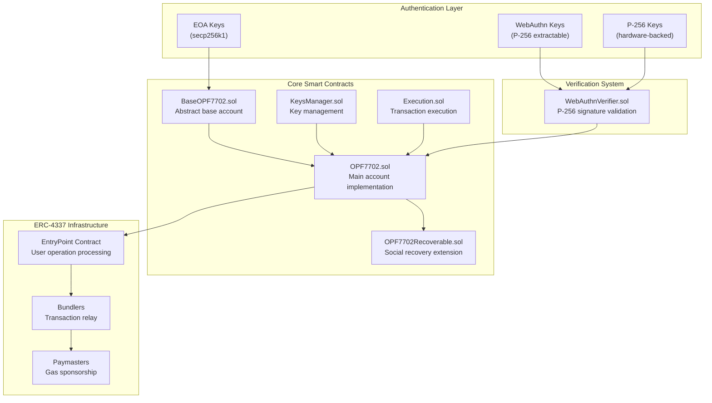
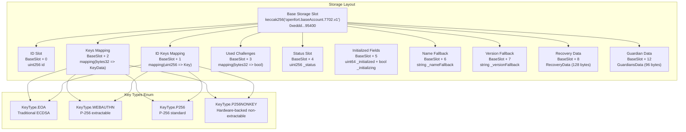
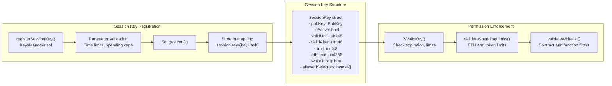

# Openfort EIP-7702 Architecture

<p align="center">
  
</p>


This document provides a comprehensive overview of the Openfort EIP-7702 Smart Accounts system—a production-ready implementation that combines EIP-7702 and ERC-4337 standards to deliver zero-deployment-cost accounts with multi-scheme key support (EOA, WebAuthn, P-256), policy-gated session management, ERC-7821 batch execution, guardian-based recovery, and WebAuthn authentication integration.

## Table of Contents

- [Repository layout (high-level)](#repository-layout)
- [System Purpose](#system-purpose)
- [Core Architecture](#core-architecture)
  - [System Component Overview](#system-component-overview)
  - [Smart Contract Components](#smart-contract-components)
- [Core contracts & responsibilities](#core-contracts--responsibilities)
  - [BaseOPF7702](#baseopf7702)
  - [KeysManager](#keysmanager)
  - [Execution (ERC-7821-style)](#execution)
  - [OPF7702 (4337 + 1271 + call-gating)](#opf7702)
  - [OPF7702Recoverable (guardians + EIP-712)](#opf7702recoverable)
  - [OPFMain (concrete wallet)](#opfmain-concrete-wallet)
- [EIP-7702 Storage Architecture](#eip-7702-storage-architecture)
- [Key Features](#key-features)
  - [Session Key System](#session-key-system)
- [GasPolicy (per-session budgets)](#gaspolicy)
- [Call-data expectations & examples](#callData-expectations-and-examples)


TL;DR

* OPFMain is the concrete account. It stacks:

    - `OPF7702Recoverable` → guardian recovery + EIP‑712 + initialization.

    - `OPF7702` → ERC‑4337 signature/permission pipeline + ERC‑1271.

    - `Execution` → ERC‑7821 batch executor (single batch, batch+opData, batch‑of‑batches).

    - `KeysManager` → key registry, spending limits, whitelists, session quotas.

    - `BaseOPF7702` → EntryPoint/WebAuthnVerifier/GasPolicy wiring, ERC‑165/777/721/1155 holders, storage helpers.

* `Signature` schemes: EOA (secp256k1), WebAuthn (P‑256), P‑256 raw, P‑256NONKEY (pre‑SHA‑256 for non‑extractable keys).

* `Sessions`: limit‑bounded keys (limit>0) get GasPolicy budgets and enforced whitelists/selectors/token limits.

* `Recovery`: guardians co‑sign an EIP‑712 digest to rotate the master key (limit==0) after time locks.

* `EIP‑7702`: upgradeProxyDelegation() to rotate logic behind an EIP‑7702 authority (via Solady LibEIP7702).

## Repository layout
```ts
src/
  core/
    BaseOPF7702.sol        # Base 4337 account + infra wiring
    KeysManager.sol        # Registry for keys + limits + whitelists
    Execution.sol          # ERC‑7821 batch executor (modes 1/2/3)
    OPF7702.sol            # 4337 validation + ERC‑1271 + call gating
    OPF7702Recoverable.sol # Guardians + EIP‑712 + recovery state machine
    OPFMain.sol            # Concrete wallet, adds EIP‑7702 proxy upgrade
  interfaces/              # Narrow, audit‑friendly surfaces
  libs/                    # P‑256, Base64, hashing, validation helpers
  utils/                   # ERC‑7201 storage view, GasPolicy, verifiers
  ```

## System Purpose
The Openfort EIP-7702 Smart Accounts system addresses key limitations in traditional wallet experiences by providing:

* Zero-deployment accounts using EIP-7702 delegation without requiring deployment transactions
* Advanced authentication supporting EOA signatures, WebAuthn/Passkeys, and P-256 cryptographic keys
* Session key management with fine-grained permissions, spending limits, and time-based controls
* Social recovery through guardian-based mechanisms
* ERC-4337 compatibility for seamless integration with account abstraction infrastructure
* The system enables users to interact with blockchain applications using familiar authentication methods (biometrics, hardware keys) while maintaining full control over their accounts and permissions.

## Core Architecture
The system is built on a modular architecture that separates concerns across multiple smart contracts, enabling flexible deployment and upgrade patterns.

### System Component Overview


### Smart Contract Components
The system consists of several interconnected smart contracts, each handling specific responsibilities:


| **Contract** | **Purpose** | **Key Functions** |
|--------------|-------------|-------------------|
| `BaseOPF7702` | Abstract base providing ERC-4337 IAccount interface and signature validation | `validateUserOp()`, `_validateSignature()` |
| `KeysManager` | Key registration, validation, and permission enforcement | `registerSessionKey()`, `isValidKey()`, `revokeKey()` |
| `Execution` | Stateless transaction execution with batch support | `execute()`, `executeBatch()` |
| `OPF7702` | Main account implementation combining execution and key management | `initialize()`, `registerKey()` |
| `OPF7702Recoverable` | Social recovery extension with guardian management | `proposeGuardian()`, `executeRecovery()` |

## Core contracts & responsibilities
### BaseOPF7702
Inherits: `BaseAccount (4337)`, `ERC721Holder`, `ERC1155Holder`, `IERC777Recipient`.

* Immutables:

    - `ENTRY_POINT` → 4337 singleton.

    - `WEBAUTHN_VERIFIER` → on‑chain P‑256/WebAuthn verifier.

    - `GAS_POLICY` → per‑session budget validator.

* Admin (self or EntryPoint only):

    - `setEntryPoint(address)` (via `UpgradeAddress` lib)

    - `setWebAuthnVerifier(address)`

* Helpers:

    - `entryPoint()` and `webAuthnVerifier()` read through UpgradeAddress indirection.

    - `supportsInterface` covers: ERC‑165, IAccount, ERC‑1271, ERC‑7821, ERC‑721/1155 receivers, ERC‑777 recipient.

    - `_clearStorage()` wipes the account’s custom storage layout (incl. recovery/guardian slots) for clean re‑init flows.

    - `_requireForExecute()` gates admin paths to `address(this)` or `entryPoint()`.

## KeysManager

Stateful registry around keys and permissions.

* Key model (`IKey`):

    - `KeyType`: `EOA` | `WEBAUTHN` | `P256` | `P256NONKEY`.

    - `Key` = `{ pubKey(P‑256 x,y), eoaAddress, keyType }`.

    - `KeyData` (per keyId = keccak256(pubKey) or keccak256(eoa)): `{ isActive, validUntil/After, limit, masterKey, whitelisting, whitelist[address] => bool, spendTokenInfo{token,limit}, allowedSelectors[≤10], ethLimit }`.

    - Master key is `limit == 0` (Admin/Second Owner).

* Mappings: `idKeys[uint256] → Key`(index 0 holds the master key); `keys[bytes32 keyId] → KeyData`; `usedChallenges[bytes32]` (WebAuthn/P‑256 replay guard).

* Lifecycle:

    - `registerKey(Key, KeyReg)` → validates times, uniqueness; marks active; for session keys `(limit>0)` forces `whitelisting=true` and initializes GasPolicy budgets with `configId=keyId`.

    - Revocation / updates keep per‑key invariants tight (`ensureLimit`, `ensureValidTimestamps`).

* Encoding helpers (for 4337 userOp.signature):

    - `encodeWebAuthnSignature(...)` → `abi.encode(KeyType.WEBAUTHN, uv, authData, clientDataJSON, challengeIdx, typeIdx, r, s, pubKey)`

    - `encodeP256Signature(r,s,pubKey,keyType)` where keyType ∈ `{P256,P256NONKEY}` → `abi.encode(KeyType, abi.encode(r,s,pubKey))`

    - `encodeEOASignature(sig)` → `abi.encode(KeyType.EOA, sig)`

### Execution 
[(ERC‑7821‑style)](https://eips.ethereum.org/EIPS/eip-7821`)

Inherits: `KeysManager`, `ReentrancyGuard`.

* Modes (top 10‑byte word):

    - 1: `0x01000000000000000000…` → single flat `Call[]` batch.

    - 2: `0x01000000000078210001…` → flat `Call[]` plus opaque opData.

    - 3: `0x01000000000078210002…` → batch of batches (`bytes[]`), internally re‑runs as Mode‑2 per sub‑batch.

* Shape:

    - `Call` = `{ address target; uint256 value; bytes data; }`

    - Mode‑1: `executionData = abi.encode(Call[])`

    - Mode‑2: executionData = `abi.encode(Call[], bytes opData)` (opaque to executor; used by validators/policies)

    - Mode‑3: executionData = `abi.encode(bytes[] batches)`

* Guards: **`MAX_TX = 9`** calls (across recursion), structural length checks, reentrancy guard, low‑level bubble‑up of revert data.

### OPF7702 
(4337 + 1271 + call‑gating)

Inherits: `Execution`, `Initializable`.

* 4337 hook: overrides `_validateSignature(userOp, userOpHash)` → dispatch by `KeyType`:

    - EOA → `ECDSA.recover(userOpHash, sig)`; if signer is this account or master key → accept.

    - WEBAUTHN → decode full payload, reject reused `userOpHash` in `usedChallenges`, `IWebAuthnVerifier.verifySignature(...)`, then permission checks.

    - P256 / P256NONKEY → for NONKEY pre‑hash `userOpHash` with SHA‑256, then `P256.verifySignature` → permission checks.

    - On success → return `_packValidationData(false, validUntil, validAfter);` else `SIG_VALIDATION_FAILED`.

* Permission check: `isValidKey(callData, sKey)` only authorizes the account’s own `execute(bytes32,bytes)` selector, and delegates to `_validateExecuteCall`:

    - Reject self‑calls (`call.target == address(this)`).

    - If master key → allow.

    - Else enforce for every `Call`:

        - `limit > 0` and decrement (`consumeQuota()`);

        - `ethLimit ≥` value and decrement;

        - `bytes4(innerData)` ∈ `allowedSelectors` (≤10 allowed);

        - If `spendTokenInfo.token == target` → `_validateTokenSpend` checks last‑arg amount;

        - `whitelisting` and `whitelist[target] == true`.

* ERC‑1271: `isValidSignature(hash, signature)`

    - 64/65‑byte → EOA path.

    - Otherwise → WebAuthn payload path (same verifier / challenge rules) → returns `0x1626ba7e` on success.

### OPF7702Recoverable 
(guardians + EIP‑712)

Inherits: `OPF7702`, `EIP712`, `ERC7201`.

* State:

    - `guardiansData`: `{ bytes32[] guardians; mapping(bytes32 => {isActive, index, pending}); lockUntil }`.

    - `recoveryData`: `{ Key key; uint64 executeAfter; uint32 guardiansRequired; }`.

* Parameters (immutable at deploy):

    - `recoveryPeriod` (cool‑down before execute), `lockPeriod` (wallet lock duration after recovery start), `securityPeriod` (add/remove delay), securityWindow (execution window).

* Flows:

    - Guardian add/remove

        - `proposeGuardian(guardianId)` / `proposeGuardianRemoval(guardianId)` → set `pending = now + securityPeriod`.

        - After `securityPeriod` and within `securityWindow` → `acceptGuardian()` / `acceptGuardianRemoval()` to finalize.

    - Start recovery (guardian‑only):

        - `startRecovery(Key recoveryKey)` → lock wallet, set `executeAfter = now + recoveryPeriod`, snapshot `guardiansRequired`, store target `recoveryKey` (EOA/WebAuthn allowed; P‑256 keys are rejected for recovery ownership).

    - Complete recovery:

        - After `executeAfter` → `completeRecovery(bytes[] signatures)`.

        - Verifies sorted unique guardian signatures over `getDigestToSign()` (EIP‑712), checks quorum, then:

            1. Delete old master key (`idKeys[0]` & `keys[mkId]`).

            2. Install `recoveryKey` as new master (sets `validUntil=max`, `validAfter=0`, `limit=0`, `whitelisting=false`).

            3. Clear lock.

* Cancel/lock control: `cancelRecovery()` (self/admin), `lock()/unlock()` time locks.

### OPFMain (concrete wallet)
Binds the stack and exposes EIP‑7702 authority upgrade:
```ts
function upgradeProxyDelegation(address newImplementation) external {
  _requireForExecute();
  LibEIP7702.upgradeProxyDelegation(newImplementation);
}
```
Note: If the authority is delegated directly (not via an EIP‑7702 proxy), upgrades won’t take effect until the authority is redelegated to a compliant proxy.

## EIP-7702 Storage Architecture

* Namespace: `"openfort.baseAccount.7702.v1"`.

* Root slot (CUSTOM_STORAGE_ROOT): `0xeddd…95400` (see `ERC7201.sol`).

* `BaseOPF7702._clearStorage()` zeroes known sub‑ranges (incl. guardian/recovery structs) to enable safe re‑initialization in advanced deployments.



## Key Features

### Session Key System
Session keys provide temporary, restricted access to smart accounts with customizable permissions. The system supports multiple key types and enforcement mechanisms:

* Key IDs (`KeyHashLib`):

    - EOA: `keccak256(abi.encodePacked(eoa))`.

    - WebAuthn/P‑256: `keccak256(abi.encodePacked(pubKey.x, pubKey.y))`.

    - Challenge replay protection: `usedChallenges[userOpHash]` is set on successful verification for WebAuthn/P‑256 userOps (and 1271), preventing replay.



## GasPolicy 
(per‑session budgets)


* Keyed by (`configId=keyId, account`). Only the account itself may mutate usage (`msg.sender == userOp.sender`).

* Budgets: `gasLimit`, `costLimit` (wei), `perOpMaxCostWei`, `txLimit`, with optional penalty shaping (BPS) across `callGas` + `postOp`.

* Validation path: `checkUserOpPolicy(id, userOp)`:

    - Decodes envelope (`preVerificationGas`, `verificationGasLimit`, `callGasLimit`, optional paymaster legs), computes worst‑case wei via `userOp.gasPrice()`.

    - Ensures usage ≤ budgets; then atomically accounts (`gasUsed`, `costUsed`, `txUsed`).

* Initialization:

    - Auto: `KeysManager._addKey` calls `initializeGasPolicy(account=this, configId=keyId, limit)` for session keys (limit>0).

    - Manual: `initializeGasPolicy(account, configId, initData)` to set exact budgets.

## CallData expectations and examples

4337 `userOp.signature` envelope

* Always ABI‑encoded as `(KeyType, bytes payload)`.

    - EOA: `payload = ecdsaSig` (64/65 bytes).

    - WebAuthn: `payload = abi.encode(uv, authenticatorData, clientDataJSON, challengeIdx, typeIdx, r, s, PubKey)`.

    - P256 / P256NONKEY: `payload = abi.encode(r, s, PubKey)` (NONKEY path pre‑SHA‑256s the digest before verify).

* ERC‑7821 execute(mode, executionData)
```ts
// Single batch (mode 1)
bytes memory executionData = abi.encode(
  Call[]({
    Call({ target: to1, value: v1, data: d1 }),
    Call({ target: to2, value: v2, data: d2 })
  })
);
account.execute(MODE_1, executionData);

// Single batch + opData (mode 2)
bytes memory executionData = abi.encode(calls, opData);
account.execute(MODE_2, executionData);

// Batch of batches
```