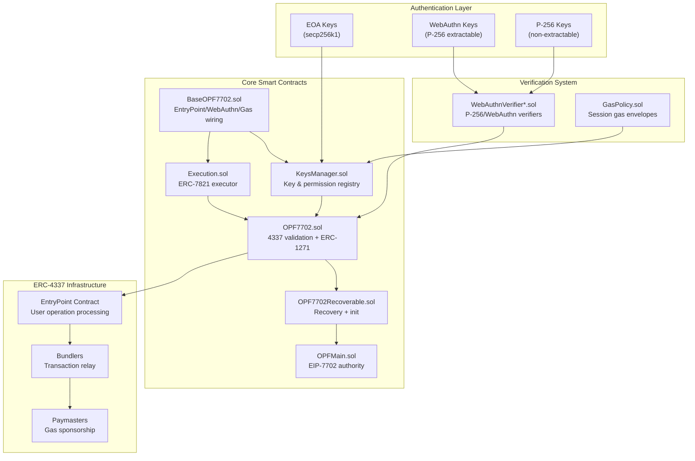
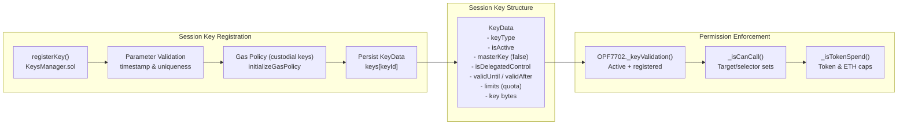

# Openfort EIP-7702 Architecture

<p align="center">
  
</p>


This document provides a comprehensive overview of the Openfort EIP-7702 Smart Accounts system—a production-ready implementation that combines EIP-7702 and ERC-4337 standards to deliver zero-deployment-cost accounts with multi-scheme key support (EOA, WebAuthn, P-256), policy-gated session management, ERC-7821 batch execution, guardian-based recovery, and WebAuthn authentication integration.

## Table of Contents

- [Repository layout (high-level)](#repository-layout)
- [System Purpose](#system-purpose)
- [Core Architecture](#core-architecture)
  - [System Component Overview](#system-component-overview)
  - [Smart Contract Components](#smart-contract-components)
- [Core contracts & responsibilities](#core-contracts--responsibilities)
  - [BaseOPF7702](#baseopf7702)
  - [KeysManager](#keysmanager)
  - [Execution (ERC-7821-style)](#execution)
  - [OPF7702 (4337 + 1271 + call-gating)](#opf7702)
  - [OPF7702Recoverable (guardians + EIP-712)](#opf7702recoverable)
  - [OPFMain (concrete wallet)](#opfmain-concrete-wallet)
- [EIP-7702 Storage Architecture](#eip-7702-storage-architecture)
- [Key Features](#key-features)
  - [Session Key System](#session-key-system)
- [GasPolicy (per-session budgets)](#gaspolicy)
- [Call-data expectations & examples](#callData-expectations-and-examples)


TL;DR

* OPFMain is the concrete account. It stacks:

    - `OPF7702Recoverable` → guardian recovery + EIP‑712 + initialization.

    - `OPF7702` → ERC‑4337 signature/permission pipeline + ERC‑1271.

    - `Execution` → ERC‑7821 batch executor (single batch, batch+opData, batch‑of‑batches).

    - `KeysManager` → key registry, selector permissions, spend limits, session quotas.

    - `BaseOPF7702` → EntryPoint/WebAuthnVerifier/GasPolicy wiring, ERC‑165/777/721/1155 holders, storage helpers.

* `Signature` schemes: EOA (secp256k1), WebAuthn (P‑256), P‑256 raw, P‑256NONKEY (pre‑SHA‑256 for non‑extractable keys).

* `Sessions`: `limits > 0` triggers quota tracking; custodial keys initialise GasPolicy envelopes while permissions/spend caps are configured via `setCanCall`/`setTokenSpend`.

* `Recovery`: guardians co‑sign an EIP‑712 digest to rotate the master key (limit==0) after time locks.

* `EIP‑7702`: upgradeProxyDelegation() to rotate logic behind an EIP‑7702 authority (via Solady LibEIP7702).

## Repository layout
```ts
src/
  core/
    BaseOPF7702.sol        # Base 4337 account + infra wiring
    KeysManager.sol        # Registry for keys + limits + permissions
    Execution.sol          # ERC‑7821 batch executor (modes 1/2/3)
    OPF7702.sol            # 4337 validation + ERC‑1271 + call gating
    OPF7702Recoverable.sol # Guardians + EIP‑712 + recovery state machine
    OPFMain.sol            # Concrete wallet, adds EIP‑7702 proxy upgrade
  interfaces/              # Narrow, audit‑friendly surfaces
  libs/                    # P‑256, Base64, hashing, validation helpers
  utils/                   # ERC‑7201 storage view, GasPolicy, verifiers
  ```

## System Purpose
The Openfort EIP-7702 Smart Accounts system addresses key limitations in traditional wallet experiences by providing:

* Zero-deployment accounts using EIP-7702 delegation without requiring deployment transactions
* Advanced authentication supporting EOA signatures, WebAuthn/Passkeys, and P-256 cryptographic keys
* Session key management with fine-grained permissions, spending limits, and time-based controls
* Social recovery through guardian-based mechanisms
* ERC-4337 compatibility for seamless integration with account abstraction infrastructure
* The system enables users to interact with blockchain applications using familiar authentication methods (biometrics, hardware keys) while maintaining full control over their accounts and permissions.

## Core Architecture
The system is built on a modular architecture that separates concerns across multiple smart contracts, enabling flexible deployment and upgrade patterns.

### System Component Overview


### Smart Contract Components
The system consists of several interconnected smart contracts, each handling specific responsibilities:


| **Contract** | **Purpose** | **Representative Functions** |
|--------------|-------------|---------------------------|
| `BaseOPF7702` | Anchors EntryPoint/WebAuthn/GasPolicy addresses and enforces privileged-call guards | `setEntryPoint()`, `setWebAuthnVerifier()`, `setGasPolicy()`, `_requireForExecute()` |
| `KeysManager` | Key lifecycle, execution permissions, and spend-policy bookkeeping | `registerKey()`, `setCanCall()`, `setTokenSpend()`, `updateKeyData()`, `revokeKey()` |
| `Execution` | ERC-7821-inspired executor with flat and recursive batch modes | `execute(bytes32,bytes)`, `supportsExecutionMode()` |
| `OPF7702` | ERC-4337 `_validateSignature` router + ERC-1271 implementation | `_validateSignature()`, `isValidSignature()`, `startOfSpendPeriod()` |
| `OPF7702Recoverable` | Recovery wrapper integrating guardians, initialization, and EIP-712 digests | `initialize()`, `startRecovery()`, `completeRecovery()`, `getDigestToInit()` |
| `OPFMain` | Concrete EIP-7702 authority with upgrade hook | `upgradeProxyDelegation()` |

## Core contracts & responsibilities
### BaseOPF7702
Inherits: `BaseAccount (4337)`, `ERC721Holder`, `ERC1155Holder`, `IERC777Recipient`.

* Immutables:

    - `ENTRY_POINT`, `WEBAUTHN_VERIFIER`, `GAS_POLICY` – default singletons resolved through `UpgradeAddress`.

* Admin surface (restricted to `address(this)` or `entryPoint()`):

    - `setEntryPoint(address)` / `setWebAuthnVerifier(address)` / `setGasPolicy(address)`; each emission is proxied through `UpgradeAddress`.

* Runtime helpers:

    - `entryPoint()`, `webAuthnVerifier()`, and `gasPolicy()` dereference the override slots, enabling delegation without redeploying accounts.

    - `supportsInterface()` covers ERC‑165, `IAccount`, `IERC1271`, ERC‑7821 (`supportsExecutionMode`), ERC‑721/1155 receivers, and ERC‑777 recipient.

    - `_requireForExecute()` and `_requireFromEntryPoint()` gate internal privileged flows used by `Execution`/`OPFMain`.

    - `_clearStorage()` zeroes the ERC‑7201 namespace (including guardian/recovery structs) to support controlled re‑initialization scenarios.

## KeysManager

Stateful registry around keys, execution permissions, and spend policies.

* Key model (`IKey`):

    - `KeyType`: `EOA`, `WEBAUTHN`, `P256`, `P256NONKEY` (pre-hash challenge path).

    - `KeyData` (per `keyId = computeKeyId(key)`): `{ keyType, bool isActive, bool masterKey, bool isDelegatedControl, uint48 validUntil, uint48 validAfter, uint48 limits, bytes key }`.

    - Master keys are identified by `limits == 0`; non-master (“session”) keys consume quotas via `limits`.

    - `KeyControl`: `Self` or `Custodial`. Custodial keys delegate gas budgeting to `GasPolicy` at registration time.

* Storage: `id` (monotonic counter), `idKeys[id] → keyId`, `keys[keyId] → KeyData`, `permissions[keyId]` (packed target+selector set), `spendStore[keyId]` (token spend map).

* Lifecycle helpers:

    - `registerKey(KeyDataReg)` validates timestamps, uniqueness, and stores the raw key bytes. For custodial keys it initializes a gas envelope via `GasPolicy.initializeGasPolicy` using `limits` as the session bound.

    - `setCanCall(keyId, target, selector, can)` maintains per-key execution permissions with wildcard support (`ANY_TARGET`, `ANY_FN_SEL`).

    - `setTokenSpend`, `updateTokenSpend`, `removeTokenSpend` manage ERC-20/ETH spend caps by period; `SpendPeriod` enumerates minute → forever.

    - `updateKeyData`, `pauseKey`, `unpauseKey`, and `revokeKey` offer lifecycle management without disturbing stored permissions unless explicitly cleared.

### Execution 
[(ERC‑7821‑style)](https://eips.ethereum.org/EIPS/eip-7821)

Inherits: `KeysManager`, `ReentrancyGuard`.

* Modes (high 10 bytes):

    - `mode_1 = 0x01000000000000000000…` – flat `Call[]` batch.

    - `mode_3 = 0x01000000000078210002…` – batch-of-batches (`bytes[]`), each recursively processed as `mode_1`.

* Payloads:

    - `Call` struct: `{ address target; uint256 value; bytes data; }`.

    - Mode 1: `abi.encode(Call[])`.

    - Mode 3: `abi.encode(bytes[] innerBatches)`.

* Guards:

    - `MAX_TX = 9` calls enforced across recursion depth (`_checkLength`, loop counter check).

    - Reentrancy protected via `nonReentrant` modifier.

    - Low-level calls bubble revert data (`_execute`).

### OPF7702 
(ERC‑4337 `_validateSignature` + ERC‑1271 + call gating)

Inherits: `Execution`, `Initializable`.

* `_validateSignature(userOp, userOpHash)` decodes `(KeyType sigType, bytes payload)` and routes:

    - `KeyType.EOA` → `ECDSA.recover`; success if signer equals the account or a registered key (master keys short‑circuit to success).

    - `KeyType.WEBAUTHN` → decode WebAuthn tuple, call `IWebAuthnVerifier.verifySignature`, then run `_keyValidation` and per-call guards.

    - `KeyType.P256` / `KeyType.P256NONKEY` → verify via `IWebAuthnVerifier.verifyP256Signature`; NONKEY mode hashes with SHA-256 first.

    - For custodial keys (`isDelegatedControl`) the contract calls `GasPolicy.checkUserOpPolicy` and rejects if the policy reports non-zero.

    - On success returns `_packValidationData(false, validUntil, validAfter)`; otherwise `SIG_VALIDATION_FAILED`.

* Execution authorisation:

    - `isValidKey(callData, sKey)` only recognises the wallet’s own `execute(bytes32,bytes)` selector and defers to `_validateExecuteCall`.

    - `_validateExecuteCall` decodes batches (mode 1 or 3) and enforces for each `Call`:

        - No self-calls (`target != address(this)`).

        - Master keys bypass additional checks; non-master keys consume `limits` via `consumeQuota()`.

        - `_isCanCall` verifies packed `(target, selector)` permissions with wildcard support (`ANY_TARGET`, `ANY_FN_SEL`, `EMPTY_CALLDATA_FN_SEL`).

        - `_isTokenSpend` applies spend caps tracked in `spendStore` (native transfers map to `NATIVE_ADDRESS`).

        - Successful checks leave the call authorised; any failure aborts validation.

* ERC‑1271: `isValidSignature(hash, signature)` delegates to `_validateEOASignature` (64/65‑byte) or `_validateWebAuthnSignature` (ABI-encoded payload) and returns `0x1626ba7e` on success.

### OPF7702Recoverable 
(guardians + EIP‑712)

Inherits: `OPF7702`, `EIP712`, `ERC7201`.

* Constructor parameters: guardian timing (`recoveryPeriod`, `lockPeriod`, `securityPeriod`, `securityWindow`) and the `RECOVERY_MANAGER` address (external `SocialRecoveryManager`).

* State held in the account:

    - `guardiansData`: `{ bytes32[] guardians; mapping(bytes32 => { bool isActive; uint256 index; uint256 pending; }); uint256 lock; }`.

    - `recoveryData`: `{ KeyDataReg key; uint64 executeAfter; uint32 guardiansRequired; }`.

* Workflow highlights:

    - The account defers guardian book-keeping to `SocialRecoveryManager` during `initialize`, `startRecovery`, and `completeRecovery`, ensuring consistent storage across upgrades.

    - `initialize(...)` registers the master key (must satisfy `_masterKeyValidation` – `limits == 0`, `KeyType` not P256/P256NONKEY, `KeyControl.Self`), optionally registers a session key, and seeds the guardian set.

    - Guardian add/remove proposals are timestamped (`pending`) and must be confirmed within `securityWindow` once `securityPeriod` elapses.

    - `startRecovery(recoveryKey)` (guardian-only) locks the wallet, snapshots required quorum (`ceil(guardianCount / 2)`), and stores the new master key proposal (EOA/WebAuthn only).

    - `completeRecovery(signatures)` verifies ordered guardian signatures over the EIP-712 digest (`getDigestToSign()`), then wipes the old master key slot and installs the new one before clearing the lock.

    - `cancelRecovery()` unlocks and clears pending recovery data when invoked by the account.

### OPFMain (concrete wallet)
Binds the stack and exposes EIP‑7702 authority upgrade:
```ts
function upgradeProxyDelegation(address newImplementation) external {
  _requireForExecute();
  LibEIP7702.upgradeProxyDelegation(newImplementation);
}
```
Note: If the authority is delegated directly (not via an EIP‑7702 proxy), upgrades won’t take effect until the authority is redelegated to a compliant proxy.

## EIP-7702 Storage Architecture

* Namespace: `"openfort.baseAccount.7702.v1"`.

* Root slot (CUSTOM_STORAGE_ROOT): `0xeddd…95400` (see `ERC7201.sol`).

* `BaseOPF7702._clearStorage()` zeroes known sub‑ranges (incl. guardian/recovery structs) to enable safe re‑initialization in advanced deployments.

```mermaid
flowchart TD
    subgraph "Storage Layout"
        BaseSlot["Base Storage Slot<br/>keccak256('openfort.baseAccount.7702.v1')<br/>0xeddd...95400"]
        
        IdSlot["ID Slot<br/>BaseSlot + 0<br/>uint256 id"]
        IdKeysSlot["ID Keys Mapping<br/>BaseSlot + 1<br/>mapping(uint256 => bytes32)"]
        KeysSlot["Keys Mapping<br/>BaseSlot + 2<br/>mapping(bytes32 => KeyData)"]
        PermissionsSlot["Execute Permissions<br/>BaseSlot + 3<br/>mapping(bytes32 => set)"]
        SpendSlot["Spend Store<br/>BaseSlot + 4<br/>mapping(bytes32 => SpendStorage)"]
        StatusSlot["Status Slot<br/>BaseSlot + 5<br/>uint256 _status"]
        InitSlot["Init Flags<br/>BaseSlot + 6<br/>uint64 _initialized / bool _initializing"]
        NameSlot["Name Fallback<br/>BaseSlot + 7<br/>string _nameFallback"]
        VersionSlot["Version Fallback<br/>BaseSlot + 8<br/>string _versionFallback"]
        RecoverySlot["Recovery Data<br/>BaseSlot + 9"]
        GuardianSlot["Guardian Data<br/>BaseSlot + 13"]
    end
    
    subgraph "Key Types Enum"
        EOAType["KeyType.EOA<br/>Traditional ECDSA"]
        WebAuthnType["KeyType.WEBAUTHN<br/>P-256 extractable"]
        P256Type["KeyType.P256<br/>P-256 standard"]
        P256NonKeyType["KeyType.P256NONKEY<br/>Hardware-backed non-extractable"]
    end

    %% Storage slot connections
    BaseSlot --> IdSlot
    BaseSlot --> IdKeysSlot
    BaseSlot --> KeysSlot
    BaseSlot --> PermissionsSlot
    BaseSlot --> SpendSlot
    BaseSlot --> StatusSlot
    BaseSlot --> InitSlot
    BaseSlot --> NameSlot
    BaseSlot --> VersionSlot
    BaseSlot --> RecoverySlot
    BaseSlot --> GuardianSlot
    
    %% Key mappings to key types
    KeysSlot --> EOAType
    KeysSlot --> WebAuthnType
    KeysSlot --> P256Type
    KeysSlot --> P256NonKeyType
    
    IdKeysSlot --> EOAType
    IdKeysSlot --> WebAuthnType
    IdKeysSlot --> P256Type
    IdKeysSlot --> P256NonKeyType
```



## Key Features

### Session Key System
Session keys provide temporary, restricted access to smart accounts with customizable permissions. The system supports multiple key types and enforcement mechanisms:

* Key IDs (`KeyHashLib`):

    - EOA: `keccak256(abi.encodePacked(eoa))`.

    - WebAuthn/P‑256: `keccak256(abi.encodePacked(pubKey.x, pubKey.y))`.

    - Replay protection relies on ERC-4337 nonces and guardian-enforced digests; there is no per-hash `usedChallenges` mapping in the current implementation.



## GasPolicy 
(per‑session budgets)


* Namespacing: budgets are stored per `(configId = keyId, account)`; the policy can only mutate state when `msg.sender == userOp.sender` to prevent griefing.

* Budgets: a single `gasLimit` counter (gas units) per session plus the live `gasUsed` tally. Auto-initialisation derives the budget from default leg estimates × `limits`; manual paths accept explicit 128-bit budgets.

* Validation path: `checkUserOpPolicy(id, userOp)` decodes the ERC-4337 envelope (`preVerificationGas`, verification gas, call gas, optional paymaster legs) and sums them with a safety margin (`SAFETY_BPS`). If the remaining budget covers the envelope, the function increments `gasUsed` and returns `VALIDATION_SUCCESS`.

* Initialization:

    - Auto: custodial keys (`KeyControl.Custodial`) trigger `initializeGasPolicy(address(this), keyId, limits)` inside `_addKey`.

    - Manual: accounts can call either overload of `initializeGasPolicy` to seed bespoke budgets.

## CallData expectations and examples

4337 `userOp.signature` envelope

* Always ABI‑encoded as `(KeyType, bytes payload)`.

    - EOA: `payload = ecdsaSig` (64/65 bytes).

    - WebAuthn: `payload = abi.encode(uv, authenticatorData, clientDataJSON, challengeIdx, typeIdx, r, s, PubKey)`.

    - P256 / P256NONKEY: `payload = abi.encode(r, s, PubKey)` (NONKEY path pre‑SHA‑256s the digest before verify).

* ERC‑7821 execute(mode, executionData)
```ts
// Single batch (mode 1)
bytes memory executionData = abi.encode(
  Call[]({
    Call({ target: to1, value: v1, data: d1 }),
    Call({ target: to2, value: v2, data: d2 })
  })
);
account.execute(MODE_1, executionData);
```

```ts
// Batch of batches (mode 3)
bytes memory executionData = abi.encode(new bytes[](2));
account.execute(MODE_3, executionData);
```

> **Note:** Calls executed by non-master keys must conform to permissions configured via `setCanCall` and optional spend caps (`setTokenSpend`). Custodial keys additionally require sufficient gas budget in `GasPolicy`.
