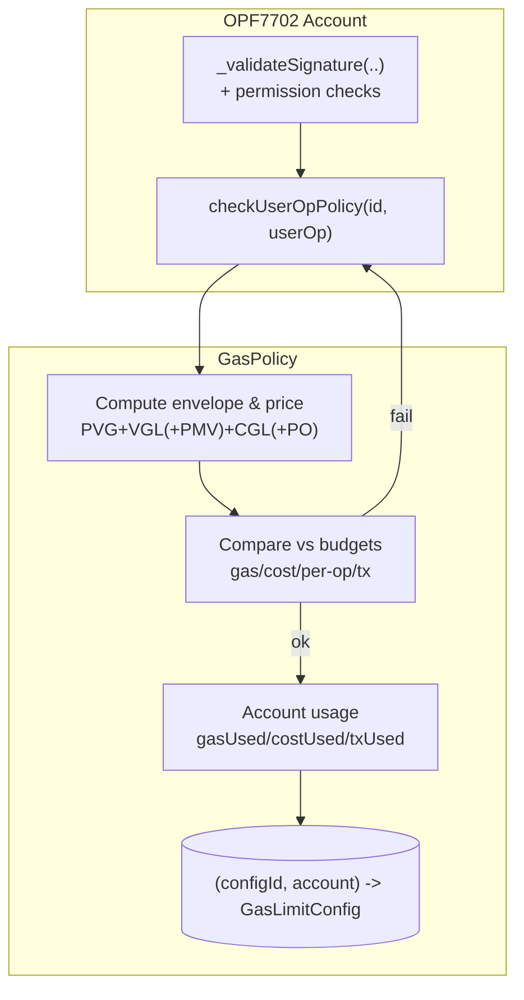
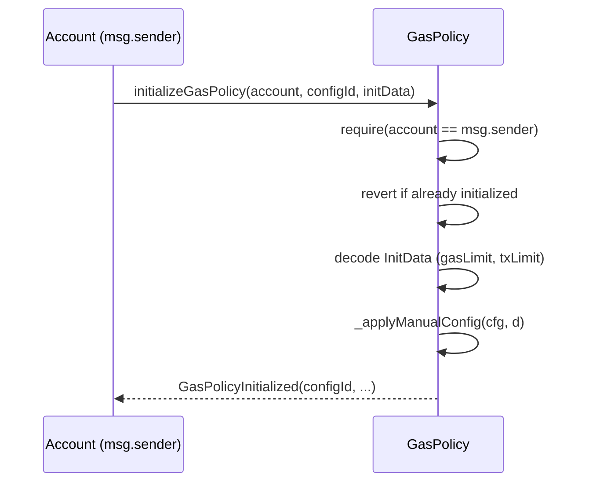
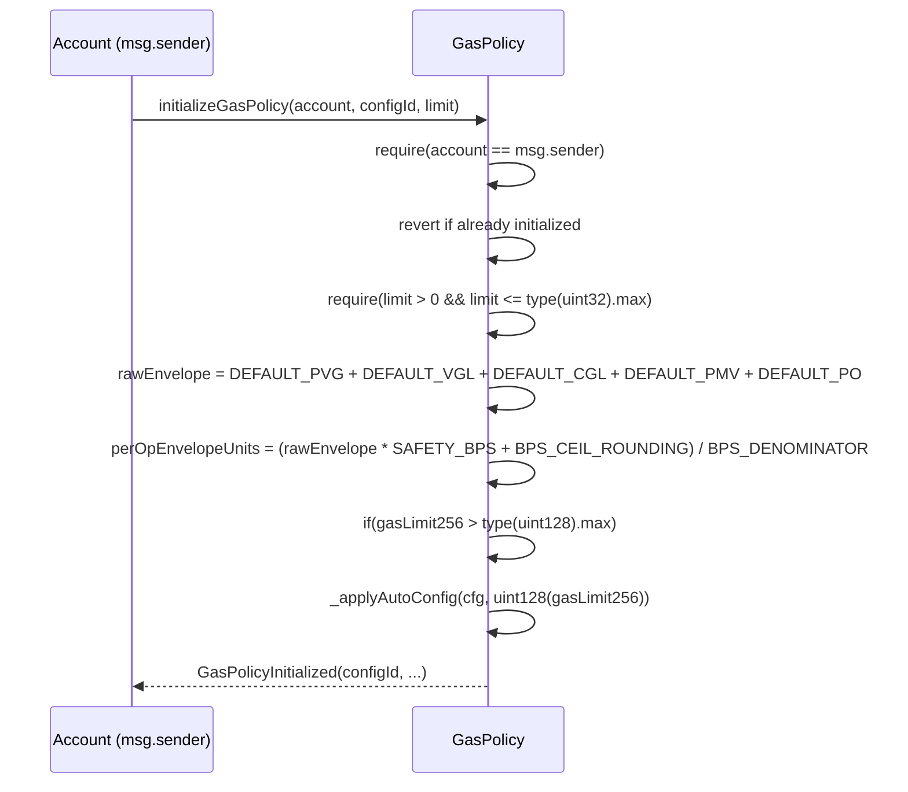
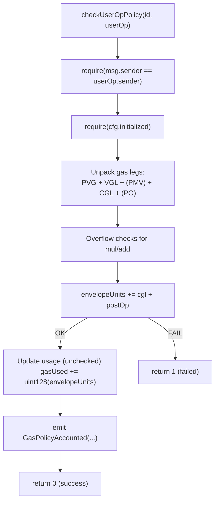

# Gas Policy Module

Enforces **per-session gas/cost/tx budgets** for EIP-7702 accounts and ERC-4337 Smart Contract Accounts. The policy validates a `PackedUserOperation`’s **gas envelope** and **worst-case wei** before execution, then **atomically accounts** usage against the session’s limits.

> Storage is keyed by **(configId, account)** where `configId` is typically the session key id (`keccak256(pubkey parts)`).

---

## Table of Contents

- [Overview](#overview)
- [Architecture](#architecture)
  - [Components & Data Flow](#components--data-flow)
  - [Data Structures](#data-structures)
- [Initialization](#initialization)
  - [Manual Initialization](#manual-initialization)
  - [Auto Initialization](#auto-initialization)
- [Validation Flow](#validation-flow)
  - [Gas Envelope](#gas-envelope)
  - [Pricing & Penalty Math](#pricing--penalty-math)
  - [Guards & Accounting](#guards--accounting)
- [API Reference](#api-reference)
- [Events](#events)
- [Errors](#errors)
- [Security Model](#security-model)
- [Recommended Defaults & Ranges](#recommended-defaults--ranges)
- [Examples](#examples)

---

## Overview

- **Who calls it?** The **account itself** (i.e., `msg.sender == userOp.sender`). This prevents third-party griefing.
- **What it checks?** Gas envelope (`PVG+VGL+PMV+CGL+PO`), worst-case wei with price headroom.
- **What it limits?**  
  - `gasLimit` / `costLimit` — cumulative ceilings  
  - `txLimit` — number of ops
- **What it updates?** `gasUsed`, `costUsed`, `txUsed` — **optimistically** on success.

---

## Architecture

### Components & Data Flow



### Data Structures
```mermaid
erDiagram
  GasLimitConfig {
    uint128 gasLimit      "Total gas units allowed"
    uint128 gasUsed       "Gas units consumed"
    bool    initialized   "Config active"
  }

  InitData {
      uint128 gasLimit;
      uint32 txLimit; // 0 = disabled
  }
```
GasLimitConfig is stored at gasLimitConfigs[configId][account].

## Initialization

#### Manual Initialization

Sets exact budgets settings.

#### Auto Initialization

Derives conservative budgets from defaults and the provided limit (allowed number of ops).

#### Validation Flow


#### Gas Envelope
	•	envelopeUnits = PVG + VGL + CGL + postOp (+ PMV if paymaster present)
	•	If paymasterAndData.length >= PAYMASTER_DATA_OFFSET, include PMV and PO.

#### Guards & Accounting
	•	Reject if any of:
	•	cfg.gasLimit > 0 && cfg.gasUsed + envelopeUnits > cfg.gasLimit
	•	nvelopeUnits > type(uint128).max
	•	On success, increment counters and emit GasPolicyAccounted.

### API Reference
| Function      | Signature                                                                                                              | Access              | Description                                                                                 |
|---------------|------------------------------------------------------------------------------------------------------------------------|---------------------|---------------------------------------------------------------------------------------------|
| Validate      | `checkUserOpPolicy(bytes32 id, PackedUserOperation userOp) returns (uint256)`                                          | Only `userOp.sender`| Validates & accounts against budgets. Returns `0` on success, `1` on failure.               |
| Init (manual) | `initializeGasPolicy(address account, bytes32 configId, bytes initData)`                                              | `account == msg.sender` | Decodes `InitData` and sets exact budgets. Fails if already initialized.                |
| Init (auto)   | `initializeGasPolicy(address account, bytes32 configId, uint256 limit)`                                               | `account == msg.sender` | Derives conservative budgets from defaults scaled by `limit`.                            |
| View (compact)| `getGasConfig(bytes32 configId, address userOpSender) view returns (uint128 gasLimit, uint128 gasUsed)` | Any                 | Compact snapshot.                                                                           |
| View (full)   | `getGasConfigEx(bytes32 configId, address userOpSender) view returns (GasLimitConfig)`                                 | Any                 | Full struct snapshot.                                                                       |
| ERC-165       | `supportsInterface(bytes4)`                                                                                            | Any                 | Supports `IERC165`, `IPolicy`, `IUserOpPolicy`.                                             |


## Security Model
	•	Call-site: Only the account may mutate its budgets (msg.sender == userOp.sender).
	•	No external calls in validation path; only reads/writes to the caller’s config slot.
	•	Overflow safety: explicit checks guard mul/add; uint128 bounds for cumulative counters.
	•	Paymaster handling: Includes paymaster legs only when paymasterAndData.length >= PAYMASTER_DATA_OFFSET.
	•	Deterministic accounting: optimistic counters updated only after all guards pass.

## Recommended Defaults & Ranges

These mirror constructor defaults and auto-init heuristics. Tune for your infra.

•	Safety multipliers
	•	SAFETY_BPS = +20% on the per-op gas envelope
•	Penalty
	•	DEFAULT_PENALTY_BPS = 10% on (CGL + PO)
	•	DEFAULT_PENALTY_THR = 40_000 gas
•	Per-op units (examples; pass via constructor): PVG/VGL/CGL/PMV/PO sized to your flows.

## Examples

1) Auto-initialize for a 20-tx session
```ts
bytes32 configId = keccak256(abi.encode(sessionPubKeyX, sessionPubKeyY));
gasPolicy.initializeGasPolicy(address(this), configId, 20);
```

2) Manual initialize with hard caps
```ts
GasLimitConfig.InitData memory d = GasLimitConfig.InitData({
  gasLimit:        8_000_000,     // total gas units
  txLimit:         20,            // max ops
});

bytes memory initData = abi.encode(d);
gasPolicy.initializeGasPolicy(address(this), configId, initData);
```

3) Validate & account inside your account’s validation hook
```ts
// In OPF7702._validateSignature(..)
if (isSessionKey) {
  uint256 code = IUserOpPolicy(GAS_POLICY).checkUserOpPolicy(configId, userOp);
  if (code != 0) return SIG_VALIDATION_FAILED;
}
```
