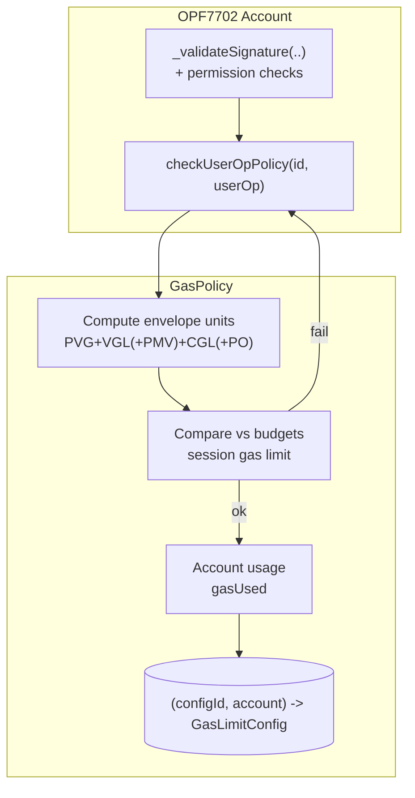
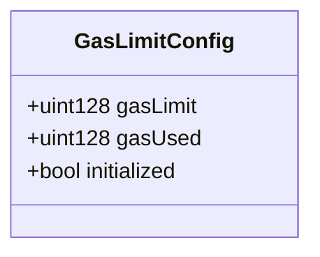
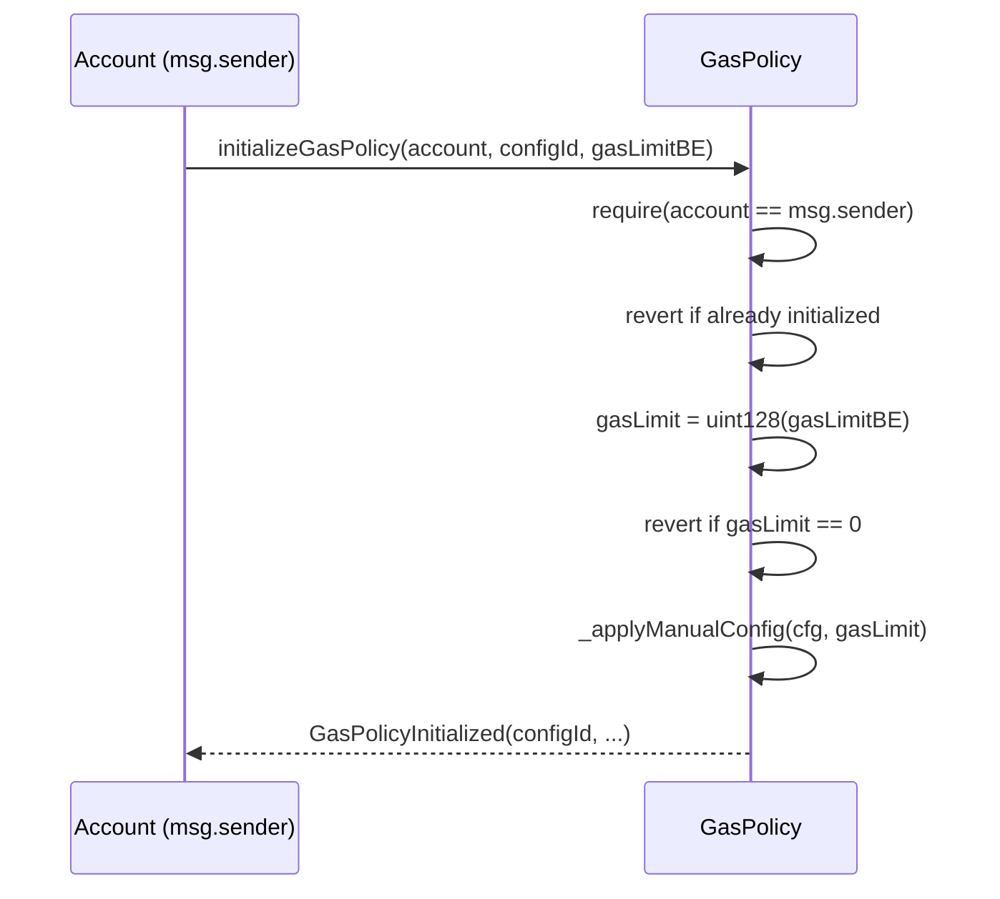
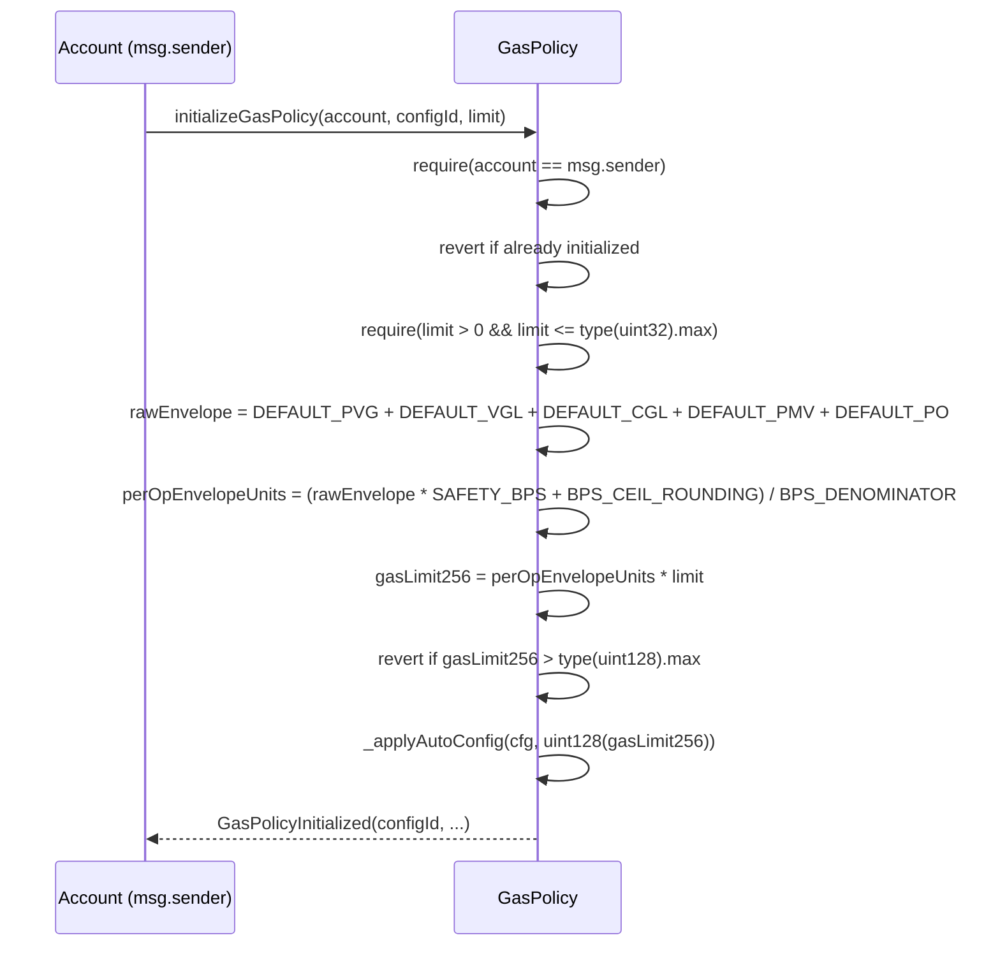

# Gas Policy Module

Enforces **per-session gas budgets** for EIP-7702 accounts and ERC-4337 Smart Contract Accounts. The policy validates a `PackedUserOperation`’s **gas envelope** before execution and then **atomically accounts** usage against the session’s limits.

> Storage is keyed by **(configId, account)** where `configId` is typically the session key id (`keccak256(pubkey parts)`).

---

## Table of Contents

- [Overview](#overview)
- [Architecture](#architecture)
  - [Components & Data Flow](#components--data-flow)
  - [Data Structures](#data-structures)
- [Initialization](#initialization)
  - [Manual Initialization](#manual-initialization)
  - [Auto Initialization](#auto-initialization)
- [Validation Flow](#validation-flow)
  - [Gas Envelope](#gas-envelope)
  - [Guards & Accounting](#guards--accounting)
- [API Reference](#api-reference)
- [Events](#events)
- [Errors](#errors)
- [Security Model](#security-model)
- [Recommended Defaults & Ranges](#recommended-defaults--ranges)
- [Examples](#examples)

---

## Overview

- **Who calls it?** The **account itself** (i.e., `msg.sender == userOp.sender`). This prevents third-party griefing.
- **What it checks?** Gas envelope (`PVG + VGL + (PMV) + CGL + (PO)`), including paymaster legs when present.
- **What it limits?** `gasLimit` — cumulative envelope units allowed across the session.
- **What it updates?** `gasUsed` — incremented optimistically once the envelope passes all guards.

---

## Architecture

### Components & Data Flow



### Data Structures

`GasLimitConfig` instances are stored at `gasLimitConfigs[configId][account]`.

## Initialization

#### Manual Initialization

Encodes an explicit 128-bit envelope budget; pass it as `bytes16` (for example `bytes16(uint128(8_000_000))`).

#### Auto Initialization

Derives conservative budgets from defaults and the provided limit (allowed number of ops). Guards against multiplication overflow and caps that exceed `uint128` via `GasPolicy_GasLimitHigh`.

#### Validation Flow

```mermaid
flowchart TD
  Start["checkUserOpPolicy(id, userOp)"]
  Sender["require(msg.sender == userOp.sender)"]
  Init["require(cfg.initialized)"]
  Aggregate["Accumulate envelopeUnits<br/>(PVG + VGL + CGL + postOp<br/>+ paymaster legs when present)"]
  Guards["Guard checks:<br/>- gasLimit == 0 &#124;&#124; gasUsed + envelopeUnits &#8804; gasLimit<br/>- envelopeUnits &#8804; type(uint128).max"]
  Account["Update usage (unchecked):<br/>gasUsed += uint128(envelopeUnits)"]
  Emit["emit GasPolicyAccounted(...)"]
  Ok["return 0 (success)"]
  Fail["return 1 (failed)"]

  Start --> Sender --> Init --> Aggregate --> Guards
  Guards -- OK --> Account --> Emit --> Ok
  Guards -- FAIL --> Fail
```


#### Gas Envelope
- envelopeUnits = PVG + VGL + CGL + postOp (+ PMV if paymaster present).
- If `paymasterAndData.length >= PAYMASTER_DATA_OFFSET`, include PMV and PO.

#### Guards & Accounting
- Reject if any of:
  - `cfg.gasLimit > 0 && cfg.gasUsed + envelopeUnits > cfg.gasLimit`
  - `envelopeUnits > type(uint128).max`
- On success, increment counters and emit `GasPolicyAccounted`.

### API Reference
| Function      | Signature                                                                                                              | Access              | Description                                                                                 |
|---------------|------------------------------------------------------------------------------------------------------------------------|---------------------|---------------------------------------------------------------------------------------------|
| Validate      | `checkUserOpPolicy(bytes32 id, PackedUserOperation userOp) returns (uint256)`                                          | Only `userOp.sender`| Validates & accounts against budgets. Returns `0` on success, `1` on failure.               |
| Init (manual) | `initializeGasPolicy(address account, bytes32 configId, bytes16 gasLimitBE)`                                          | `account == msg.sender` | Sets an explicit 128-bit envelope budget (fails on zero or reinit).                      |
| Init (auto)   | `initializeGasPolicy(address account, bytes32 configId, uint256 limit)`                                               | `account == msg.sender` | Derives conservative budgets from defaults scaled by `limit`.                            |
| View (compact)| `getGasConfig(bytes32 configId, address userOpSender) view returns (uint128 gasLimit, uint128 gasUsed)` | Any                 | Compact snapshot.                                                                           |
| View (full)   | `getGasConfigEx(bytes32 configId, address userOpSender) view returns (GasLimitConfig)`                                 | Any                 | Full struct snapshot.                                                                       |
| ERC-165       | `supportsInterface(bytes4)`                                                                                            | Any                 | Supports `IERC165`, `IPolicy`, `IUserOpPolicy`.                                             |


## Events
- `GasPolicyInitialized(bytes32 configId, address account, uint256 gasLimit, bool autoInit)` — emitted when a configuration is created (manual and auto paths both flag `autoInit = false` in the current implementation).
- `GasPolicyAccounted(bytes32 configId, address account, uint256 envelopeUnits, uint256 gasUsedTotal)` — emitted after successfully charging a UserOperation against the budget.

## Errors
- `GasPolicy__AccountMustBeSender()` — initialization callers must match the `account` argument.
- `GasPolicy__IdExistAlready()` — configuration already exists for `(configId, account)`.
- `GasPolicy__ZeroBudgets()` — manual initialization attempted with a zero gas limit.
- `GasPolicy__BadLimit()` — auto initialization invoked with `limit == 0` or `limit > type(uint32).max`.
- `GasPolicy_GasLimitHigh()` — derived envelope exceeds `uint128` capacity.
- `GasPolicy__InitializationIncorrect()` — constructor defaults contain zero values.

## Security Model
- Call-site: only the account may mutate its budgets (`msg.sender == userOp.sender`).
- No external calls in the validation path; only reads/writes to the caller’s config slot.
- Overflow safety: explicit guards ensure envelope units fit within `uint128` before casting.
- Paymaster handling: includes paymaster legs only when `paymasterAndData.length >= PAYMASTER_DATA_OFFSET`.
- Deterministic accounting: optimistic counters update only after all guards pass.

## Recommended Defaults & Ranges

These mirror constructor defaults and auto-init heuristics. Tune for your infra.

- Safety multiplier: `SAFETY_BPS = 12_000` (adds 20% headroom to the per-op envelope).
- BPS helpers: `BPS_DENOMINATOR = 10_000`, `BPS_CEIL_ROUNDING = 9_999` for ceil division.
- Default legs: provide realistic `_defaultPVG`, `_defaultVGL`, `_defaultCGL`, `_defaultPMV`, `_defaultPO` in the constructor to match the session patterns you expect. Each must be non-zero.
- Manual budgets: encode the cumulative per-session envelope directly as `bytes16(uint128(totalGasUnits))`.

## Examples

1) Auto-initialize for a 20-tx session
```ts
bytes32 configId = keccak256(abi.encode(sessionPubKeyX, sessionPubKeyY));
gasPolicy.initializeGasPolicy(address(this), configId, 20);
```

2) Manual initialize with hard caps
```ts
bytes16 manualLimit = bytes16(uint128(8_000_000)); // total envelope units for the session
gasPolicy.initializeGasPolicy(address(this), configId, manualLimit);
```

3) Validate & account inside your account’s validation hook
```ts
// In OPF7702._validateSignature(..)
if (isSessionKey) {
  uint256 code = IUserOpPolicy(GAS_POLICY).checkUserOpPolicy(configId, userOp);
  if (code != 0) return SIG_VALIDATION_FAILED;
}
```
