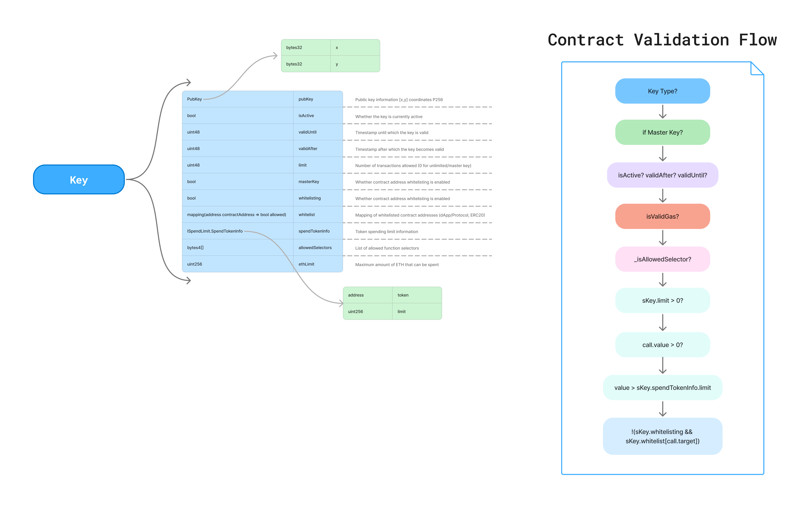
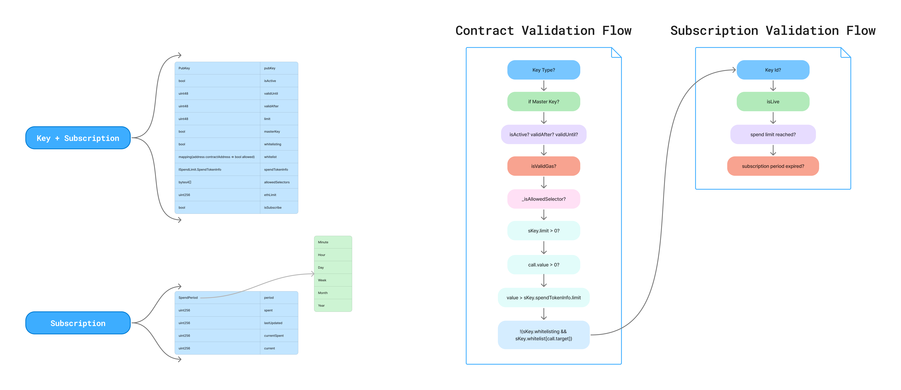
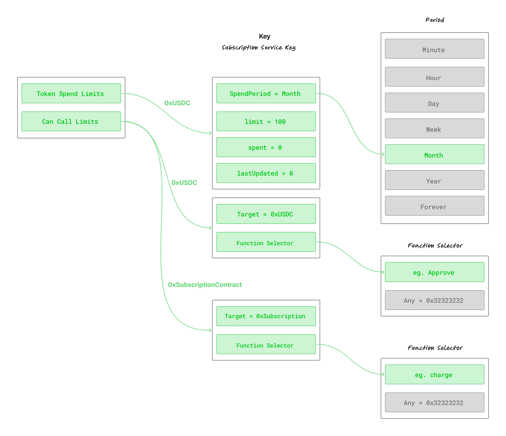
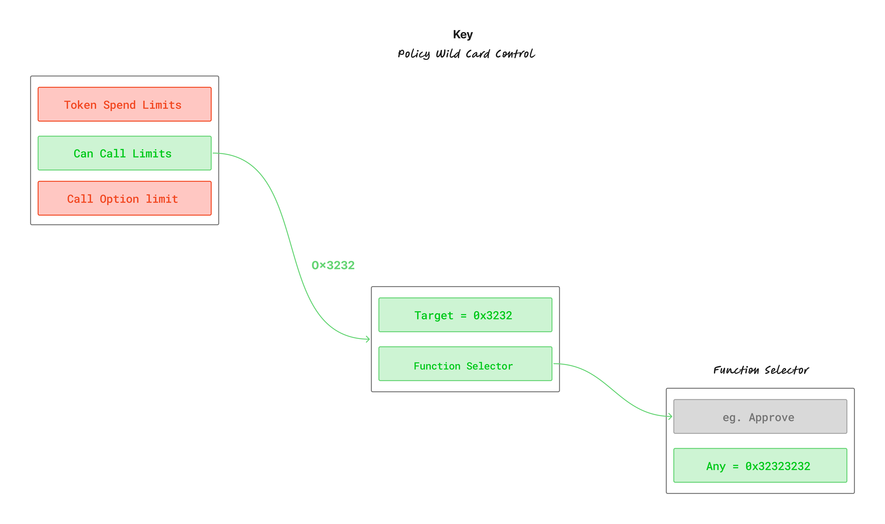

# Key on-chain Permissions

This document covers the key management and permission enforcement system within the Openfort EIP-7702 Smart Accounts version 0.0.1 and 0.0.2.

## System Architecture
The key system is built around three primary components that work together to provide secure, temporary access control and spending policy.

## Key Types and Capabilities
The system supports four distinct key types, each with different cryptographic properties and security characteristics:


| Key Type | Description | Use Cases | Validation Method |
|----------|-------------|-----------|-------------------|
| EOA | Traditional ECDSA keys | Standard wallets, development | ECDSA signature verification |
| WEBAUTHN | WebAuthn credentials | Biometrics, hardware keys | WebAuthn assertion validation |
| P256 | Standard P-256 keys | Extractable P-256 signatures | P-256 ECDSA verification |
| P256NONKEY | Hardware-bound P-256 | Non-extractable hardware keys | SHA-256 digest validation |

## Version 0.0.1
> [Key Manager v0.0.1]("https://github.com/openfort-xyz/openfort-7702-account/blob/releases/v0.0.1/src/core/KeysManager.sol")

Keys enable temporary, scoped access to smart accounts with granular permission controls including spending limits, contract whitelisting, and time-based restrictions.

### Permission Control Framework
Keys operate within a comprehensive permission framework that enforces multiple layers of access control:



### Key Permissions Structure

Each key is configured with the following permission fields:

| Permission | Field | Type | Description |
|------------|-------|------|-------------|
| **Time Bounds** | `validAfter` | `uint48` | Unix timestamp - key becomes valid after this time |
| | `validUntil` | `uint48` | Unix timestamp - key expires after this time |
| **Usage Quota** | `limit` | `uint48` | Maximum number of operations allowed (decrements per call) |
| **ETH Spending** | `ethLimit` | `uint256` | Maximum native ETH (in wei) the key can spend |
| **Token Spending** | `spendTokenInfo.token` | `address` | ERC-20 token address for spend tracking |
| | `spendTokenInfo.limit` | `uint256` | Maximum token amount the key can transfer |
| **Target Restriction** | `whitelisting` | `bool` | When `true`, enforces contract whitelist |
| | `whitelist` | `mapping(address => bool)` | Allowed target contract addresses |
| **Function Filtering** | `allowedSelectors` | `bytes4[]` | Permitted function selectors (max 10) |

### Permission Details

#### Time Bounds
Controls **when** a key can be used:
- `validAfter`: Key is rejected if `block.timestamp < validAfter`
- `validUntil`: Key is rejected if `block.timestamp > validUntil`

**Example**: A key valid for 24 hours starting now:
```
validAfter  = block.timestamp          // e.g., 1706300000
validUntil  = block.timestamp + 1 days // e.g., 1706386400
```

#### Usage Quota (`limit`)
Controls **how many times** a key can execute operations:
- Decrements by 1 for each call in a transaction
- Key becomes invalid when `limit` reaches 0
- Master keys have `limit = 0` (unlimited)

**Example**: A key limited to 100 transactions:
```
limit = 100
```

#### ETH Spending (`ethLimit`)
Controls **how much native ETH** the key can transfer:
- Tracks cumulative ETH spent across all transactions
- Each transaction's `value` is subtracted from `ethLimit`
- Transaction reverts if `value > ethLimit`

**Example**: A key with 0.5 ETH spending cap:
```
ethLimit = 500000000000000000 // 0.5 ETH in wei
```

#### Token Spending (`spendTokenInfo`)
Controls **how much of a single ERC-20 token** the key can transfer:
- Only **one token** can be configured per key
- Tracks cumulative token spend via `transfer()` and `transferFrom()`
- Only standard ERC-20 patterns supported (amount in last 32 bytes of calldata)

**Example**: A key with 1000 USDC spending cap:
```
spendTokenInfo.token = 0xA0b86991c6218b36c1d19D4a2e9Eb0cE3606eB48 // USDC
spendTokenInfo.limit = 1000000000 // 1000 USDC (6 decimals)
```

#### Contract Whitelisting
Controls **which contracts** the key can interact with:
- `whitelisting = true` enforces the whitelist (mandatory for session keys)
- Only addresses in the `whitelist` mapping can be called
- The token address in `spendTokenInfo` is automatically whitelisted

**Example**: A key that can only interact with Uniswap Router and USDC:
```
whitelisting    = true
whitelist[0x7a250d5630B4cF539739dF2C5dAcb4c659F2488D] = true // Uniswap Router
whitelist[0xA0b86991c6218b36c1d19D4a2e9Eb0cE3606eB48] = true // USDC
```

#### Function Selector Filtering (`allowedSelectors`)
Controls **which functions** the key can call:
- Array of `bytes4` function selectors (maximum 10)
- Transaction reverts if the called function's selector is not in the array

**Example**: A key that can only call `transfer` and `approve`:
```
allowedSelectors = [
    0xa9059cbb, // transfer(address,uint256)
    0x095ea7b3  // approve(address,uint256)
]
```

---

### Key Configuration Examples

#### Example 1: Gaming Session Key
A key for a gaming dApp that allows limited in-game token spending:

| Parameter | Value | Rationale |
|-----------|-------|-----------|
| `validAfter` | `now` | Immediately active |
| `validUntil` | `now + 4 hours` | Gaming session duration |
| `limit` | `500` | Max 500 in-game actions |
| `ethLimit` | `0` | No ETH transfers allowed |
| `spendTokenInfo.token` | `GAME_TOKEN` | In-game currency |
| `spendTokenInfo.limit` | `10000 * 10^18` | 10,000 tokens max |
| `whitelist` | `[GameContract, GAME_TOKEN]` | Only game interactions |
| `allowedSelectors` | `[transfer, performAction]` | Limited functions |

#### Example 2: DeFi Trading Key
A key for automated trading with strict spending limits:

| Parameter | Value | Rationale |
|-----------|-------|-----------|
| `validAfter` | `now` | Immediately active |
| `validUntil` | `now + 7 days` | Weekly trading period |
| `limit` | `1000` | Max 1000 swaps |
| `ethLimit` | `1 ETH` | Allow ETH for gas/swaps |
| `spendTokenInfo.token` | `USDC` | Stablecoin for trading |
| `spendTokenInfo.limit` | `10000 USDC` | $10k trading limit |
| `whitelist` | `[UniswapRouter, USDC]` | Only DEX interactions |
| `allowedSelectors` | `[swapExactTokensForTokens, approve]` | Swap functions only |

---

### Key Constraints (v0.0.1)

| Constraint | Requirement | Reason |
|------------|-------------|--------|
| Session key `limit` | Must be `> 0` | `limit = 0` reserved for master keys |
| Session key `whitelisting` | Must be `true` | Prevents unrestricted contract access |
| Token per key | Single token only | One `spendTokenInfo` per key |
| Selector count | Maximum 10 | `MAX_SELECTORS` constant |
| Token standard | ERC-20 only | Amount extracted from last 32 bytes |
| Self-calls | Blocked | `call.target != address(this)` enforced |

---

### Security Model

The session key security model implements defense-in-depth through multiple validation layers:
| Security Layer | Purpose | Implementation |
|----------------|---------|----------------|
| Signature Validation | Cryptographic authenticity | Key type-specific signature verification |
| Time Bounds | Temporal access control | validAfter and validUntil timestamp checks |
| Usage Limits | Transaction count control | limit field with per-operation decrement |
| Spending Caps | Financial risk mitigation | ETH and token spending limits |
| Contract Whitelisting | Target restriction | Address-based access control |
| Function Filtering | Operation-level control | Function selector validation |
| Gas Policy | Resource usage control | Gas envelope calculation, budget enforcement, penalty handling |
| Gas Griefing Protection | DoS prevention | Signature length validation |


## Version 0.0.2
> [Key Manager v0.0.2](https://github.com/openfort-xyz/openfort-7702-account/blob/main/src/core/KeysManager.sol)

Version 0.0.2 introduces a significantly enhanced permission system inspired by [Ithaca's GuardedExecutor](https://github.com/ithacaxyz/account/blob/main/src/GuardedExecutor.sol). The major improvements include period-based spending limits, wildcard permissions, and multi-token support.

### What Changed from v0.0.1

| Feature | v0.0.1 | v0.0.2 |
|---------|--------|--------|
| **Contract Permissions** | `whitelist` mapping + `allowedSelectors[]` (max 10) | `ExecutePermissions` with `EnumerableSet canExecute` (capacity 2048) |
| **Token Spending** | Single token, absolute lifetime limit | Multiple tokens (64), **period-based limits** |
| **Native ETH** | Separate `ethLimit` field | Unified via `0xEeeE...EEeE` sentinel address |
| **Wildcards** | None | `ANY_TARGET`, `ANY_FN_SEL`, `EMPTY_CALLDATA_FN_SEL` |
| **Key Control** | Boolean `whitelisting` | `isDelegatedControl` flag + `KeyControl` enum |
| **Key Management** | Register/Revoke only | + `updateKeyData()`, `pauseKey()`, `unpauseKey()` |
| **Permission Management** | Fixed at registration | Dynamic via `setCanCall()`, `setTokenSpend()` |

---

### Permission Control Framework



### Key Permissions Structure (v0.0.2)

| Permission | Storage | Type | Description |
|------------|---------|------|-------------|
| **Time Bounds** | `validAfter` | `uint48` | Unix timestamp - key becomes valid after this time |
| | `validUntil` | `uint48` | Unix timestamp - key expires after this time |
| **Usage Quota** | `limits` | `uint48` | Maximum number of operations allowed (decrements per call) |
| **Key Control** | `isDelegatedControl` | `bool` | When `true` (external delegation), enables gas policy enforcement |
| **Execute Permissions** | `canExecute` | `EnumerableSet` | Set of allowed `(target, selector)` tuples (capacity 2048) |
| **Token Spending** | `tokens` | `EnumerableSet` | Set of token addresses with spend rules (capacity 64) |
| | `tokenData[token][period]` | `TokenPeriodSpend` | Per-token, per-period spend tracking |

---

### Execute Permissions System


#### Packed Permission Format
Each permission is stored as a single `bytes32` value:
```
┌────────────────────────────────────────┬──────────────┐
│         target address (20 bytes)      │ selector (4) │
└────────────────────────────────────────┴──────────────┘
```

#### Wildcard Constants
```solidity
ANY_TARGET        = 0x3232323232323232323232323232323232323232  // Any contract
ANY_FN_SEL        = 0x32323232                                  // Any function
EMPTY_CALLDATA_FN_SEL = 0xe0e0e0e0                              // Plain ETH transfer (no calldata)
```

#### Permission Matching Hierarchy
When checking if a key can execute a call, the system checks in order:

| Priority | Pattern | Meaning |
|----------|---------|---------|
| 1 | `(target, selector)` | Exact match - specific function on specific contract |
| 2 | `(target, ANY_FN_SEL)` | Any function on specific contract |
| 3 | `(ANY_TARGET, selector)` | Specific function on any contract |
| 4 | `(ANY_TARGET, ANY_FN_SEL)` | Full wildcard - any function on any contract |

**Example**: Allow a key to call any function on Uniswap Router:
```solidity
setCanCall(keyHash, UniswapRouter, ANY_FN_SEL, true);
```

**Example**: Allow a key to call `transfer()` on any ERC-20:
```solidity
setCanCall(keyHash, ANY_TARGET, 0xa9059cbb, true);
```

---

### Period-Based Token Spending

#### Spending Periods
v0.0.2 introduces **tumbling window** spending limits with calendar-anchored periods:

| Period | Resets At (UTC) | Use Case |
|--------|-----------------|----------|
| `Minute` | Every minute boundary | High-frequency micro-payments |
| `Hour` | Every hour boundary | Hourly rate limiting |
| `Day` | 00:00:00 UTC daily | Daily allowances |
| `Week` | Monday 00:00:00 UTC | Weekly budgets |
| `Month` | 1st of month 00:00:00 UTC | Monthly allowances |
| `Year` | January 1st 00:00:00 UTC | Annual budgets |
| `Forever` | Never resets | Lifetime caps |

#### How Period Limits Work

**Key concept**: A limit is an **amount-per-period**, not "number of transactions".

Example: `Month, 1000 USDC` means:
- ✅ 2 × 500 USDC
- ✅ 5 × 200 USDC
- ✅ 10 × 100 USDC
- ✅ 1000 × 1 USDC
- ❌ Any transaction that would push monthly total > 1000

#### Storage Structure
```
TokenPeriodSpend {
    limit: uint256       // Maximum amount per period
    spent: uint256       // Amount spent in current period
    lastUpdated: uint48  // Timestamp of last spend
}
```

#### Counter Reset Logic
On each spend operation:
1. Compute `currentPeriodStart = startOfPeriod(block.timestamp, period)`
2. If `lastUpdated < currentPeriodStart` → new period → `spent = 0`
3. `spent += amount`
4. If `spent > limit` → revert `ExceededSpendLimit(token)`

---

### Real-World Example: Monthly Allowance

**Scenario**: Alice gives Bob a monthly USDC allowance

**Setup**: Alice adds Bob as a non-admin key and sets USDC limit = 1,000 per Month.

| Term | Meaning |
|------|---------|
| "Month" | Calendar month in UTC. Resets at 00:00:00 UTC on the 1st |
| "Limit" | Total amount cap per period (not transaction count) |

#### Timeline Example

| Date | Action | Result |
|------|--------|--------|
| Sep 03 | Bob sends 400 USDC | ✅ Month total = 400/1000 |
| Sep 20 | Bob sends 600 USDC | ✅ Month total = 1000/1000 (at cap) |
| Sep 28 | Bob tries 50 USDC | ❌ Reverts (would exceed 1000) |
| Oct 01 00:00:00 UTC | Period resets | Counter = 0. Bob can spend 1000 again |

#### Important Nuances

**Approvals count toward the limit (safety feature)**:
If Bob, in one batch:
1. Approves 1,000 USDC to a dApp
2. Then spends 600 USDC

The system charges the **maximum** of:
- Declared in calldata (including the approve): 1,000
- Actual balance decrease: 600

→ **Charged: 1,000** for that batch. Approvals are revoked post-batch to prevent drain attacks.

**Policy persistence**: The monthly allowance renews every month indefinitely until:
- Alice removes the spend rule, OR
- `validUntil` timestamp is exceeded

**UTC-based**: All period boundaries use UTC (not local time).

---

### Native ETH Spending

Native ETH is tracked using the sentinel address:
```solidity
NATIVE_TOKEN = 0xEeeeeEeeeEeEeeEeEeEeeEEEeeeeEeeeeeeeEEeE
```

**Example**: Allow 0.1 ETH per day:
```solidity
setTokenSpend(keyHash, NATIVE_TOKEN, SpendPeriod.Day, 0.1 ether);
```

Plain ETH transfers (calls with value but no calldata) require:
```solidity
setCanCall(keyHash, target, EMPTY_CALLDATA_FN_SEL, true);
```

---

### Combining Multiple Limits

You can set **multiple periods** on the same token for layered protection:

**Example**: Daily + Monthly shaping
```solidity
// Max 50 USDC per day
setTokenSpend(keyHash, USDC, SpendPeriod.Day, 50e6);

// Max 1,000 USDC per month (even if daily allows more attempts)
setTokenSpend(keyHash, USDC, SpendPeriod.Month, 1000e6);
```

Both limits are enforced. A transaction fails if it exceeds **either** limit.

**Example**: Block a token entirely
```solidity
// Setting limit = 0 blocks all spending (clean error message)
setTokenSpend(keyHash, USDC, SpendPeriod.Forever, 0);
```

---

### Key Configuration Examples (v0.0.2)

#### Example 1: Employee Expense Card
A key for an employee with monthly expense limits:


| Parameter | Value | Rationale |
|-----------|-------|-----------|
| `validAfter` | `now` | Immediately active |
| `validUntil` | `now + 1 year` | Employment period |
| `limits` | `1000` | Max 1000 transactions |
| `isDelegatedControl` | `true` | Company controls gas |
| **Spend Rules** | | |
| USDC / Month | `5000 USDC` | Monthly expense budget |
| USDC / Day | `500 USDC` | Daily cap for safety |
| **Execute Permissions** | | |
| `(VendorContract, ANY_FN_SEL)` | Approved vendor interactions |
| `(USDC, transfer)` | Direct payments |

#### Example 2: Trading Bot Key
A key for automated DeFi trading:


| Parameter | Value | Rationale |
|-----------|-------|-----------|
| `validAfter` | `now` | Immediately active |
| `validUntil` | `now + 30 days` | Trading period |
| `limits` | `10000` | High tx frequency |
| `isDelegatedControl` | `false` | Self-custody |
| **Spend Rules** | | |
| USDC / Day | `10000 USDC` | Daily trading volume |
| USDC / Forever | `100000 USDC` | Lifetime cap |
| **Execute Permissions** | | |
| `(UniswapRouter, swapExactTokensForTokens)` | Swap function |
| `(UniswapRouter, swapTokensForExactTokens)` | Swap function |
| `(ANY_TARGET, approve)` | Approve any token |

#### Example 3: Subscription Service Key
A key for a service that charges monthly:



| Parameter | Value | Rationale |
|-----------|-------|-----------|
| `validAfter` | `now` | Immediately active |
| `validUntil` | `type(uint48).max` | No expiry |
| `limits` | `0` | Unlimited (master-like for this use) |
| `isDelegatedControl` | `true` | Service controls execution |
| **Spend Rules** | | |
| USDC / Month | `100 USDC` | Subscription fee |
| **Execute Permissions** | | |
| `(SubscriptionContract, charge)` | Only charge function |
| `(USDC, Approve)` | Pay to service |

#### Example 4: Gaming Session with Micro-transactions
A key for in-game purchases with tight controls:


| Parameter | Value | Rationale |
|-----------|-------|-----------|
| `validAfter` | `now` | Immediately active |
| `validUntil` | `now + 4 hours` | Gaming session |
| `limits` | `500` | Max 500 actions |
| `isDelegatedControl` | `false` | Player controls |
| **Spend Rules** | | |
| GAME_TOKEN / Hour | `100 tokens` | Hourly spending cap |
| GAME_TOKEN / Forever | `1000 tokens` | Session lifetime cap |
| **Execute Permissions** | | |
| `(GameContract, ANY_FN_SEL)` | All game functions |
| `(GAME_TOKEN, transfer)` | In-game transfers |

---

### Policy Wildcard Control Examples

The wildcard system provides flexible permission patterns. Below are common configurations from most restrictive to least restrictive.


#### Full Wildcard (Least Restrictive)
Allow any function on any contract. Use with extreme caution.

```solidity
// Key can call ANYTHING on ANY contract
setCanCall(keyHash, ANY_TARGET, ANY_FN_SEL, true);
```




#### Wildcard Security Matrix

| Pattern | Risk Level | Recommended Safeguards |
|---------|------------|------------------------|
| `(target, selector)` | 🟢 Low | Spend limits optional |
| `(target, ANY_FN_SEL)` | 🟡 Medium | Spend limits recommended |
| `(ANY_TARGET, selector)` | 🟡 Medium | Spend limits **required** |
| `(ANY_TARGET, ANY_FN_SEL)` | 🔴 High | Spend limits + short validity + low quota |
| `(ANY_TARGET, EMPTY_CALLDATA)` | 🟡 Medium | ETH spend limit **required** |

---

### Key Constraints (v0.0.2)

| Constraint | Requirement | Reason |
|------------|-------------|--------|
| Session key `limits` | Must be `> 0` | `limits = 0` reserved for master keys |
| Execute permissions capacity | Maximum 2048 | `EnumerableSet` size limit |
| Token spend rules capacity | Maximum 64 tokens | `EnumerableSet` size limit |
| Self-calls | Blocked | `call.target != address(this)` enforced |
| `execute()` selector | Cannot be whitelisted | Prevents privilege escalation |
| Period boundaries | UTC-based | Calendar-anchored tumbling windows |

---

### Security Model (v0.0.2)

| Security Layer | Purpose | Implementation |
|----------------|---------|----------------|
| Signature Validation | Cryptographic authenticity | Key type-specific signature verification |
| Time Bounds | Temporal access control | `validAfter` and `validUntil` timestamp checks |
| Usage Limits | Transaction count control | `limits` field with per-operation decrement |
| Period Spending | Financial risk mitigation | Per-token, per-period spend accounting |
| Execute Permissions | Target + function restriction | `(target, selector)` whitelist with wildcards |
| Gas Policy | Resource usage control | `isDelegatedControl` triggers policy checks |
| Approval Revocation | Drain prevention | Approvals revoked post-batch |
| Pause Capability | Emergency response | `pauseKey()` for immediate disable |