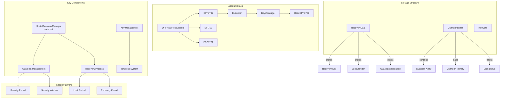
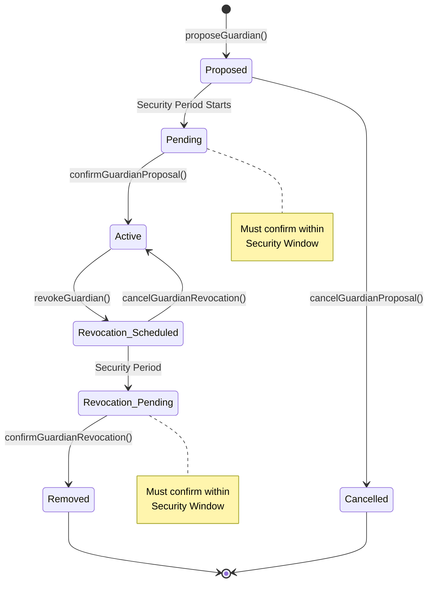
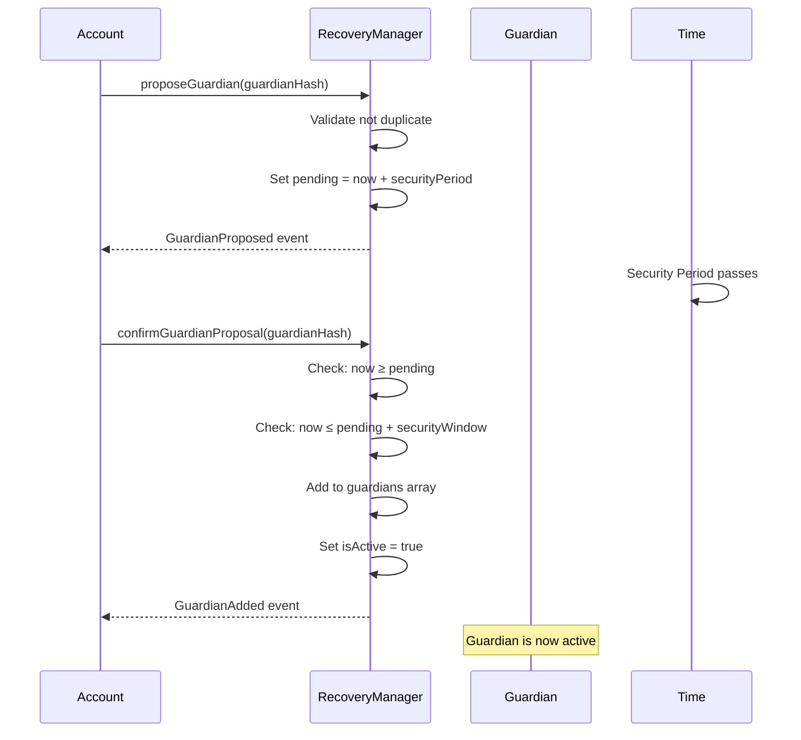
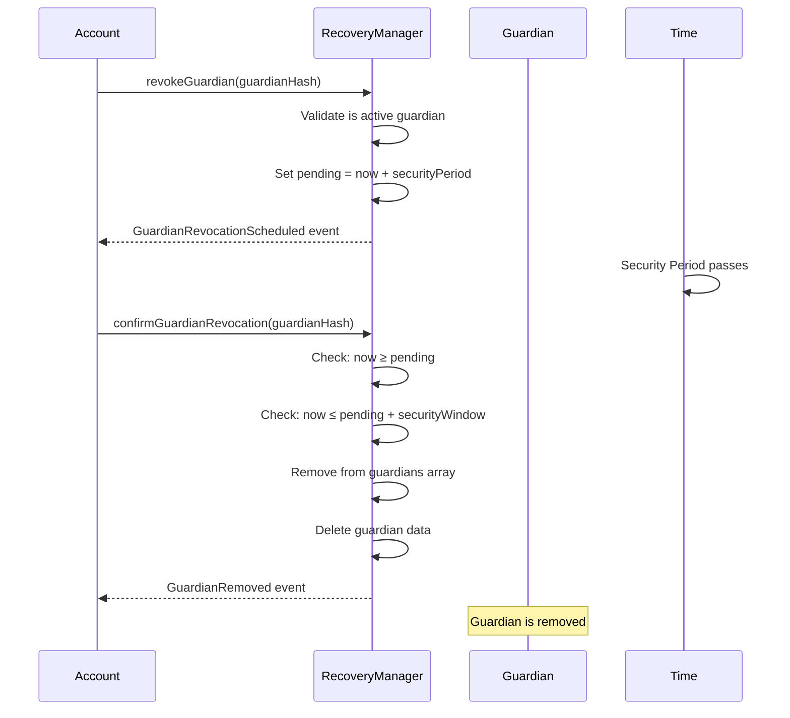
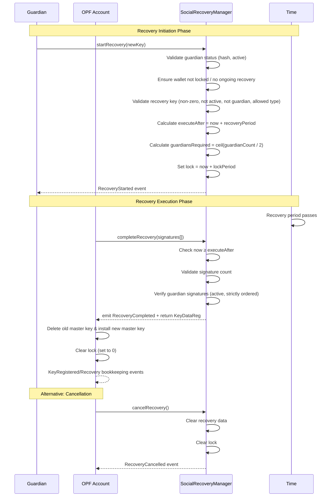
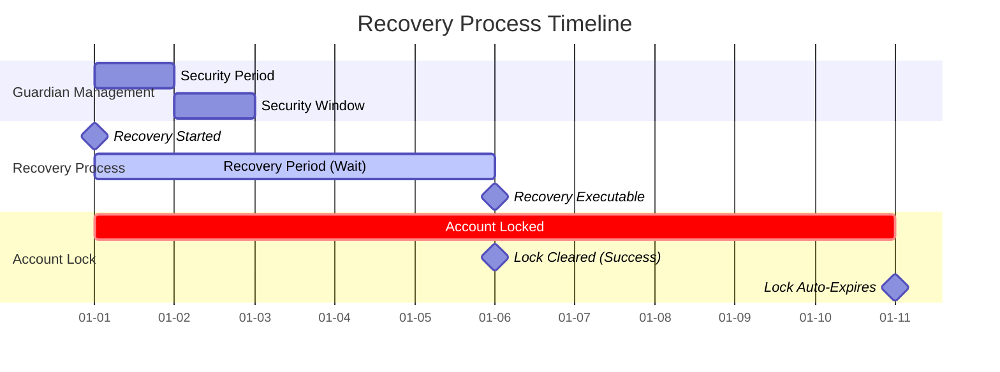
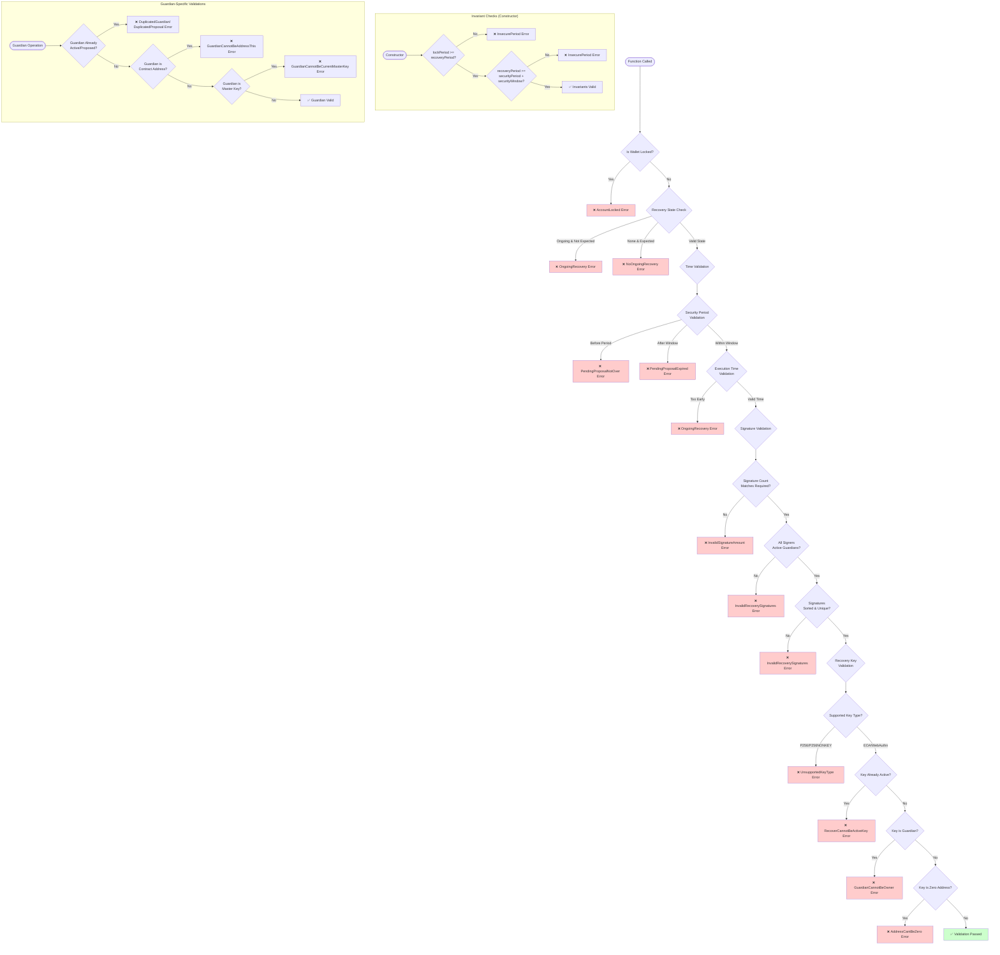

# Recovery Module
The OPF7702Recoverable module implements a guardian-based social recovery system for EIP-7702 + ERC-4337 smart contract wallets. This enables users to recover their accounts if they lose access to their master key, using a network of trusted guardians. Recovery state and guardian coordination are managed by an **external** `SocialRecoveryManager` contract; the account delegates setup and completion of recovery flows to this manager during initialization and `completeRecovery`.

## Table of Contents

- [Definitions](#definitions)
- [Invariants (checked in constructor)](#invariants)
- [How they’re used](#how-theyre-used)
  - [Guardian changes](#guardian-changes)
  - [Recovery flow](#recovery-flow)
- [Key Features](#key-features)
- [Guardian Management System](#guardian-management-system)
  - [Guardian Lifecycle](#guardian-lifecycle)
  - [Guardian Data Structure](#guardian-data-structure)
  - [Guardian Operations](#guardian-operations)
    - [Adding a Guardian](#adding-a-guardian)
    - [Removing a Guardian](#removing-a-guardian)
  - [Recovery Process](#recovery-process)
    - [Recovery Data Structure](#recovery-data-structure)
    - [Recovery Flow](#recovery-flow-1)
    - [Recovery Timeline](#recovery-timeline)
- [Security Features](#security-features)
  - [Time-based Security Parameters](#time-based-security-parameters)
  - [Security Validations](#security-validations)
- [Function Reference](#function-reference)
  - [Initialization](#initialization)
  - [Guardian Management Functions](#guardian-management-functions)
  - [Recovery Functions](#recovery-functions)
  - [View Helpers](#view-helpers)
  - [EIP-712 Signature Schemas](#eip-712-signature-schemas)
    - [Recovery Signature](#recovery-signature)
    - [Initialization Signature](#initialization-signature)
  - [Recommended ranges (non-binding)](#recommended-ranges-non-binding)
  - [Edge cases & guarantees](#edge-cases--guarantees)
  - [Testing checklist](#testing-checklist)

### Definitions
- `recoveryPeriod` — **Seconds to wait** after `startRecovery` before `completeRecovery` is allowed.
- `lockPeriod` — **Seconds the wallet stays “locked”** after `startRecovery`. The lock is cleared early on `completeRecovery()` or `cancelRecovery()`.
- `securityPeriod` — **Timelock** (seconds) before a guardian add/remove can be confirmed.
- `securityWindow` — **Confirmation window** (seconds) after `securityPeriod` during which a pending add/remove **must** be confirmed, or it expires.
- `guardian hash` — Deterministic hash of a guardian address (`computeHash(address)`); all guardian lists operate on these hashes instead of raw addresses.

### Invariants
(checked in constructor)
- `lockPeriod ≥ recoveryPeriod`  
- `recoveryPeriod ≥ securityPeriod + securityWindow`  
If either fails, the deploy reverts with `OPF7702Recoverable_InsecurePeriod()`.

### How they’re used

#### Guardian changes
- **Propose add**: `proposeGuardian(g)` sets `pending = now + securityPeriod`.
- **Confirm add**: `confirmGuardianProposal(g)` allowed only in  
  `now ∈ [pending, pending + securityWindow]`.  
  Before `pending` → `PendingProposalNotOver`. After the window → `PendingProposalExpired` (re-propose).
- **Cancel add**: `cancelGuardianProposal(g)` before confirmation.
- **Revoke**: symmetric to add (`revokeGuardian` → `confirmGuardianRevocation` / `cancelGuardianRevocation`).
- **During lock**: guardian mutations are blocked (`AccountLocked`).
- **Caller requirement**: all guardian mutations must originate from the account contract itself (`msg.sender == _account`).

#### Recovery flow
- **Start**: `startRecovery(newKey)` (guardian-only) sets:
  - `executeAfter = now + recoveryPeriod`
  - `lock = now + lockPeriod`
  - `guardiansRequired = ceil(guardianCount / 2)`
  - rejects zeroed keys, keys already active on the wallet, keys matching an existing guardian, and recovery payloads with `KeyType.P256` / `KeyType.P256NONKEY`
- **Complete**: `completeRecovery(signatures)` allowed when `now ≥ executeAfter` and signature count/ordering check passes. On success:
  - old master key is deleted; `newKey` becomes **master**
  - lock is **cleared** (`lock = 0`) even if `lockPeriod` hasn’t elapsed
  - guardian signatures must be strictly ordered by guardian hash (`computeHash(signer)`) to prevent duplicates
- **Cancel**: `cancelRecovery()` (account contract via self-call/EntryPoint) clears recovery and lock.
- **Lock events**: each call to `_setLock` emits `WalletLocked(locked)` so off-chain monitors can track the wallet’s lock state.

## Key Features
* Guardian-based recovery with multi-signature thresholds
* Time-locked operations for security
* Recovery targets support EOA and WebAuthn master keys (P256 / P256NONKEY proposals are rejected)
* Progressive security periods for guardian management
* Account locking during recovery process
* Guardian identities stored as hashed addresses with strictly ordered signature validation


> `GuardiansData` and `RecoveryData` live inside the `SocialRecoveryManager`; the account contract only keeps key metadata (`KeyData`).

## Guardian Management System

### Guardian Lifecycle


### Guardian Data Structure
```ts
struct GuardianIdentity {
    bool isActive;      // Currently active guardian
    uint256 index;      // Position in guardians array
    uint256 pending;    // Timestamp for pending action
}

struct GuardiansData {
    bytes32[] guardians;                    // Active guardian hashes
    mapping(bytes32 => GuardianIdentity) data;  // Guardian metadata
    uint256 lock;                           // Global lock timestamp
}
```
> Guardian identities are stored as `bytes32` hashes derived from EOA guardians (`computeHash(address))`; raw addresses never enter storage.

### Guardian Operations
#### Adding a Guardian

#### Removing a Guardian



> All guardian management calls enforce `msg.sender == _account`; in practice these are routed through the OPF account itself (self-call/EntryPoint), never directly from an external owner address.

### Recovery Process
#### Recovery Data Structure
```ts
struct RecoveryData {
    KeyDataReg key;           // New master key to install
    uint64 executeAfter;      // Timestamp when recovery can execute
    uint32 guardiansRequired; // Number of guardian signatures required
}
```

#### Recovery Flow


#### Recovery Timeline



### Security Features
#### Time-based Security Parameters
| Parameter         | Purpose                               | Typical Value | Constraint                                  |
|-------------------|---------------------------------------|---------------|---------------------------------------------|
| `recoveryPeriod`  | Delay before recovery can execute     | 2–7 days      | Must be > `securityPeriod + securityWindow` |
| `lockPeriod`      | Account lock duration during recovery | 7–14 days     | Must be > `recoveryPeriod`                  |
| `securityPeriod`  | Timelock for guardian changes         | 1–3 days      | Base security delay                         |
| `securityWindow`  | Window to confirm guardian changes    | 1–2 days      | Action expiry window                        |

#### Security Validations


### Function Reference
#### Initialization
```ts
function initialize(
    IKey.KeyDataReg calldata _keyData,
    IKey.KeyDataReg calldata _sessionKeyData,
    bytes memory _signature,
    bytes32 _initialGuardian
) external initializer
```
**Purpose**: Initialize the wallet with a master key, optional session key, and seed the first guardian via `SocialRecoveryManager.initializeGuardians`.

Parameters:

* `_keyData`: Master key registration payload (must pass `_masterKeyValidation` → limits = 0, non-P256 type, self control)
* `_sessionKeyData`: Optional session key payload (ignored if `.key` is empty)
* `_signature`: EIP-712 signature computed by `getDigestToInit`
* `_initialGuardian`: Guardian hash to activate immediately (must be non-zero)

### Guardian Management Functions
| Function                          | Purpose                      | Access Control                         | Timelock                      |
|-----------------------------------|------------------------------|----------------------------------------|-------------------------------|
| `proposeGuardian(bytes32)`        | Propose new guardian         | Account contract (`msg.sender == _account`) | Yes — `securityPeriod`        |
| `confirmGuardianProposal(bytes32)`| Activate proposed guardian   | Account contract                        | Within `securityWindow`       |
| `cancelGuardianProposal(bytes32)` | Cancel guardian proposal     | Account contract                        | Before confirmation           |
| `revokeGuardian(bytes32)`         | Schedule guardian removal    | Account contract                        | Yes — `securityPeriod`        |
| `confirmGuardianRevocation(bytes32)`| Remove guardian           | Account contract                        | Within `securityWindow`       |
| `cancelGuardianRevocation(bytes32)`| Cancel removal             | Account contract                        | Before confirmation           |

### Recovery Functions
| Function                      | Purpose            | Access Control                                     | Requirements                                   |
|-------------------------------|--------------------|----------------------------------------------------|-----------------------------------------------|
| `startRecovery(KeyDataReg)`   | Initiate recovery  | Active guardian address (`msg.sender`)             | Not locked, no ongoing recovery, key not active/guardian/P256 |
| `completeRecovery(bytes[])`   | Execute recovery   | Typically the account contract (no caller check)   | After `recoveryPeriod`, signatures ordered & match quorum    |
| `cancelRecovery()`            | Cancel recovery    | Account contract (`msg.sender == _account`)        | Ongoing recovery exists                       |

`OPF7702Recoverable.completeRecovery` invokes the manager, receives the approved `KeyDataReg`, and then updates its own storage (deleting the old master key, installing the new one, and clearing the lock).

#### View Helpers
| Function                                | Returns                                 | Notes                                                   |
|-----------------------------------------|------------------------------------------|---------------------------------------------------------|
| `getGuardians(address)`                 | `bytes32[]` guardian hashes              | Hashes are stored in the order guardians were activated. |
| `getPendingStatusGuardians(address,bytes32)` | Pending timestamp (0 if none)         | Shared field for both add and revoke workflows.         |
| `isLocked(address)`                     | `bool`                                   | `true` while `lock > block.timestamp`.                  |
| `isGuardian(address,bytes32)`           | `bool`                                   | Checks active status in `GuardiansData`.                |
| `guardianCount(address)`                | `uint256`                                | Number of active guardians.                             |
| `getDigestToSign(address)`              | `bytes32` EIP-712 digest                 | Guardians sign this digest during `completeRecovery`.   |

###  EIP-712 Signature Schemas
#### Recovery Signature
```ts
// SocialRecoveryManager
bytes32 private constant RECOVER_TYPEHASH = keccak256(
    "Recover((uint8 keyType,uint48 validUntil,uint48 validAfter,uint48 limits,bytes key,uint8 keyControl) key,uint64 executeAfter,uint32 guardiansRequired)"
);

// getDigestToSign(account) := _hashTypedDataV4(
//   keccak256(abi.encode(
//     RECOVER_TYPEHASH,
//     recoveryData[account].key,
//     recoveryData[account].executeAfter,
//     recoveryData[account].guardiansRequired
//   ))
// )
```

#### Initialization Signature
Initialization digests are produced by `OPF7702Recoverable.getDigestToInit` (see `Architecture.md`). The recovery manager only receives the already-initialized guardian hash via `initializeGuardians`.

### Recommended ranges (non-binding)
| Parameter         | Typical Value | Rationale |
|-------------------|---------------|-----------|
| `recoveryPeriod`  | 2–7 days      | Gives time to react to compromise before takeover. Must cover `securityPeriod + securityWindow`. |
| `lockPeriod`      | 7–14 days     | Longer than `recoveryPeriod` to dampen churn; clears early on successful completion. |
| `securityPeriod`  | 1–3 days      | Baseline delay to deter rushed guardian churn. |
| `securityWindow`  | 1–2 days      | Reasonable window to execute after timelock. |

### Edge cases & guarantees
- Proposals are **unique** per guardian; re-proposing within the live window reverts (`DuplicatedProposal` / `DuplicatedRevoke`).
- Confirmations require the proposal to be **known** and within the allowed window.
- Recovery cannot start if:
  - Wallet is already locked (`AccountLocked`), or
  - A recovery is ongoing (`_requireRecovery(false)`).
- Completion requires **sorted, unique** guardian signatures over the EIP-712 digest (`getDigestToSign()`), exactly `guardiansRequired` entries.
- Recovery proposals using `KeyType.P256` or `KeyType.P256NONKEY` revert with `UnsupportedKeyType`.

### Testing checklist
- Enforce constructor invariants with boundary values (equalities allowed).
- Guardian add/remove: confirm exactly at window edges; reject just outside.
- Recovery: reject completion at `executeAfter - 1`, accept at `executeAfter`.
- Lock behavior: locked right after `startRecovery`; auto-unlocks after `lockPeriod` if not completed; clears on success/cancel.
