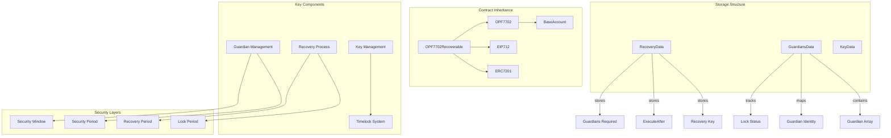
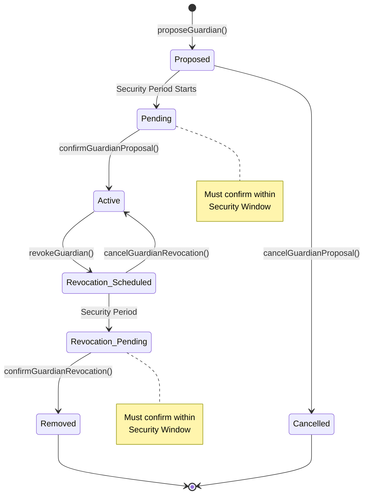
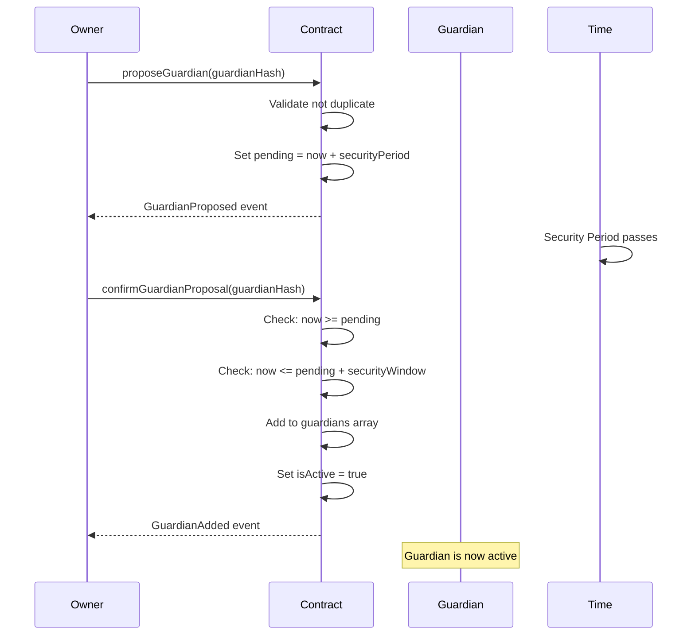
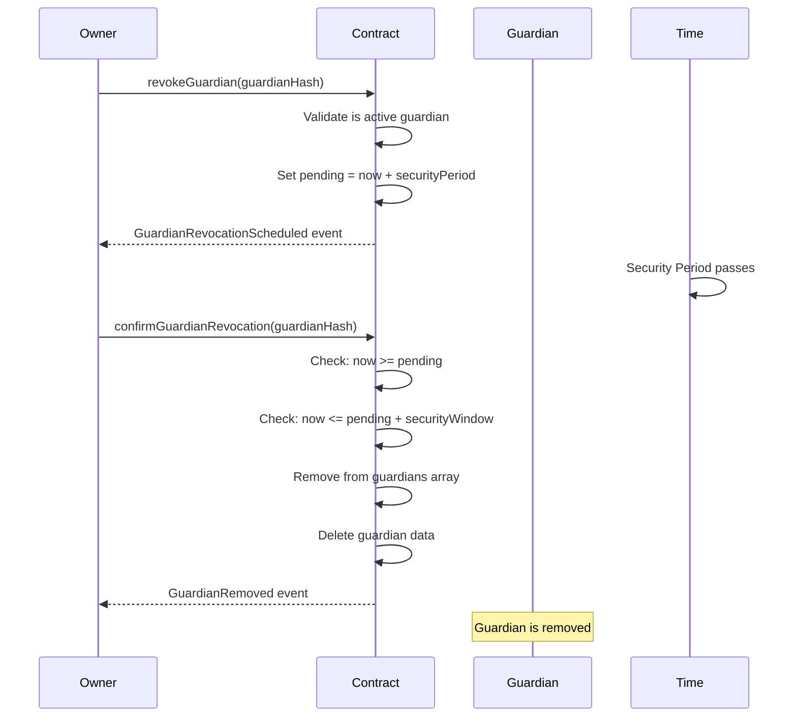

# Recovery Module
The OPF7702Recoverable contract implements a guardian-based social recovery system for EIP-7702 + ERC-4337 smart contract wallets. This enables users to recover their accounts if they lose access to their master key, using a network of trusted guardians.

## Key Features
* Guardian-based recovery with multi-signature thresholds
* Time-locked operations for security
* Multiple key types support (EOA, WebAuthn, P256)
* Progressive security periods for guardian management
* Account locking during recovery process



## Guardian Management System

### Guardian Lifecycle


### Guardian Data Structure
```ts
struct GuardianIdentity {
    bool isActive;      // Currently active guardian
    uint256 index;      // Position in guardians array
    uint256 pending;    // Timestamp for pending action
}

struct GuardiansData {
    bytes32[] guardians;                    // Active guardian hashes
    mapping(bytes32 => GuardianIdentity) data;  // Guardian metadata
    uint256 lock;                           // Global lock timestamp
}
```

### Guardian Operations
#### Adding a Guardian

#### Removing a Guardian



### Recovery Process
#### Recovery Data Structure
```ts
struct RecoveryData {
    Key key;                  // New master key to set
    uint64 executeAfter;      // Timestamp when recovery can execute
    uint32 guardiansRequired; // Number of signatures needed
}
```

#### Recovery Flow
```mermaid

```

#### Recovery Timeline
```mermaid

```

### Security Features
#### Time-based Security Parameters
| Parameter         | Purpose                               | Typical Value | Constraint                                  |
|-------------------|---------------------------------------|---------------|---------------------------------------------|
| `recoveryPeriod`  | Delay before recovery can execute     | 2–7 days      | Must be > `securityPeriod + securityWindow` |
| `lockPeriod`      | Account lock duration during recovery | 7–14 days     | Must be > `recoveryPeriod`                  |
| `securityPeriod`  | Timelock for guardian changes         | 1–3 days      | Base security delay                         |
| `securityWindow`  | Window to confirm guardian changes    | 1–2 days      | Action expiry window                        |

#### Security Validations
```mermaid

```

### Function Reference
#### Initialization
```ts
function initialize(
    Key calldata _key,
    KeyReg calldata _keyData,
    Key calldata _sessionKey,
    KeyReg calldata _sessionKeyData,
    bytes memory _signature,
    bytes32 _initialGuardian
) external initializer
```
**Purpose**: Initialize the wallet with a master key and first guardian
Parameters:

* `_key`: Master key structure
* `_keyData`: Master key permissions (must be unrestricted)
* `_sessionKey`: Optional session key
* `_sessionKeyData`: Session key permissions
* `_signature`: EIP-712 signature authorizing initialization
* `_initialGuardian`: First guardian hash (required)

### Guardian Management Functions
| Function                          | Purpose                      | Access Control    | Timelock                      |
|-----------------------------------|------------------------------|-------------------|-------------------------------|
| `proposeGuardian(bytes32)`        | Propose new guardian         | Owner/EntryPoint  | Yes — `securityPeriod`        |
| `confirmGuardianProposal(bytes32)`| Activate proposed guardian   | Owner/EntryPoint  | Within `securityWindow`       |
| `cancelGuardianProposal(bytes32)` | Cancel guardian proposal     | Owner/EntryPoint  | Before confirmation           |
| `revokeGuardian(bytes32)`         | Schedule guardian removal    | Owner/EntryPoint  | Yes — `securityPeriod`        |
| `confirmGuardianRevocation(bytes32)`| Remove guardian           | Owner/EntryPoint  | Within `securityWindow`       |
| `cancelGuardianRevocation(bytes32)`| Cancel removal             | Owner/EntryPoint  | Before confirmation           |

### Recovery Functions
| Function                      | Purpose            | Access Control   | Requirements                                   |
|-------------------------------|--------------------|------------------|-----------------------------------------------|
| `startRecovery(Key)`          | Initiate recovery  | Active Guardian  | Not locked, no ongoing recovery               |
| `completeRecovery(bytes[])`   | Execute recovery   | Anyone           | After `recoveryPeriod`, valid signatures      |
| `cancelRecovery()`            | Cancel recovery    | Owner/EntryPoint | Ongoing recovery exists                       |

###  EIP-712 Signature Schemas
#### Recovery Signature
```ts
bytes32 constant RECOVER_TYPEHASH = keccak256(
    "Recover(Key key,uint64 executeAfter,uint32 guardiansRequired)"
);

struct RecoverData {
    Key key;              // New master key
    uint64 executeAfter;  // Execution timestamp
    uint32 guardiansRequired; // Signature threshold
}
```

#### Initialization Signature
```ts
bytes32 constant INIT_TYPEHASH = keccak256(
    "Initialize(bytes key,bytes keyData,bytes sessionKey,bytes sessionKeyData,bytes32 guardian)"
);
```
