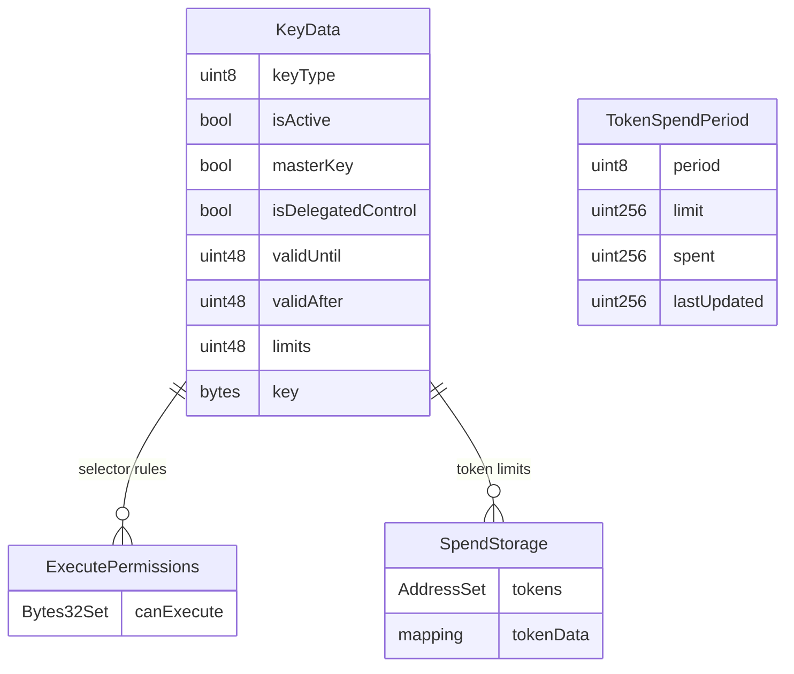
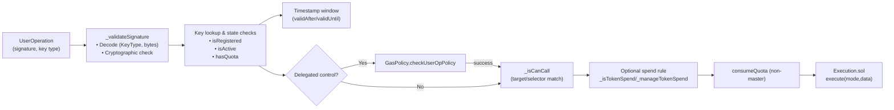

# Session Keys & Permission System

Session keys provide temporary, scoped access to Openfort’s 7702/4337 smart accounts. They are registered by the account itself, authorised through the EntryPoint, and validated at execution time against a layered permission model covering quotas, target selectors, token spend limits, and (optionally) custodial gas budgets.

---

## Table of Contents
- [Architecture Overview](#architecture-overview)
- [Key Types](#key-types)
- [Lifecycle & Registration](#lifecycle--registration)
- [Permission Surfaces](#permission-surfaces)
  - [Execution Quotas](#execution-quotas)
  - [Selector Permissions](#selector-permissions)
  - [Token Spend Policies](#token-spend-policies)
  - [Custodial Gas Budgets](#custodial-gas-budgets)
- [Storage Layout](#storage-layout)
- [Validation Pipeline](#validation-pipeline)
- [Spend Enforcement Details](#spend-enforcement-details)
- [Management APIs](#management-apis)
- [Security Considerations](#security-considerations)

---

## Architecture Overview

```mermaid
flowchart TD
    subgraph "Key Authoring"
        IKeyDefs["IKey.sol\n• KeyData\n• KeyDataReg\n• KeyType\n• KeyControl"]
        Owner["Account / EntryPoint"]
    end

    subgraph "Key Management"
        Manager["KeysManager.sol\n• registerKey\n• setCanCall\n• setTokenSpend\n• updateKeyData"]
        Storage["Storage namespace\n• keys[keyId]\n• permissions[keyId]\n• spendStore[keyId]"]
        GasPolicy["GasPolicy.sol\n• initializeGasPolicy\n• checkUserOpPolicy"]
    end

    subgraph "Execution"
        OPF7702["OPF7702.sol\n• _validateSignature\n• _validateExecuteCall"]
        Execution["Execution.sol\n• execute(mode,data)\n• MAX_TX guard"]
        Recovery["OPF7702Recoverable.sol\n• initialize\n• recovery flows"]
    end

    IKeyDefs --> Manager
    Owner --> Manager
    Manager --> Storage
    Manager --> GasPolicy
    Storage --> OPF7702
    GasPolicy --> OPF7702
    OPF7702 --> Execution
```

Master keys are established through `initialize` / recovery flows; session keys are added post-deployment via `registerKey` (self-call or EntryPoint). All permission tables live inside the account’s ERC-7201 namespace, while the gas budget (if any) is tracked by `GasPolicy` per `(keyId, account)`.

---

## Key Types

`IKey.KeyType` defines four tiers of cryptographic material:

| Type | Description | Validation in `OPF7702` |
|------|-------------|--------------------------|
| `EOA` | secp256k1 ECDSA signatures (`abi.encode(address)`) | `_validateKeyTypeEOA` (ECDSA recover) |
| `WEBAUTHN` | WebAuthn/FIDO2 credentials (`abi.encode(pubKey.x, pubKey.y)`) | `_validateKeyTypeWEBAUTHN` via `IWebAuthnVerifier.verifySignature` |
| `P256` | Extractable P-256 keys (raw ECDSA) | `_validateKeyTypeP256` using the verifier’s P-256 path |
| `P256NONKEY` | Non-extractable WebCrypto P-256 (pre-hashed) | `_validateKeyTypeP256NonKey` (verifier hashes first) |

All registration payloads (`KeyDataReg`) carry validity windows, per-call quotas, and a `KeyControl` (self vs custodial). Session keys **must** set `limits > 0`; master keys enforce different invariants and are not registered through `registerKey`.

---

## Lifecycle & Registration

1. **Authorisation** – Calls must pass `_requireForExecute()`, i.e. originate from the account itself (self-call) or the EntryPoint.
2. **Payload checks** – `KeysManager.registerKey` enforces:
   - `key` bytes non-empty (`keyCantBeZero`)
   - `limits > 0` (`mustHaveLimits`)
   - Valid timestamp window (`validateTimestamps` with `isUpdate = false`)
3. **Insertion** – `_addKey` computes `keyId`, rejects duplicates, writes `KeyData`, and marks `masterKey = (_keyData.limits == 0)` (never hit for session keys).
4. **Custodial gas budgets** – When `keyControl == KeyControl.Custodial`, `_addKey` calls `GasPolicy.initializeGasPolicy(address(this), keyId, _keyData.limits)` to seed a session envelope.
5. **Indexing** – `idKeys[id] = keyId; id++` allows deterministic iteration (master key remains at index 0).
6. **Eventing** – Emits `KeyRegistered(keyId, keyControl, keyType, masterKey, validAfter, validUntil, limits)`.

Session keys can later be paused (`pauseKey`), unpaused, updated (`updateKeyData` extends validity/quota), or fully revoked (`revokeKey` clears metadata and permissions).

---

## Permission Surfaces

### Execution Quotas
- Stored in `KeyData.limits`.
- `KeyDataValidationLib.hasQuota` returns `true` for master keys or when `limits > 0`.
- `_validateCall` aborts if a key lacks quota; `consumeQuota()` decrements the counter after every authorised call.

### Selector Permissions
- `setCanCall` manages a per-key `EnumerableSetLib.Bytes32Set` of packed `(target, selector)` tuples.
- Wildcards:
  - `ANY_TARGET = 0x3232…32` (allow selector on any contract)
  - `ANY_FN_SEL = 0x32323232` (allow any selector on a specific contract)
  - `EMPTY_CALLDATA_FN_SEL = 0xe0e0e0e0` (plain ETH transfer)
- `_isCanCall` attempts matches in order: exact, target wildcard, selector wildcard, full wildcard.
- `clearExecutePermissions` iterates and removes all entries; `hasCanCall`/`executePermissionAt` provide read-only introspection.

### Token Spend Policies
- `setTokenSpend` attaches a per-period limit to a `(keyId, token)` pair (use `NATIVE_ADDRESS = 0xEeee…EEeE` for ETH).
- `SpendPeriod` buckets: `Minute`, `Hour`, `Day`, `Week`, `Month`, `Year`, `Forever`.
- `SpendStorage` tracks an `AddressSet` of token addresses and per-token `TokenSpendPeriod { period, limit, spent, lastUpdated }`.
- `_isTokenSpend` inspects calldata:
  - empty calldata ⟶ native transfer
  - `transfer`, `transferFrom`, `approve` ⟶ extracts the amount with `LibBytes.load`
- `_manageTokenSpend` resets counters at the start of each period (`startOfSpendPeriod`) and rejects if `spent + amount > limit`.
- `clearSpendPermissions` removes all configured tokens; individual rules can be removed with `removeTokenSpend`.

### Custodial Gas Budgets
- Active only when `isDelegatedControl == true` (i.e. custodial keys).
- During validation, `_validateKeyType*` calls `GasPolicy.checkUserOpPolicy(keyId, userOp)`. A non-zero return value aborts the user operation.
- Budgets can be initialised manually on-chain (`GasPolicy.initializeGasPolicy(account, configId, bytes16 limit)`) or derived automatically from constructor defaults via the `uint256 limit` overload.

---

## Storage Layout



All three structures live within the ERC-7201 namespace anchored by `BaseOPF7702`. Selector and spend tables are cleared explicitly via `clearExecutePermissions` / `clearSpendPermissions` at revoke time to avoid orphaned entries.

---

## Validation Pipeline



Failure at any stage aborts validation and the EntryPoint returns `SIG_VALIDATION_FAILED`.

---

## Spend Enforcement Details

1. **Detection** – `_isTokenSpend` classifies the call based on selector:
   - Empty calldata → native transfer (`token = NATIVE_ADDRESS`, amount = `msg.value`).
   - `transfer`, `transferFrom`, `approve` → load the `uint256` amount argument.
2. **Limit lookup** – If no spend rule exists (`hasTokenSpend == false`), the function returns `false` and the execution is rejected.
3. **Period maintenance** – `_manageTokenSpend` compares `block.timestamp` with `TokenSpendPeriod.lastUpdated`. Crossing into a new period resets `spent` to zero.
4. **Enforcement** – Ensures `spent + amount <= limit`, then increments `spent`.

Because native ETH is mapped to `NATIVE_ADDRESS`, a single policy can cap both ETH transfers and ERC-20 transfers independently per token.

---

## Management APIs

Key management entry points exposed to authorised callers:

| Function | Purpose |
|----------|---------|
| `registerKey(KeyDataReg)` | Store a new session key (limits > 0) |
| `updateKeyData(keyId, validUntil, limits)` | Extend expiry and reset quota |
| `pauseKey(keyId)` / `unpauseKey(keyId)` | Soft-disable or resume a key |
| `revokeKey(keyId)` | Remove key metadata and clear associated permissions |
| `setCanCall(keyId, target, selector, can)` | Grant/revoke selector permissions |
| `clearExecutePermissions(keyId)` | Remove all selector entries |
| `setTokenSpend(keyId, token, limit, period)` | Create a token/ETH spend rule |
| `updateTokenSpend(keyId, token, limit, period)` | Mutate an existing rule |
| `removeTokenSpend(keyId, token)` / `clearSpendPermissions(keyId)` | Remove one or all spend rules |
| `hasTokenSpend`, `tokenSpend`, `spendTokens` | Read-only introspection of spend configuration |

All functions require `_requireForExecute()`; they must be invoked via the account (self-call) or through the EntryPoint.

---

## Security Considerations

- **Quota depletion** – Session keys exhaust `limits` and must be refreshed (`updateKeyData`) to continue operating. Master keys bypass quotas entirely.
- **Target guarding** – `setCanCall` rejects zero addresses and self-calls, preventing privilege escalation through `address(this)`.
- **Spend rule optionality** – If no spend rule exists for a token, `_isTokenSpend` returns `false`, so keys must opt in explicitly to move value.
- **Custodial gas enforcement** – Delegated keys cannot consume more gas than their configured envelope; `GasPolicy` updates counters atomically within the account call.
- **Pause/Revoke** – Pausing preserves configuration for future reactivation, while revoking wipes metadata and emits `KeyRevoked`.
- **Recovery isolation** – Guardian storage and recovery state live in `SocialRecoveryManager`, ensuring key permissions remain untouched during recovery flows.

By combining signature validation, temporal gates, execution quotas, spend accounting, and optional gas budgets, the session key framework provides granular yet auditable control over delegated access.
