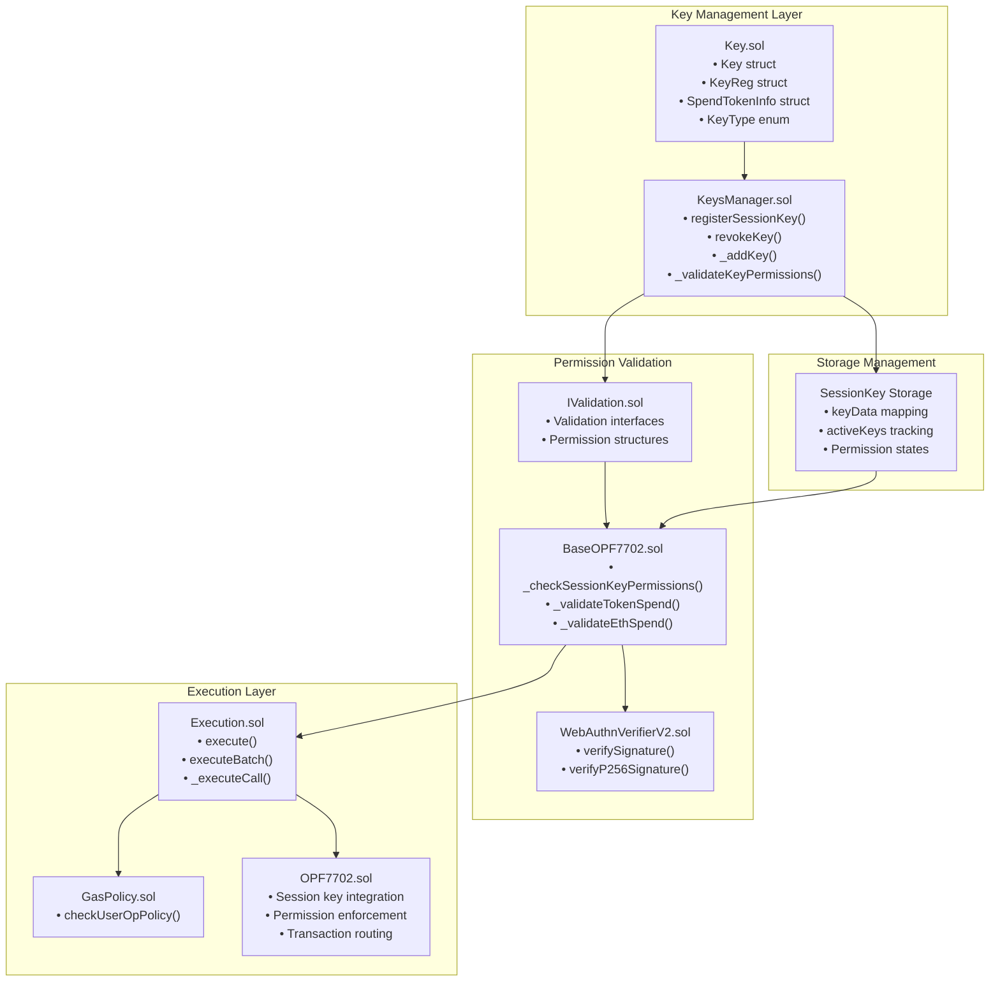

# Session Keys & Permission System

This document covers the session key management and permission enforcement system within the Openfort EIP-7702 Smart Accounts. Session keys enable temporary, scoped access to smart accounts with granular permission controls including spending limits, contract whitelisting, and time-based restrictions.

For information about the core account abstraction implementation, see Account Abstraction Implementation. For details about authentication mechanisms and WebAuthn integration, see WebAuthn Integration.

## System Architecture
The session key system is built around three primary components that work together to provide secure, temporary access delegation:
