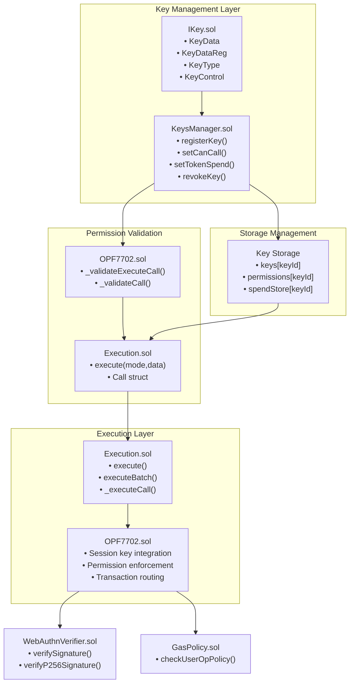
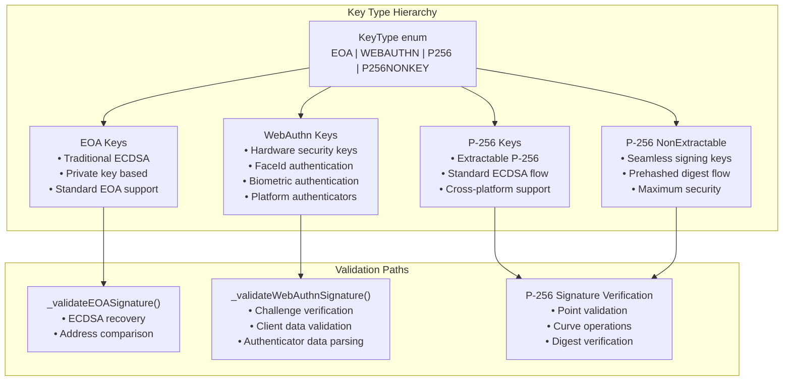
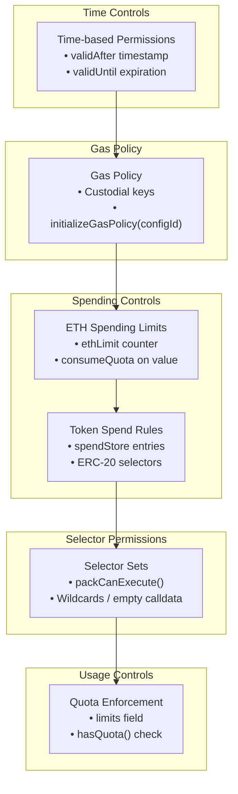
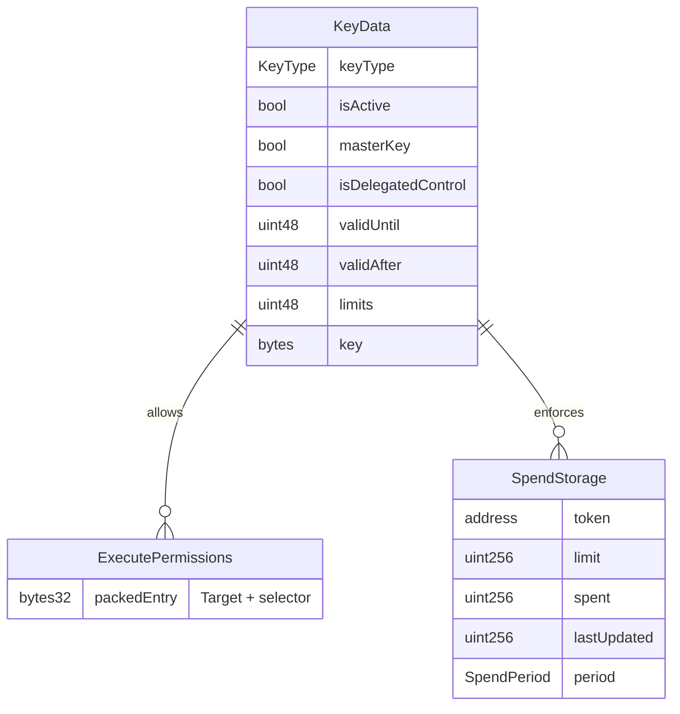
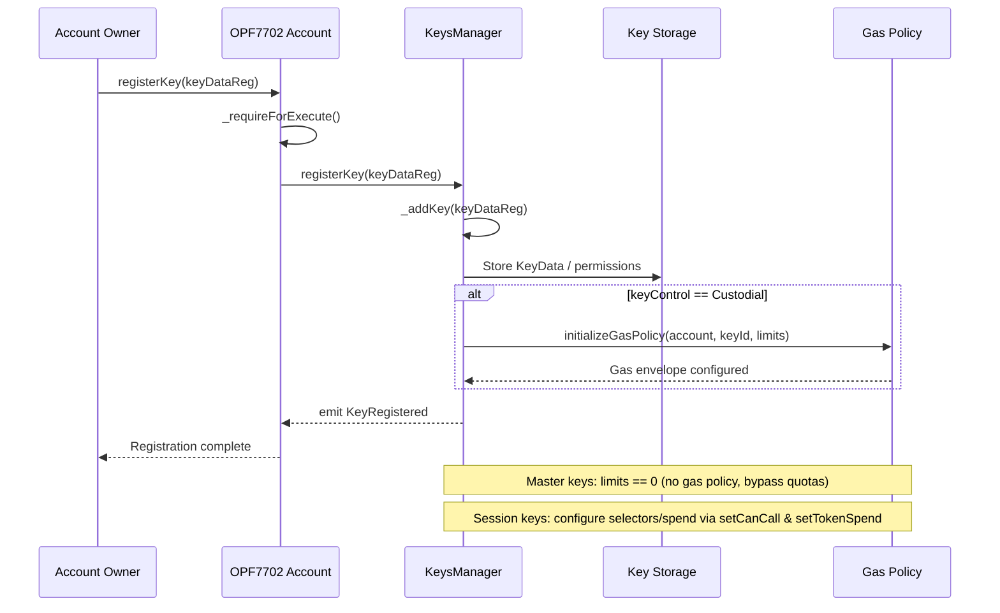
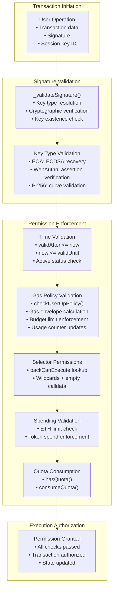
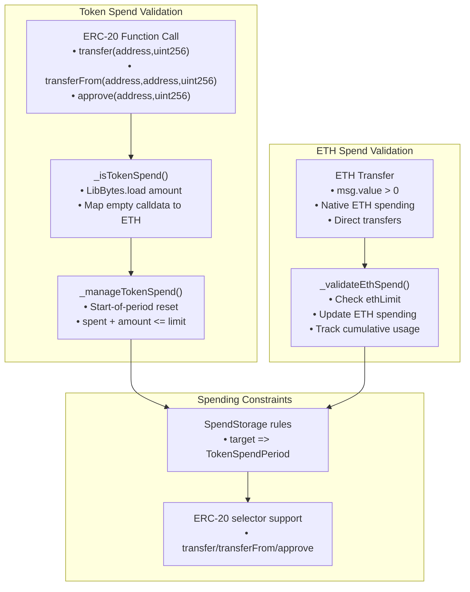

# Session Keys & Permission System

This document covers the session key management and permission enforcement system within the Openfort EIP-7702 Smart Accounts. Session keys enable temporary, scoped access to smart accounts with granular permission controls including selector restrictions, spend caps, and time-based limits.

For information about the core account abstraction implementation, see Account Abstraction Implementation. For details about authentication mechanisms and WebAuthn integration, see WebAuthn Integration.

## Table of Contents

- [System Architecture](#system-architecture)
- [Key Types and Capabilities](#key-types-and-capabilities)
- [Permission Control Framework](#permission-control-framework)
- [Gas, Spend, and Selector Controls](#gas-spend-and-selector-controls)
- [Session Key Data Structure](#session-key-data-structure)
- [Key Management Lifecycle](#key-management-lifecycle)
- [Permission Validation Flow](#permission-validation-flow)
- [Validation and Enforcement](#validation-and-enforcement)
  - [Spending Limit Enforcement](#spending-limit-enforcement)
- [Security Model](#security-model)

## System Architecture
The session key system is built around three primary components that work together to provide secure, temporary access delegation:

After registration, the account owner (or authorised automation) configures selector and spend permissions via `setCanCall`, `setTokenSpend`, `updateTokenSpend`, or clears them with the corresponding `clear*` helpers.

## Key Types and Capabilities
The system supports four distinct key types, each with different cryptographic properties and security characteristics:

| Key Type | Description | Use Cases | Validation Method |
|----------|-------------|-----------|-------------------|
| EOA | Traditional ECDSA keys | Standard wallets, development | ECDSA signature verification |
| WEBAUTHN | WebAuthn credentials | Biometrics, hardware keys | WebAuthn assertion validation |
| P256 | Standard P-256 keys | Extractable P-256 signatures | P-256 ECDSA verification |
| P256NONKEY | Hardware-bound P-256 | Non-extractable hardware keys | SHA-256 digest validation |

## Permission Control Framework
Session key enforcement layers include:

- **Temporal bounds** – `validAfter` and `validUntil` must frame the current timestamp for a key to be considered active.
- **Execution quotas** – `limits` decrements through `consumeQuota()` on every authorised call; master keys set `limits == 0` and bypass quota exhaustion.
- **Selector permissions** – `setCanCall` maintains packed `(target, selector)` entries with wildcard rules (`ANY_TARGET`, `ANY_FN_SEL`, `EMPTY_CALLDATA_FN_SEL`) governing which contracts/functions a key may execute.
- **Spend policies** – Optional `setTokenSpend` rules and the `ethLimit` counter cap ERC‑20 transfers/approvals and native value forwarding per period.
- **Custodial gas policies** – Keys created with `KeyControl.Custodial` initialise a session envelope in `GasPolicy`, limiting how much validation/call gas the key may consume in ERC‑4337 flows.

## Gas, Spend, and Selector Controls

## Session Key Data Structure
The core session key storage structure contains all permission and metadata fields:

* `KeyData` – canonical on-chain metadata for each key (`keyType`, activity flags, temporal bounds, quota, encoded key bytes).
* `ExecutePermissions` – packed `(target, selector)` entries maintained through `setCanCall`; supports wildcard matching via sentinel addresses/selectors.
* `SpendStorage` – per-key spend configuration reset on period boundaries and enforced via `_isTokenSpend`/`_manageTokenSpend`.

## Key Management Lifecycle
Session keys follow a structured lifecycle from registration through usage to expiration:

Registration Process

## Permission Validation Flow

## Validation and Enforcement
The permission system implements multiple validation layers to ensure secure execution:

### Spending Limit Enforcement
Token spending validation follows strict ERC-20 patterns with specific security constraints:

Native ETH transfers reuse the same path by mapping empty calldata to `NATIVE_ADDRESS`, ensuring both value and token flows respect per-period limits.

## Security Model

The session key security model implements defense-in-depth through multiple validation layers:
| Security Layer | Purpose | Implementation |
|----------------|---------|----------------|
| Signature Validation | Cryptographic authenticity | Key type-specific signature verification |
| Time Bounds | Temporal access control | validAfter and validUntil timestamp checks |
| Usage Limits | Transaction count control | `limits` quota with `hasQuota()/consumeQuota()` |
| Value Caps | Financial risk mitigation | `ethLimit` plus `setTokenSpend` rules per period |
| Selector Permissions | Target/selector restriction | Packed `(target, selector)` permissions with wildcard support |
| Gas Policy | Resource usage control | Gas envelope calculation, budget enforcement, penalty handling |
| Gas Griefing Protection | DoS prevention | Signature length validation |

