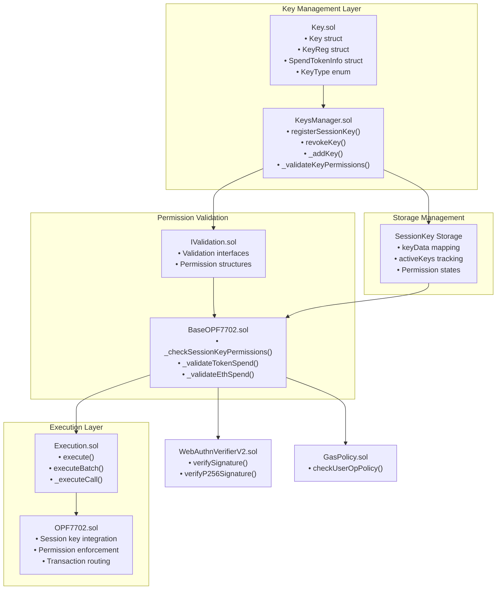
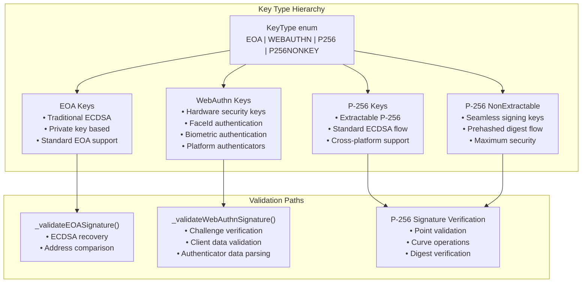
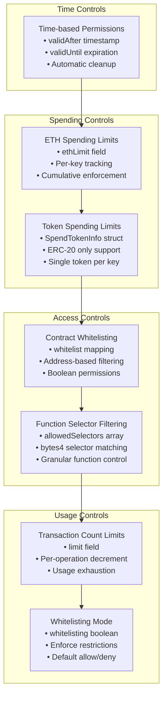
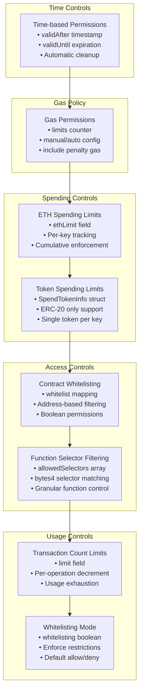
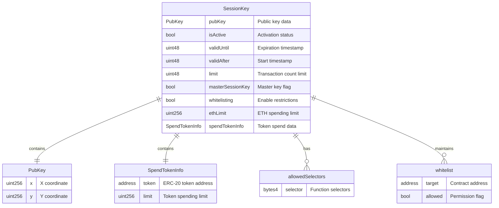
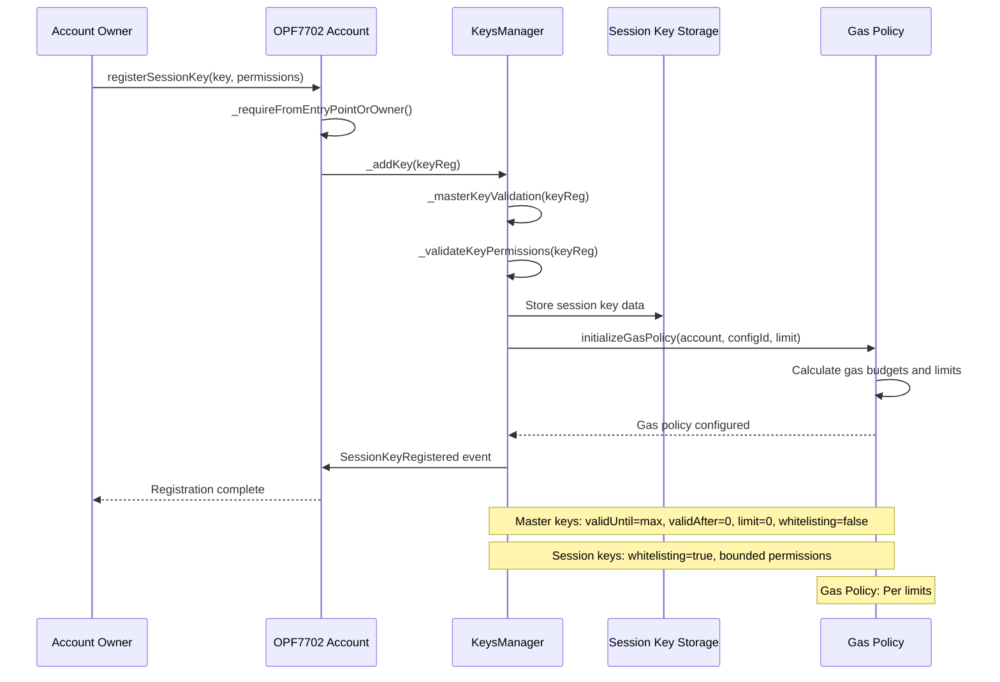
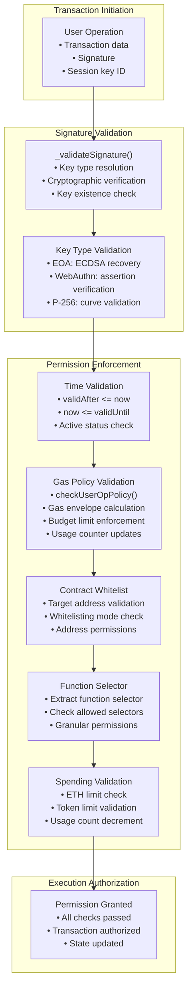
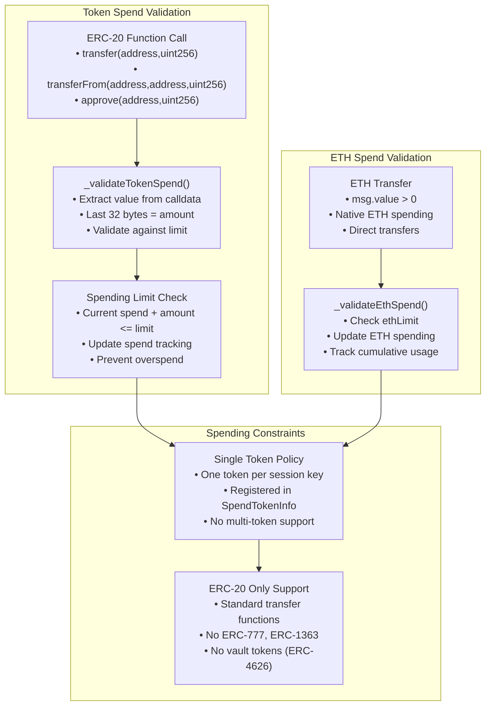

# Session Keys & Permission System

This document covers the session key management and permission enforcement system within the Openfort EIP-7702 Smart Accounts. Session keys enable temporary, scoped access to smart accounts with granular permission controls including spending limits, contract whitelisting, and time-based restrictions.

For information about the core account abstraction implementation, see Account Abstraction Implementation. For details about authentication mechanisms and WebAuthn integration, see WebAuthn Integration.

## System Architecture
The session key system is built around three primary components that work together to provide secure, temporary access delegation:

## Key Types and Capabilities
The system supports four distinct key types, each with different cryptographic properties and security characteristics:

| Key Type | Description | Use Cases | Validation Method |
|----------|-------------|-----------|-------------------|
| EOA | Traditional ECDSA keys | Standard wallets, development | ECDSA signature verification |
| WEBAUTHN | WebAuthn credentials | Biometrics, hardware keys | WebAuthn assertion validation |
| P256 | Standard P-256 keys | Extractable P-256 signatures | P-256 ECDSA verification |
| P256NONKEY | Hardware-bound P-256 | Non-extractable hardware keys | SHA-256 digest validation |

## Permission Control Framework
Session keys operate within a comprehensive permission framework that enforces multiple layers of access control:

## Permission Control Framework
Session keys operate within a comprehensive permission framework that enforces multiple layers of access control:

## Session Key Data Structure
The core session key storage structure contains all permission and metadata fields:

## Key Management Lifecycle
Session keys follow a structured lifecycle from registration through usage to expiration:

Registration Process

## Permission Validation Flow

## Validation and Enforcement
The permission system implements multiple validation layers to ensure secure execution:

### Spending Limit Enforcement
Token spending validation follows strict ERC-20 patterns with specific security constraints:

## Security Model
The session key security model implements defense-in-depth through multiple validation layers:
| Security Layer | Purpose | Implementation |
|----------------|---------|----------------|
| Signature Validation | Cryptographic authenticity | Key type-specific signature verification |
| Time Bounds | Temporal access control | validAfter and validUntil timestamp checks |
| Usage Limits | Transaction count control | limit field with per-operation decrement |
| Spending Caps | Financial risk mitigation | ETH and token spending limits |
| Contract Whitelisting | Target restriction | Address-based access control |
| Function Filtering | Operation-level control | Function selector validation |
| Gas Policy | Resource usage control | Gas envelope calculation, budget enforcement, penalty handling |
| Gas Griefing Protection | DoS prevention | Signature length validation |