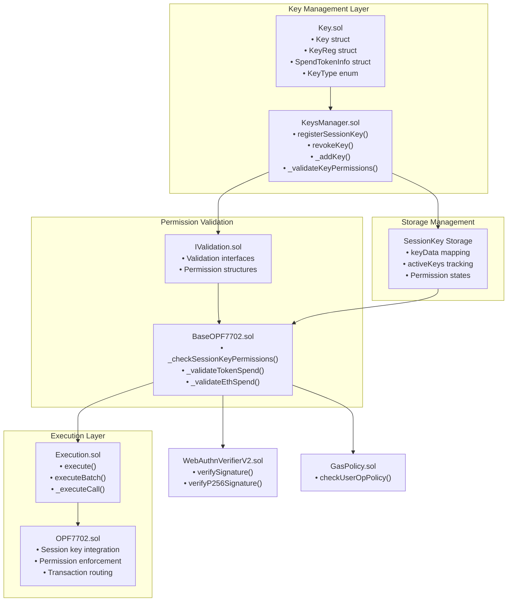
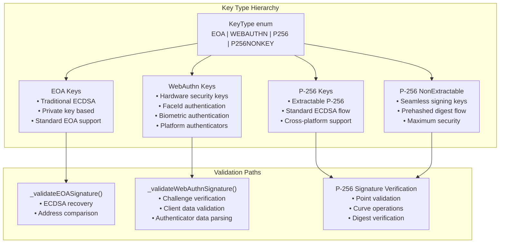

# Session Keys & Permission System

This document covers the session key management and permission enforcement system within the Openfort EIP-7702 Smart Accounts. Session keys enable temporary, scoped access to smart accounts with granular permission controls including spending limits, contract whitelisting, and time-based restrictions.

For information about the core account abstraction implementation, see Account Abstraction Implementation. For details about authentication mechanisms and WebAuthn integration, see WebAuthn Integration.

## System Architecture
The session key system is built around three primary components that work together to provide secure, temporary access delegation:


## Key Types and Capabilities
The system supports four distinct key types, each with different cryptographic properties and security characteristics:


| Key Type | Description | Use Cases | Validation Method |
|----------|-------------|-----------|-------------------|
| EOA | Traditional ECDSA keys | Standard wallets, development | ECDSA signature verification |
| WEBAUTHN | WebAuthn credentials | Biometrics, hardware keys | WebAuthn assertion validation |
| P256 | Standard P-256 keys | Extractable P-256 signatures | P-256 ECDSA verification |
| P256NONKEY | Hardware-bound P-256 | Non-extractable hardware keys | SHA-256 digest validation |



## Permission Control Framework
Session keys operate within a comprehensive permission framework that enforces multiple layers of access control:

```mermaid
flowchart TD
    subgraph "Time Controls"
        TimeValidation["Time-based Permissions<br/>• validAfter timestamp<br/>• validUntil expiration<br/>• Automatic cleanup"]
    end
    
    subgraph "Spending Controls"
        EthLimits["ETH Spending Limits<br/>• ethLimit field<br/>• Per-key tracking<br/>• Cumulative enforcement"]
        TokenLimits["Token Spending Limits<br/>• SpendTokenInfo struct<br/>• ERC-20 only support<br/>• Single token per key"]
    end
    
    subgraph "Access Controls"
        ContractWhitelist["Contract Whitelisting<br/>• whitelist mapping<br/>• Address-based filtering<br/>• Boolean permissions"]
        FunctionFilter["Function Selector Filtering<br/>• allowedSelectors array<br/>• bytes4 selector matching<br/>• Granular function control"]
    end
    
    subgraph "Usage Controls"
        TransactionLimits["Transaction Count Limits<br/>• limit field<br/>• Per-operation decrement<br/>• Usage exhaustion"]
        WhitelistingMode["Whitelisting Mode<br/>• whitelisting boolean<br/>• Enforce restrictions<br/>• Default allow/deny"]
    end

    %% Flow connections
    TimeValidation --> EthLimits
    EthLimits --> TokenLimits
    TokenLimits --> ContractWhitelist
    ContractWhitelist --> FunctionFilter
    FunctionFilter --> TransactionLimits
    TransactionLimits --> WhitelistingMode
    ```

## Permission Control Framework
Session keys operate within a comprehensive permission framework that enforces multiple layers of access control:

```mermaid
flowchart TD
    subgraph "Time Controls"
        TimeValidation["Time-based Permissions<br/>• validAfter timestamp<br/>• validUntil expiration<br/>• Automatic cleanup"]
    end

    subgraph "Gas Policy"
        GasPolicy["Gas Permissions<br/>• limits counter<br/>• manual/auto config<br/>• include penalty gas"]
    end

    subgraph "Spending Controls"
        EthLimits["ETH Spending Limits<br/>• ethLimit field<br/>• Per-key tracking<br/>• Cumulative enforcement"]
        TokenLimits["Token Spending Limits<br/>• SpendTokenInfo struct<br/>• ERC-20 only support<br/>• Single token per key"]
    end
    
    subgraph "Access Controls"
        ContractWhitelist["Contract Whitelisting<br/>• whitelist mapping<br/>• Address-based filtering<br/>• Boolean permissions"]
        FunctionFilter["Function Selector Filtering<br/>• allowedSelectors array<br/>• bytes4 selector matching<br/>• Granular function control"]
    end
    
    subgraph "Usage Controls"
        TransactionLimits["Transaction Count Limits<br/>• limit field<br/>• Per-operation decrement<br/>• Usage exhaustion"]
        WhitelistingMode["Whitelisting Mode<br/>• whitelisting boolean<br/>• Enforce restrictions<br/>• Default allow/deny"]
    end

    %% Flow connections
    TimeValidation --> GasPolicy
    GasPolicy --> EthLimits
    EthLimits --> TokenLimits
    TokenLimits --> ContractWhitelist
    ContractWhitelist --> FunctionFilter
    FunctionFilter --> TransactionLimits
    TransactionLimits --> WhitelistingMode
```


