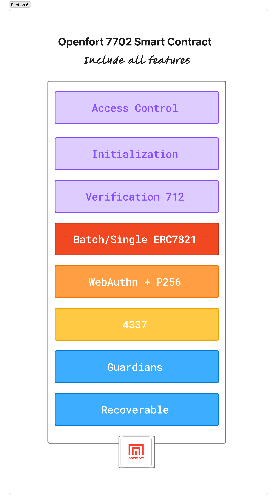
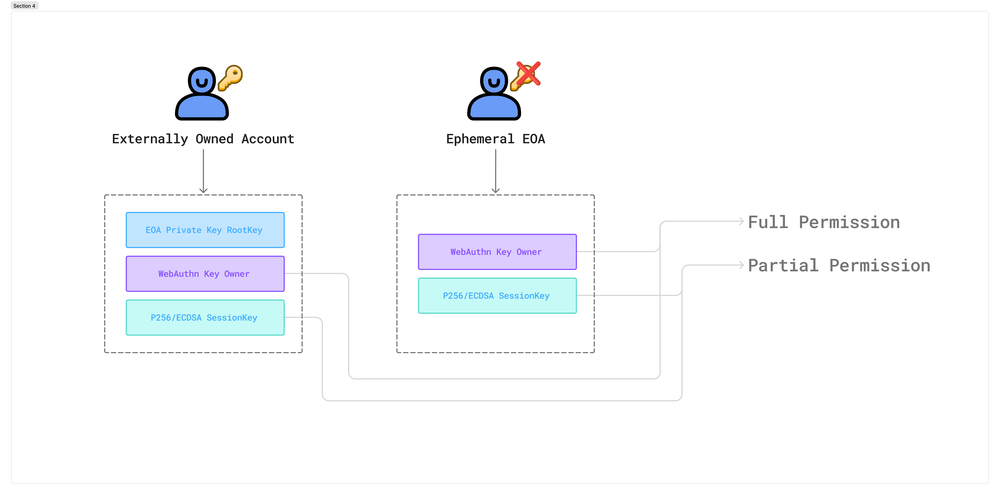
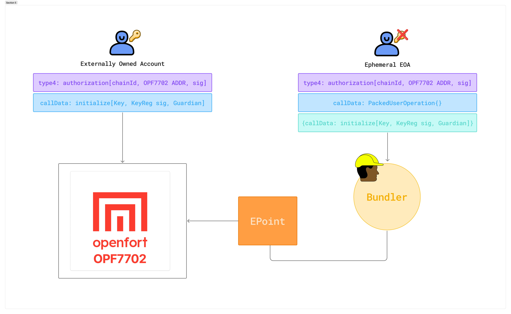

<h1 align="center"> Openfort EIP-7702 Smart Accounts </h1>

<p align="center">
  
</p>

> 🚧 **Work In Progress**
> 
> This repository is under active development.  
> Contracts are **unaudited**, and the codebase may have **breaking changes** without notice.

**All-in-one EIP-7702 powered smart accounts with session key support**

---

## Overview
<div align="center">
  <table>
    <tr>
      <td width="70%" valign="top">
Smart wallets have made great strides in improving user experience, but still face challenges with key management, account recovery, and cross-application session management. Openfort's EIP-7702 implementations aim to solve these problems with a comprehensive smart account solution that puts users in control.

We believe smart accounts should provide an excellent experience throughout a user's journey:

- **Effortless Onboarding**: Use WebAuthn and Passkeys with no deployment transaction required  
- **Flexible Authentication**: Multiple authentication methods including EOA and WebAuthn/Passkeys  
- **Fine-grained Access Control**: Session keys with customizable permissions and spending limits  
- **Secure Transactions**: Built-in security features including whitelisting, function filtering, and time-based controls  
- **Seamless Experience**: Full compatibility with ERC-4337 account abstraction standard  
- **Gas Sponsorship**: Allow applications to pay for user transactions through session keys  
- **No Vendor Lock-in**: Built on EIP-7702 and ERC-4337 standards for maximum interoperability  
- **🟢 Live Demo**: [https://7702.openfort.xyz](https://7702.openfort.xyz)
</td>
<td width="30%" valign="top" align="center">
  
</td>
  </tr>
</table>


</div>

<br></br>
## EIP7702 Quickstart
[EIP-7702](https://eips.ethereum.org/EIPS/eip-7702) is an upgrade (Pectra) Ethereum enhancement behaving both as a smart account and as a regular EOA, effectively creating a “hybrid” account that enables embedding EVM code into an Externally Owned Account (EOA). Our [video blog series](https://www.youtube.com/watch?v=94VhTY-1ZsI) has more details for all of you.
Account Abstraction has many features that EOA holders can now access due to this. Account Abstraction offers sponsored gas fees as well as multiple operations batched in a single transaction plus session keys in addition to chain abstraction support with similar conveniences.

This guide walks through a basic demo that leverages ERC-4337 along with EIP-7702 so that an EOA can directly send a gasless user operation. This [video blog](https://www.youtube.com/watch?v=bE7YUrThS5k) gives information regarding the architecture of the `openfort 7702 account`.

We'll demonstrate how to build a complete smart account system that:

- Creates secure passkeys using WebAuthn
- Initializes smart accounts with non-extractable keys
- Signs and executes UserOperations seamlessly
- Implements session keys for enhanced user experience
---
<br></br>
## Installation
```bash
npm install viem @noble/secp256k1 ox permissionless
```
```bash
yarn add viem @noble/secp256k1 ox permissionless
```

---
## Steps
<kbd style="padding: 2px 6px; font-size: 18px; background-color: #fc3c2f; border: 1px solid #ccc; border-radius: 4px;">1</kbd>&nbsp;&nbsp;&nbsp;&nbsp;*Prepares an EIP-7702 Authorization for signing. This Action will fill the required fields of the Authorization object if they are not provided (e.g. nonce and chainId).*
<br></br> ****Contract****: [0x211DC8EB0b09F5b762979C8681641dB05D7cd481](https://sepolia.etherscan.io/address/0x211dc8eb0b09f5b762979c8681641db05d7cd481)

#### `Self-execution`
```ts

import { sepolia } from 'viem/chains';
import { privateKeyToAccount } from 'viem/accounts'

const SEPOLIA_RPC = '';

const walletClient = createWalletClient({
  account,
  chain: sepolia,
  transport: http(SEPOLIA_RPC),
});

const authorization = await walletClient.prepareAuthorization({
  account: privateKeyToAccount('0x...'),
  contractAddress: '0x211DC8EB0b09F5b762979C8681641dB05D7cd481',
  executor: 'self', 
});
```
* Type: 'self' | undefined
* Source: [VIEM](https://viem.sh/docs/eip7702/prepareAuthorization)

#### `Ephemeral EOA`
>> *<u>What is An Ephemeral EOA:</u> *****ephemeral key is a temporary cryptographic key created for a single use and then deleted. Unlike permanent keys, ephemeral keys are discarded after each session, making them more secure since compromised keys can't be reused.****
```ts
import { createClient } from "viem";
import { sepolia } from 'viem/chains';
import { prepareAuthorization } from "viem/actions";
import { generatePrivateKey, privateKeyToAccount, signAuthorization } from "viem/accounts";

const privateKey = generatePrivateKey();
const signer = privateKeyToAccount(privateKey);

const client = createClient({
  sepolia,
  pollingInterval: 1_000,
  transport: http()
});

const authorization = await prepareAuthorization(client, {
  account: signer.address,
  contractAddress: '0x211DC8EB0b09F5b762979C8681641dB05D7cd481'
});
```
<p align="left">
  
</p>

---
<br></br> 
---
<kbd style="padding: 2px 6px; font-size: 18px; background-color: #fc3c2f; border: 1px solid #ccc; border-radius: 4px;">2</kbd>&nbsp;&nbsp;&nbsp;&nbsp;*Initialize the account with a WebAuthn owner, Session Key and guardian.*
```ts
function initialize(
    Key calldata _key,
    KeyReg calldata _keyData,
    Key calldata _sessionKey,
    KeyReg calldata _sessionKeyData,
    bytes memory _signature,
    bytes32 _initialGuardian
) external initializer {}
```
* Source: [OPF7702](https://github.com/openfort-xyz/openfort-7702-account/blob/3c3eecfc80d34295a9e72c749bbb9ff4b0018b48/src/core/OPF7702Recoverable.sol#L122)

#### `Creating Your First Passkey`
The adventure begins with creating a WebAuthn credential that will serve for your smart account as the primary authentication method. Your device ties to this credential as well as biometric authentication and a PIN protects that same device.
```ts
import { toHex } from "viem";
import { Bytes, WebAuthnP256 } from "ox";

// Create a WebAuthn credential using the account address as the user ID
const credential = await WebAuthnP256.createCredential({
  authenticatorSelection: {
    requireResidentKey: false,
    residentKey: "preferred",        // Store credential on device when possible
    userVerification: "required",    // Require biometric/PIN verification
  },
  user: {
    id: Bytes.from(account.address),
    name: `${account.address.slice(0, 6)}...${account.address.slice(-4)}`,
  },
});

// Store the credential ID for future authentication
const credentialId = credential.id;

const x = toHex(credential.publicKey.x, { size: 32 });
const y = toHex(credential.publicKey.y, { size: 32 });
```
* A unique key pair that is bound to their device is then created when this process prompts authentication by the user through Face ID, Touch ID, Windows Hello, etc. The private key remains within secure hardware. Smart account initialization returns back the public key.

#### `CallData`
With the WebAuthn credential now created, a smart account recognizing this passkey as its primary signer can be initialized:
* Prepare Key Data
```ts
import { zeroAddress, toHex, keccak256, encodeFunctionData } from "viem";

export enum KeyType {
  EOA = 0,
  WEBAUTHN = 1,
  P256 = 2,
  P256_NON_EXTRACTABLE = 3,
}

const key = {                               
  pubKey: {                         
    x: toHex(x),                   
    y: toHex(y),                   
  },
  eoaAddress: zeroAddress,         
  keyType: KeyType.WEBAUTHN,       
} as const;
```

<br></br> 
* Prepare Token Spend  
```ts
const spendTokenInfo = {
  token: zeroAddress,             
  limit: 0n,
} as const;
```

<br></br> 
* Prepare Key Registration Data 
```ts
const keyReg = {
  validUntil: 0n,
  validAfter: 0n,
  limit: 0n,
  whitelisting: false,
  contractAddress: zeroAddress,
  spendTokenInfo: spendTokenInfo,
  allowedSelectors: ['0xdeedbeff'],
  ethLimit: 0n
} as const;

const initialGuardian = keccak256('address');
```

<br></br> 
* Prepare Session Key Registration Data (Optional)
```ts
const sessionKey = {                               
  pubKey: {                         
    x: toHex(x), // if not register sessionKey add bytes32(0)                   
    y: toHex(y), // if not register sessionKey add bytes32(0)                   
  },
  eoaAddress: zeroAddress, // if not register sessionKey add zeroAddress         
  keyType: KeyType.P256_NON_EXTRACTABLE,       
} as const;

const spendTokenInfo = {
  token: usdcAddress,             
  limit: spending_limits,
} as const;

const sessionKeyReg = {
  validUntil: unixTime,
  validAfter: unixTime,
  limit: limits,
  whitelisting: true,
  contractAddress: address,
  spendTokenInfo: spendTokenInfo,
  allowedSelectors: [approve_selector, transfer_selector, swap_selector],
  ethLimit: eth_limits
} as const;

```

<br></br> 
* Call Data (If Sponsored use with `userOperation`) 
```ts

// Prepare the initialization call data
const callData = encodeFunctionData({
  abi: accountABI,
  functionName: "initialize",
  args: [
    key,
    keyReg,
    sessionKey,
    sessionKeyReg,                    
    SIGNATURE_EIP712,  // sign with EOA/EPHEMERAL EOA `function getDigestToInit`
    initialGuardian
  ]
});

// Create the user operation with EIP-7702 authorization if EPHEMERAL EOA
const userOperation = await walletClient.prepareUserOperation({
  callData,
  authorization: signedAuthorization,  // EIP-7702 authorization signature
});
```

<p align="left">
  
</p>

* An EOA can temporarily act as a smart contract because EIP-7702 authorization exists so it enables the initialization process. After execution of this UserOperation, your smart account is ready for WebAuthn-based transactions.
---
<br></br> 
---
<kbd style="padding: 2px 6px; font-size: 18px; background-color: #fc3c2f; border: 1px solid #ccc; border-radius: 4px;">3</kbd>&nbsp;&nbsp;&nbsp;&nbsp;*Register Session Key P256.*
```js
function registerKey(Key calldata _key, KeyReg calldata _keyData) public {}
```
* Source: [OPF7702](https://github.com/openfort-xyz/openfort-7702-account/blob/3c3eecfc80d34295a9e72c749bbb9ff4b0018b48/src/core/KeysManager.sol#L71)

#### `Creating a Session Key`

* Session keys are additionally non-extractable P256 keys that exist. They are created through usage of the WebCrypto API and are stored in a local way:

```ts
import { WebCryptoP256 } from "ox";

// Generate a new P256 key pair for the session
const keyPair = await WebCryptoP256.createKeyPair();
const publicKey = await WebCryptoP256.getPublicKey({ 
  publicKey: keyPair.publicKey 
});

// Store the key pair securely (e.g., in IndexedDB)
await storeSessionKey(keyPair);
```
* WebAuthn is great for security, but nobody wants to scan their fingerprint for every little action. Session keys fix that: they’re short-lived “spare keys” with limited powers, so you can breeze through everyday tasks without constant biometric check-ins.

#### `Registering the Session Key`
The session key must be registered with the smart account because it defines its permissions along with validity:
* Prepare Key Data
```ts
const key = {                               
  pubKey: {                         
    x: toHex(publicKey.x),         // The P256 public key x coordinate
    y: toHex(publicKey.y),         // The P256 public key y coordinate           
  },
  eoaAddress: zeroAddress,         
  keyType: KeyType.P256_NON_EXTRACTABLE,       
} as const;

const spendTokenInfo = {
  token: TOKEN_ADDRESS,             
  limit: SPEND_LIMIT,
} as const;
```

<br></br>
* Prepare Key Registration Data 
```ts
const keyReg = {
  validUntil: VALID_UNTIL,
  validAfter: VALID_AFTER,
  limit: ACTIONS_LIMIT,
  whitelisting: true,
  contractAddress: CONTRACT_ADDRESS,
  spendTokenInfo: spendTokenInfo,
  allowedSelectors: [ALLOW_SELECTORS],
  ethLimit: ETH_SPEND_LIMIT
} as const;
```
<br></br>
* Call Data (If Sponsored use with `userOperation`) 
```ts
const callData = encodeFunctionData({
  abi: accountABI,
  functionName: 'registerSessionKey',
  args: [
    key,
    keyReg
  ]
});

// This registration requires WebAuthn approval
const userOperation = await walletClient.prepareUserOperation({
  callData,
  signature: webAuthnStubSignature,
});

// Sign with WebAuthn (one-time approval for session key)
const webauthnData = await WebAuthnP256.sign({
  challenge: getUserOperationHash(userOperation),
  credentialId,
  rpId: window.location.hostname,
  userVerification: "required",
});
```

---
<br></br> 
---
<kbd style="padding: 2px 6px; font-size: 18px; background-color: #fc3c2f; border: 1px solid #ccc; border-radius: 4px;">4</kbd>&nbsp;&nbsp;&nbsp;&nbsp;*Executing Transactions with WebAuthn.*
Let's show the time when we mint some ERC-20 tokens. First, a UserOperation is prepared by us with a placeholder for its signature. Then, the actual WebAuthn signature acts in its place:
* `Preparing the Transaction`
```ts
// Encode the mint function call
const data = encodeFunctionData({
  abi: erc20ABI,
  functionName: "mint",
  args: [
    walletClient.account.address,
    parseEther("10"),  // Mint 10 tokens
  ],
});

// Prepare UserOperation with stub signature
const userOperation = await walletClient.prepareUserOperation({
  calls: [
    {
      to: erc20Address,
      data,
    },
  ],
  signature: webAuthnStubSignature,  // Placeholder signature
});
```

The actual signature is now generated using the WebAuthn credential:
```ts
// Get the UserOperation hash that needs to be signed
const userOperationHash = getUserOperationHash(userOperation);

// Sign with WebAuthn - this triggers biometric authentication
const webauthnData = await WebAuthnP256.sign({
  challenge: userOperationHash,
  credentialId,                      // The credential we created earlier
  rpId: window.location.hostname,    // Relying party identifier
  userVerification: "required",      // Require user verification
});

// Replace stub signature with the actual WebAuthn signature
userOperation.signature = encodeWebAuthnSignature(webauthnData);

// Send to bundler for execution
await bundlerClient.sendUserOperation(userOperation);
```
* The user experiences a familiar biometric prompt like Face ID, fingerprint, etc., so once they authenticate, someone signs then submits the transaction.

---
<br></br> 
---
<kbd style="padding: 2px 6px; font-size: 18px; background-color: #fc3c2f; border: 1px solid #ccc; border-radius: 4px;">5</kbd>&nbsp;&nbsp;&nbsp;&nbsp;*Using Session Keys for Transactions.*
* After setup, your session keys can authorize transactions on their own—no fingerprint or face scan needed:

#### `Prepare CallData`
* Call Data (If Sponsored use with `userOperation`) 
```ts
import { WebCryptoP256 } from "ox";

// Prepare the transaction as before
const userOperation = await walletClient.prepareUserOperation({
  calls: [
    {
      to: erc20Address,
      data: encodeFunctionData({
        abi: erc20ABI,
        functionName: "mint",
        args: [walletClient.account.address, parseEther("10")],
      }),
    },
  ],
  signature: P256Signature,
});

// Sign with the session key (no user interaction required)
const { r, s } = await WebCryptoP256.sign({
  privateKey: sessionKey.privateKey,
  payload: getUserOperationHash(userOperation),
});

// Format and attach the signature
userOperation.signature = encodeP256Signature({ r, s });

// Submit the transaction
await bundlerClient.sendUserOperation(userOperation);
```

---
<br></br> 
---
# Conclusion
WebAuthn with P256 signatures marks a large advance with regard to Web3 security, as well as user experience. Smart accounts that are more secure and even more user-friendly than customary wallets, can be built through leveraging familiar authentication methods and also eliminating private key exposure.

Adapting to different security contexts, a system results from combining WebAuthn for high-security operations and session keys for routine transactions requiring strong authentication for sensitive actions enabling frictionless interactions for everyday use.

Account abstraction standards are maturing, also WebAuthn support is expanding now. For many mainstream Web3 applications, this kind of approach will then become increasingly viable too. Web3's future securing means making security automatic and invisible, not teaching users private key management.
